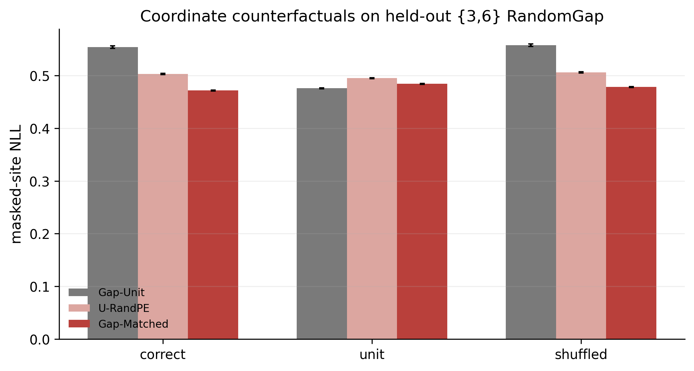

# 尺度感知坐标与 Local--Global Ising 离散扩散实验报告

版本：v1.0<br>
日期：2026-08-19<br>
实验状态：Level 1、Stage 2A 与 Stage 2B 单训练 seed 因果筛选均已完成<br>
结论状态：允许进入多 seed 正式确认，尚不构成论文级最终结论

## 摘要

本实验研究一个比“把位置编码窗口调大”更严格的问题：如果训练数据中的格点具有
不同的真实物理间距，离散扩散模型能否根据 context 中提供的二维坐标判断 token
之间的相对尺度，并把这种能力外推到训练时未出现的间距？二维临界 Ising 模型适合
这一检验，因为它同时具有精确局部 Markov 规律和幂律长程关联；模型若只记住局部
纹理、只受随机位置编码正则化，或让新增远程 token 污染局部判断，都可以被专门的
对照实验识别。

实验分三步推进。Level 1 用 dense 2D RoPE 模型分离数据几何与坐标几何，发现 matched
physical coordinates 确实改善中长程关联，但同时恶化局部 Markov posterior，因此原
dense 方案被判定为 `NO-GO`。Stage 2A 引入 Local--Global denoiser：局部分支只允许
一次物理 Manhattan 半径 1 的信息传播，全局分支使用 dense 2D RoPE，最终只通过门控
logit residual 合并。该结构把 W=64 distant-MASK pollution 从 `0.1822` 降至
`0.0193`，生成 short/expanded `G(r)` NRMSE 达到 `0.0162/0.0492`，但 matched 坐标
相对 data-only 的独立增益只有 `0.00164`，略低于预注册 practical threshold `0.002`，
因此判定为 `CONDITIONAL_GO`。

Stage 2B 随后加入 RandomGap 因果对照。三个同构、同初始化模型分别接收：真实稀疏
自旋但 unit 坐标、连续自旋但同分布随机位置编码、真实稀疏自旋与精确匹配坐标。
在 held-out gap `{3,6}` 上，matched 模型相对 data-only、RandomPE 和 uniform T3 的
配对 NLL 差分别为 `-0.08238`、`-0.03142` 和 `-0.00997`；把同一模型的正确坐标换成
unit 或跨样本 shuffled 坐标，NLL 分别恶化 `0.01262` 和 `0.00682`。五项预注册检查
全部通过，自动判定为 `GO_FULL_2B`。该结果支持“模型在当前设置中利用了与自旋几何
匹配的真实坐标”这一受限结论，但由于只有一个训练 seed，仍需三 seed、15,000-step
层级确认后才能形成稳定方法结论。

## 1. 与此前实验的关系

本实验不替代仓库中既有的 `L=64` 基线和 `L=64→128` 直接外推实验，而是回答后续的
机制问题。三条实验线的边界如下：

| 实验线 | 核心问题 | 结果位置 |
|---|---|---|
| `L=64` 基线 | 离散扩散能否在训练尺度上生成合理临界 Ising 构型 | `artifacts/final_l64/` |
| `L=64→128` 零样本外推 | 固定尺度训练的模型能否直接恢复更大晶格的有限尺寸 scaling | `artifacts/final_l128_zero_shot/` |
| 本报告 | 随机化真实物理采样几何与坐标能否教会模型按相对尺度推断 | `results/scale_aware_context/` |

此前 `L=64→128` 实验已经显示：原模型在大晶格上仍能保留部分局部纹理，但大尺度
关联偏强，真正外推区间的 `G(r)` NRMSE 较高。本实验不再只观察“外推失败”，而是
主动改变训练几何、加入坐标反事实对照，并用局部—全局结构尝试定位和修复失败原因。

## 2. 研究问题与可证伪假设

### 2.1 核心研究问题

设一个窗口中的格点坐标为

\[
\mathbf{x}_{ij}=(x_i,y_j),
\]

相邻 token 在数组中的 rank 距离始终为 1，但真实物理增量可以是
`1,2,4,8` 或样本内随机变化。研究问题是：模型能否从
`\mathbf{x}_{ij}-\mathbf{x}_{kl}` 判断物理距离，而不是把“数组相邻”机械地当成
“物理最近邻”？

### 2.2 三个替代解释

一个模型在 held-out 间距上改善，并不自动证明它使用了真实坐标。至少有三个替代
解释必须排除：

1. **data-only augmentation**：仅仅见过稀疏采样的自旋构型就足以改善；
2. **RandomPE regularization**：随机坐标只起普通正则化作用，不需要与自旋匹配；
3. **capacity/context effect**：更大模型或更多远程 token 带来表面收益，同时污染
   局部 posterior。

因此正式设计同时比较 matched、unit、phase-only、data-only、RandomPE、dense 和
Local--Global，并对同一模型执行 correct/unit/shuffled coordinate swap。

### 2.3 预注册方向

如果 matched physical coordinates 真有独立贡献，应同时看到：

- matched 模型在未见 gap 上优于 data-only 与 RandomPE；
- 同一 matched 模型在换成 unit 或 shuffled 坐标时退化；
- 改善超过预设 `0.002` NLL practical threshold，而不只是置信区间刚好不跨 0；
- 长程改善不能以明显破坏局部 Markov 规律为代价。

## 3. Monte Carlo 父场与数据划分

### 3.1 物理系统

数据来自二维无外场铁磁 Ising 模型，周期边界，`L=1024`，逆温
`beta=0.44068679350977147`。选择临界点是因为此时相关长度发散，局部相互作用与长程
幂律关联同时存在，最适合检验 context 外推。

### 3.2 Wolff 采样设置

父场由 Numba 加速的 Wolff cluster Monte Carlo 生成：

| 参数 | 值 |
|---|---:|
| 独立链数 | 12 |
| 每链构型数 | 128 |
| burn-in | 20 sweeps |
| 目标样本间隔 | 2 sweeps |
| adaptation | 3 sweeps |
| pilot cluster updates | 128 |
| 总 seed | 20260818 |
| 初态 | `random` 与 `plus` 交替 |

12 条链在链级划分为 train/val/test-target/test-control=`6/2/2/2`，对应
`768/256/256/256` 个父构型。测试链从未参与训练；test-control 用于估计有限 MC
噪声底。完整 chain seed、实际 cluster size、实现的 sweep gap 和 split manifest 都
保存在 NPZ 的 `metadata` 中。

Level 1 聚合诊断给出 energy split-`Rhat=1.0263`、`|m|` split-`Rhat=1.0139`；各链
energy 的 integrated autocorrelation time 约为 `0.88–3.19`。这些数值支持父场可用于
pilot，但正式论文仍应报告更保守的链级区间和独立再生成检查。

### 3.3 数据文件

父场按 bit packing 存储为
[`data/level1/parents_l1024.npz`](../data/level1/parents_l1024.npz)，大小
`129,795,241` bytes，SHA-256 为
`1f7de1ec81e82ebcfcbc4134d5670ee35711230f05d00cd037c7b9e575ef8934`。
该文件和所有正式 checkpoint 均由 Git LFS 管理。

## 4. 离散扩散任务

模型词表为 `{-1 spin,+1 spin,MASK,PAD}`，输出只预测两个 clean spin 类别。对每个
样本从 `t∈[0.01,1]` 采样 mask probability，并以 `0.02` 概率显式加入完全 mask
端点。给定 clean 构型 `x`，有效位置独立地以概率 `t` 替换为吸收态 `MASK`。训练
目标只在被 mask 位置计算交叉熵，并乘以 `1/t`：

\[
\mathcal{L}=\frac{1}{N_{\rm valid}}
\sum_i \frac{\mathbf{1}[i\ {\rm masked}]}{t}
\operatorname{CE}(p_\theta(x_i\mid x_t,t,\mathbf{x}),x_i).
\]

验证使用固定 `t={0.2,0.5,0.8,0.95}`、固定 clean sample 和固定 mask trace，避免不同
模型因噪声实现不同而产生伪差异。训练时使用 D4 几何增强和全局 spin flip；坐标随
旋转/翻转同步变换。

## 5. 网络与坐标表示

### 5.1 Dense coordinate baseline

Level 1 使用 6-block dense Transformer，`d_model=128`、4 heads、MLP ratio 4、
dropout 0、2D RoPE base 10,000，总参数 `1,713,282`。二维物理坐标直接进入 RoPE；
因此 attention logit 能依赖相对坐标差，而不是依赖一个固定最大网格表。

### 5.2 Local--Global Scale Denoiser

Stage 2A/2B 使用两个隐藏状态完全独立的分支：

```text
masked spins + t + physical coordinates
        ├─ Local branch: 1× Manhattan radius-1 attention + 3× pointwise MLP
        └─ Global branch: 6× dense coordinate-aware 2D RoPE attention
                                      ↓
         local logits + sigmoid(gate) × global residual logits
```

Local branch 的宽度为 64、4 heads，共 4 blocks；只有第一层传播空间信息，其余三层
为逐 site MLP，因此总物理感受野不会随层数扩大。Global branch 宽度 128、4 heads、
6 blocks。门控输入同时包含 local hidden、global hidden 和 diffusion time，初始 gate
为 `0.1`。该模型参数量为 `1,978,501`。

为排除参数量混杂，Stage 2A 还训练 7-block Dense+，参数量 `1,976,706`，与
Local--Global 仅相差约 `0.09%`。因此 Local--Global 的改善不能简单归因于参数更多。

## 6. 共同训练设置与计算资源

除明确写出的几何差异外，各对照使用相同 optimizer、学习率、mask 过程和初始化。

| 项目 | 设置 |
|---|---|
| 训练 seed | 1234 |
| updates | 每模型 8,000 |
| optimizer | fused AdamW，betas `(0.9,0.95)` |
| peak learning rate | `3e-4` |
| minimum learning rate | `3e-5` |
| warmup | 500 updates |
| weight decay | `0.05` |
| gradient clip | `1.0` |
| EMA | `0.999` |
| precision | BF16 训练；FP32 机制 probe |
| validation interval | 500 updates |
| widths | Level 1/2A `{16,24,32,48}`；2B 另加 64 |
| per-width batch | `{16:32,24:14,32:8,48:4,64:2}` |
| gradient accumulation | 2 |
| GPU | 单张 NVIDIA RTX 5090 D 32 GB |
| software | PyTorch 2.8.0 + CUDA 12.8 |

记录的 PyTorch peak allocation 低于整卡 `nvidia-smi` 峰值；它只表示张量分配器，
不能当作整机显存占用。训练实测如下：

| 阶段 | 模型 | 8k 用时（秒） | updates/s | peak allocated GiB |
|---|---|---:|---:|---:|
| Level 1 | T0/T3/Pphase/Punit | 373.5–381.0 | 21.00–21.42 | 0.473–0.474 |
| Stage 2A | Dense-T3+/Dense-Punit+ | 424.6–429.9 | 18.61–18.84 | 0.544 |
| Stage 2A | LG-T3/LG-Punit | 518.8 | 15.42 | 0.607 |
| Stage 2B | 三个 RandomGap controls | 588.0–599.4 | 13.35–13.61 | 0.606 |

Stage 2A 的大规模 Markov 后处理曾达到约 `13.4 GiB` 峰值并实现 100% GPU 利用率；
这与上表训练循环的 PyTorch allocation 是不同测量口径。

## 7. Level 1：分离数据几何与坐标几何

### 7.1 四组对照

四个 6-block dense 模型共享同一初始化 hash
`ab204250...fa959375`，几何定义如下：

| 模型 | 自旋采样 | 输入坐标 | 目的 |
|---|---|---|---|
| T0 | 固定 `W=48, stride=1` | unit | 同分布基线 |
| T3 | `W∈{16,24,32,48}`, stride `{1,2,4}` | 与真实 stride 匹配 | 完整尺度感知处理 |
| Pphase | 连续自旋窗口 | 坐标 stride `{1,2,4}` | 只改变 RoPE phase |
| Punit | 真实 stride `{1,2,4}` | unit | data-only control |

held-out 均匀 stride 3/6 从未在训练集合中出现。机制评估包括：正确坐标对 unit/wrong
scale 的配对 NLL、精确 Ising Markov blanket、W=64 生成 `G(r)`、能量、磁化和低频
谱功率，以及 64/128 reverse-step sampler 排名稳定性。

### 7.2 结果

T3 在 held-out stride 上明显优于 T0，且对坐标反事实敏感。例如 stride 3/6 时，
T3 correct-minus-unit NLL 分别为 `-0.02241/-0.04471`，四个 `t` bin 方向一致。生成
层面，expanded `r=17..32` 的 connected `G(r)` NRMSE 从 T0 的 `0.1643` 降到
T3 的 `0.0466`。

然而长程改善伴随局部损害。short `r=1..8` NRMSE 从 `0.0354` 升到 `0.0541`；
Large-MASK Markov pollution 从 T0 的 `0.0638` 升到 T3 的 `0.1183`，Large-Visible
pollution 从 `0.00230` 升到 `0.01903`。这说明同一 dense hidden state 同时承担局部
与全局推断时，未学习好的远程 context 会污染局部预测。


按预注册规则，coordinate signal 与 generation signal 虽然通过，但 ID guard 与
pollution improvement 失败，因此结论为 **`NO-GO for unchanged dense design`**，而
不是否定尺度坐标假设本身。

## 8. Stage 2A：局部—全局结构性解耦

### 8.1 实验步骤

Stage 2A 依次执行：

1. 对 S0/S1/S2 sampler、32/64/128/256 steps 和两个采样 seed 做冻结选择；
2. 冻结 `S0 + 256 steps + temperature 1.0 + 2 refinement sweeps`；
3. 训练参数匹配的 Dense-T3+、Dense-Punit+、LG-T3、LG-Punit；
4. 用 2048 个 base samples、4 个 diffusion times 做 paired coordinate probe；
5. 在 `W={8,16,24,32,48,64}` 上测 Small、Large-PAD、Large-MASK、
   Large-Visible context 的 Markov pollution；
6. 在 W=64 上生成 256 个模型样本，并与 1024 个 MC reference 比较；
7. 用预注册门槛聚合为自动判定。

### 8.2 关键结果

Local--Global 对局部污染的修复非常明显：

| 指标（W=64） | Dense-T3+ | LG-T3 | 变化 |
|---|---:|---:|---:|
| distant-MASK pollution ↓ | 0.18217 | 0.01927 | 降低约 89% |
| distant-visible pollution ↓ | 0.01128 | 0.000077 | 接近 MC/数值噪声量级 |
| generation short `G(r)` NRMSE ↓ | — | 0.01618 | 通过门槛 |
| generation expanded `G(r)` NRMSE ↓ | — | 0.04918 | 通过门槛 |
| energy absolute error ↓ | — | 0.02665 | 通过门槛 |


LG-T3 的 ID NLL 为 `0.32791`，优于 T0 的 `0.33351`，因此局部保护不是以整体 ID
性能恶化换来的。对同一 LG-T3 使用 correct 与 unit 坐标，配对 NLL 差为
`-0.03225`，95% CI `[-0.03282,-0.03169]`。

真正限制 Stage 2A 结论的是模型间独立贡献：`LG-T3 - LG-Punit=-0.00164`，95% CI
`[-0.00178,-0.00150]`。它统计上稳定，但绝对值没有达到预设 `0.002` practical
threshold。自动判定因此为 **`CONDITIONAL_GO`**，并要求加入 RandomPE 与更强
data-only control，而不是直接扩大实验规模。

## 9. Stage 2B：RandomGap 因果分辨筛选

### 9.1 为什么使用 RandomGap

uniform stride 仍可能让网络把一个 batch 的全局 stride 当成隐含类别。RandomGap
在每个样本、每条轴上独立从 `{1,2,4,8}` 抽取相邻增量，使坐标不再能用单个类别
概括。模型只有比较实际相对坐标，才能知道两个 token 的真实物理距离。

### 9.2 三个严格配对模型

三个 Local--Global 模型均有 `1,978,501` 参数、8,000 updates、相同 clean/mask RNG
设计，初始化 hash 完全相同：
`e9cdb0...d5bd1baf2d9f2`。

| 模型 | 自旋几何 | 坐标几何 | 排除的解释 |
|---|---|---|---|
| LG-Gap-Unit | 真实 RandomGap | rank/unit | 稀疏数据本身是否足够 |
| LG-U-RandPE | 连续 stride-1 | 同分布但与自旋错配的 RandomGap 坐标 | 随机位置编码正则化 |
| LG-Gap-Matched | 真实 RandomGap | 精确物理 offset | 完整 matched-distance 假设 |

训练 width 为 `{16,24,32,48,64}`，gap 为 `{1,2,4,8}`。测试覆盖：W=64 seen mixture、
W=64 held-out `{3,6}` mixture、固定 gap 3、固定 gap 6，以及 W=48 固定 gap 10。

### 9.3 评估协议

机制 probe 使用 512 个配对样本、batch 16、FP32、seed `161803` 和
`t={0.2,0.5,0.8,0.95}`。每个样本同时评估 correct、unit 和跨样本 shuffled
coordinates；因此 coordinate swap 不改变 clean spin 或 mask。置信区间由 10,000
次 paired bootstrap 得到，bootstrap seed 为 `20260819`。

### 9.4 最终数值

下表是 held-out `{3,6}` RandomGap 上的 paired NLL difference；负值表示左侧模型或
左侧坐标条件更好。

| 预注册对比 | 均值 | 95% CI | `0.002` practical threshold |
|---|---:|---:|---|
| Gap-Matched − Gap-Unit | **-0.08238** | `[-0.08591,-0.07890]` | 通过 |
| Gap-Matched − U-RandPE | **-0.03142** | `[-0.03187,-0.03095]` | 通过 |
| Gap-Matched − uniform LG-T3 | **-0.00997** | `[-0.01053,-0.00945]` | 通过 |
| CorrectCoord − UnitCoord | **-0.01262** | `[-0.01293,-0.01231]` | 方向通过 |
| CorrectCoord − ShuffledCoord | **-0.00682** | `[-0.00707,-0.00657]` | 方向通过 |




这五项检查共同排除了两个最直接的替代解释。Gap-Matched 大幅优于 Gap-Unit，说明
稀疏自旋增强本身不够；它又优于 U-RandPE，说明随机坐标正则化本身不够。同一模型
在不改变自旋和 mask 的情况下被 unit/shuffled 坐标显著破坏，则提供了模型确实读取
坐标内容的反事实证据。自动标签为 **`GO_FULL_2B`**。

## 10. 如何阅读图表

### 10.1 `01_geometry_nll`

该图按测试 geometry 展示各模型 NLL。横向比较时应固定 geometry；不能把不同 gap
下的绝对 NLL 直接解释为模型能力变化，因为更大 gap 本身就是更困难的数据分布。
关键信号是 Gap-Matched 在 seen、held-out 和固定 gap 组中相对对照的方向是否一致。

### 10.2 `02_paired_contrasts`

横轴为 NLL 差，0 表示两条件相同；负值有利于 matched/correct 条件。点是配对均值，
误差线是 bootstrap 95% CI。所有关键区间位于 0 左侧，且前三个模型间对比超过
`0.002` 实用门槛。

### 10.3 `03_coordinate_counterfactual`

该图只改变传入同一 checkpoint 的坐标，不改变 clean sample、mask 或模型参数。
correct 优于 unit 说明绝对/相对尺度有用；correct 优于 shuffled 说明坐标必须与当前
自旋样本匹配，而不是只要拥有相同边缘分布即可。

### 10.4 `04_nll_by_t`

该图把结果按 diffusion time 分开。低 `t` 时可见 token 多，更偏局部补全；高 `t`
时 mask 多，更依赖全局统计。分 bin 曲线用于检查总平均是否由单一噪声水平偶然驱动，
不应仅凭某一个 `t` 的最好点下结论。

## 11. 有效性、审计与故障恢复

本次归档保留了以下有效性证据：

- 27/27 单元测试通过；覆盖吸收扩散端点、采样无残留 MASK、坐标平移/PAD 不变性、
  RandomGap/RandomPE 因子分解、Local 分支半径不扩张等；
- 三个 Stage 2B 模型初始化 hash 完全相同；
- 所有正式模型达到 8,000 updates，无 NaN、OOM 或缺失 checkpoint；
- probe 使用固定 sample/mask trace 和 FP32，避免 BF16 排名抖动；
- 逐样本 CSV/NPZ、聚合 JSON、PNG/PDF 和生成 checkpoint 均保留；
- Stage 2B 运行曾因服务器异常关闭中断，但训练从原子 `last.pt` 与 RNG 状态恢复；
  最终三个模型均完整结束，退出码为 0。中断只增加墙钟时间，没有重置模型或混入
  不同初始化。

本机默认 Python 环境未安装 PyTorch，因此归档前本机只执行了 Python 静态编译与
31 个 JSON 解析校验；真正的 27 项 PyTorch 单测是在正式 CUDA 环境中执行，完整
输出保存在 `stage2b_causal_screen/audit/tests.log`。

## 12. 归档结构与复现步骤

### 12.1 必要资产

| 内容 | 位置 | 是否 LFS |
|---|---|---|
| L1024 MC 父场 | `data/level1/parents_l1024.npz` | 是 |
| 11 个正式 best checkpoint | `results/scale_aware_context/checkpoints/` | 是 |
| Level 1 原始逐样本结果 | `results/scale_aware_context/level1_rapid/raw/` | 大 CSV/NPZ 是 |
| Stage 2A 完整原始结果 | `results/scale_aware_context/stage2a_screen/raw/` | 大 CSV/NPZ 是 |
| Stage 2B 逐样本结果 | `results/scale_aware_context/stage2b_causal_screen/per_sample.npz` | 否，约 0.8 MB |
| 精选图表与自动判定 | `results/scale_aware_context/` | 否 |
| 代码与配置 | 仓库根目录、`ism_diffusion/`、`configs/`、`scripts/` | 否 |

### 12.2 克隆与校验

```bash
git clone https://github.com/zxfly666/ISM.git
cd ISM
git lfs pull
pip install -r requirements.txt
(cd results/scale_aware_context/checkpoints && sha256sum -c SHA256SUMS)
python -m unittest discover -s tests -v
```

### 12.3 从头执行

```bash
python generate_level1_parents.py \
  --output data/level1/parents_l1024.npz --lattice-size 1024 \
  --workers 12 --seed 20260818

bash scripts/run_level1_training.sh
bash scripts/run_level1_evaluation.sh
bash scripts/run_stage2a_formal.sh
bash scripts/run_stage2b_causal.sh
```

脚本默认自动解析仓库根目录并使用环境中的 `python`，也可用 `ISM_ROOT` 和
`PYTHON_BIN` 覆盖。若只复核统计，不需要重新训练，直接读取归档的 raw 与
`stage2b_causal_screen/per_sample.npz` 即可。

## 13. 结论与结论边界

### 13.1 当前可以支持的结论

1. 固定尺度 dense attention 不是理想方案：它能学到部分长程尺度信号，但会污染
   临界 Ising 的精确局部 Markov posterior。
2. Local--Global logit-level 解耦能显著减少这种局部污染，同时保留生成关联函数的
   中长程质量。
3. 在单 seed RandomGap screen 中，matched physical coordinates 的收益不能由
   data-only augmentation 或 RandomPE regularization 单独解释。
4. 模型对 correct/unit/shuffled coordinate swap 的响应说明它确实使用了坐标内容，
   而不只是把坐标当作无意义噪声。

### 13.2 当前不能支持的结论

1. 不能声称方法已经在多 seed 下稳定；目前只有一个训练 seed。
2. 不能声称已经解决 `W=128/256` 的完整生成外推；Stage 2B 当前主要是 denoising
   causal probe。
3. 不能声称方法可直接推广到所有物理系统；当前只有二维临界 Ising。
4. 不能把很窄的 bootstrap CI 当成训练不确定性；当前 CI 主要反映固定 checkpoint
   下的样本不确定性。

## 14. 下一步正式实验

下一阶段应严格执行而不是继续扩大单 seed 图表：

1. 训练 seed `{1234,2345,3456}`；每模型 15,000 updates；
2. 对 MC chain、crop/sample 和 training seed 做层级 bootstrap；
3. 报告每个 seed 的效应，而不仅是 pooled mean；
4. 加入 W=96/128 的可行 gap stress test，并遵守父场半跨度约束；
5. 在通过上述确认后，再比较 dense、axial、sparse/local-global attention 的计算收益；
6. 最后才扩展到其他临界系统或 Monte Carlo/world-model 任务。

## 15. 主要 claim—evidence 对照

| Claim | 直接证据 | 状态 |
|---|---|---|
| 尺度坐标含有可学习信号 | Level 1 correct-vs-unit/wrong-scale、held-out stride | 支持 |
| 原 dense 方案污染局部规律 | Level 1 Markov pollution 与 short `G(r)` 退化 | 支持 |
| Local--Global 能结构性修复污染 | 参数匹配 Dense+ 对照；W=64 MASK/visible pollution | 支持 |
| matched 坐标优于 data-only | Stage 2B `-0.08238`，CI 全负 | 单 seed 支持 |
| matched 坐标优于 RandomPE | Stage 2B `-0.03142`，CI 全负 | 单 seed 支持 |
| 方法已具备论文级稳定性 | 尚无多训练 seed、跨系统与大 W 生成确认 | 不支持，待实验 |

## 16. 对抗性自审

- **贡献**：实验提供了“真实物理距离匹配”与普通位置编码扩展的可检验区分，但最终
  创新强度仍取决于多 seed 和跨任务结果。
- **写作**：所有模型、数据几何、坐标几何、seed、门槛和失败结果均已显式记录。
- **实验强度**：因果对照较完整，效应量大于门槛；主要短板是训练 seed 数为 1。
- **评估完整性**：已有 data-only、RandomPE、capacity、coordinate swap 与局部污染
  对照；尚缺 W=128 生成、跨系统和计算复杂度正式比较。
- **方法合理性**：Local 分支的物理感受野由代码和单测保证；Global 分支仍是 dense，
  因而当前工作首先验证学习假设，不宣称已经解决长 context 的计算成本。

综上，本轮实验最合理的定位是：**一个通过了单 seed 因果筛选、值得投入完整确认的
研究方向**。它比简单的正结果更有价值，因为 Level 1 明确暴露失败机制，Stage 2A
修复结构缺陷，Stage 2B 再排除替代解释；但在三 seed 正式确认完成前，报告始终保留
这一结论边界。
