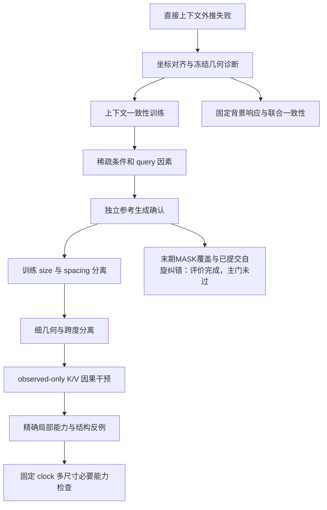
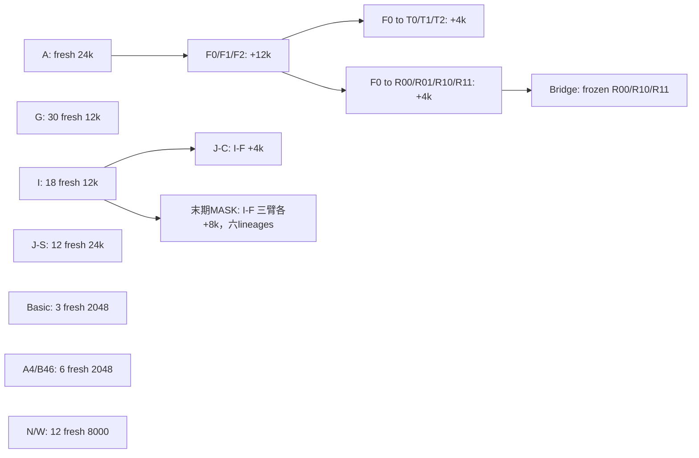

# 研究证据地图 · Critical Ising conditional geometry

本项目问：**一个 masked conditional 网络能否利用真实物理坐标，在训练未覆盖的观测布局和上下文尺寸上做准确推断；这种条件能力是否足以带来正确的联合生成？**

临界二维 Ising 同时有已知物理结构、长程关联和可独立采样的参考分布，适合把“局部预测变好”与“整个分布正确”分开检验。它是静态平衡体系，**不是 world model 验证**。最初的 dense、多 block size、真实 spacing 训练构想在此被拆成可检验的小问题；模型、统计门和后续精确局部任务是本项目的具体操作化，不等同于老师完整 idea。

**先看两轮：**[Size × spacing factorial](size-spacing-factorial/README.md) 是最完整的物理因素对照；[固定 clock 尺寸泛化](canonical-context-size-generalization/README.md) 是精确真值的必要能力检查。两者都有重要负结果。

**10月1日新增：**[末期MASK覆盖与已提交自旋纠错](late-mask-coverage-and-committed-spin-correction/README.md) 已完成18条续训分支和全部正式评价；**P1/P2主门均未过，W96局部/stress能力仍失败**，三项旧CE保留通过。

## 30 秒结论

| 当前证据 | 可以说 | 不能说 |
|---|---|---|
| 强正证据：G 的 H1/H2 | 配对 fresh 训练中，真实 spacing 多样性与 size 覆盖分别改善指定条件任务 | 任意任务都协同，或学得尺度不变性 |
| 强但局部的正证据：最新 N/W | 固定 clock 的宽尺寸训练把主平均精确 KL 从 0.092391 降到 0.009247 | 绝对准确性已解决：W **0/6** seed 通过最坏误差门 |
| 负/未决：G-H3、I-P1、J、Bridge | 原定完整门未通过；某些方向性或次要结果仍有价值 | “不显著”就是等效，或老师整体 idea 错误 |
| 条件—联合缺口 | 条件 CE、顺序一致性、生成关联与能量可发生 tradeoff | 条件改善自动证明正确 joint distribution |

## 实验全景（状态指科学门，不是文件有没有生成）

| 日期 | 科学问题 / 入口 | 训练身份 | 主队列新评价参考 / 新生成 | 主结果与状态 |
|---|---|---|---|---|
| 09-21 | [几何对齐条件学习](geometry-aligned-conditioning/README.md) · A/B/C | 18 fresh，6 配对 seed | 512 MC / 16,128 图 | 两任务排序反转；无普遍真实坐标优势 |
| 09-22 | [上下文一致性续训](context-consistency-training/README.md) · F | 18 continuation，继承六 A | 1,024 MC / 46,080 图 | F2−F1 主生成指标区间跨 0 |
| 09-23 | [固定背景几何响应](fixed-background-geometry-response/README.md) | 36 frozen | 复用 F MC / 0 | 真实几何响应明显；联合/顺序一致性未解决（诊断） |
| 09-23 | [稀疏条件续训](sparse-conditioning-training/README.md) · T | 18 continuation，自 F0 | 1,024 MC / 5,760 图 | 两主指标及保留门通过；顺序 TV 变差 |
| 09-24 | [mask × query factorial](mask-query-factorial/README.md) · R | 24 continuation，自 F0，非 T | 1,024 MC / 5,376 图 | KL 改善；校正后的生成主门未通过 |
| 09-24 | [独立参考生成确认](independent-generation-bridge/README.md) | 18 frozen R | 2,048 MC / 4,032 图 | 两个完整不确定性区间跨 0 |
| 09-25 | [size × spacing factorial](size-spacing-factorial/README.md) · G | 30 fresh，6×5 | 1,024 MC / 1,920 图 | H1/H2 通过；H3 未通过且非等效 |
| 09-26 | [细几何识别](fine-geometry-identification/README.md) · I | 18 fresh，6×3 | 2,048 MC / 2,304 图 | P2 实质门通过，P1 仅方向；合取门失败 |
| 09-27 | [observed-only K/V 干预](observed-key-value-intervention/README.md) · J | C:12 continued；S:12 fresh | 4,096 MC / 0 | S 唯一主门失败；局部能力门也失败 |
| 09-28 | [精确局部能力](exact-local-capability/README.md) | 3 fresh D + 结构/冻结诊断 | 精确枚举 / 0 | 4×4 raw 能力通过；扩容失败；O 有结构盲点 |
| 09-28 | [局部上下文尺寸对照](local-context-size-diagnostic/README.md) · A4/B46 | 6 fresh + 旧 D 冻结诊断 | 精确真值 / 0 | 固定 clock 相对改善；12×12 绝对门 0/3 |
| 09-30 | [固定 clock 尺寸泛化](canonical-context-size-generalization/README.md) · N/W | 12 fresh，6 对 | 精确 G8 / 0 | 实质差门通过；W 绝对门 0/6，完整门失败 |
| 10-01 | [末期MASK覆盖与已提交自旋纠错](late-mask-coverage-and-committed-spin-correction/README.md) · A/L/E | 18 continuation，自六 I-F | **2048 MC / 6912正式图** | P1/P2主门未过，W96局部/stress失败；三CE保留通过 |

上表生成数指各 campaign 的正式主队列，不把附属诊断累加成训练复现：A/B/C 的 D 诊断另有 4,992 张新生成图；F 的两 seed 扩容筛选单列于其开发分支，不混入六 seed 主统计。

[12h size × clock](preflights/size-clock-factorial/README.md) 只有预检和预算停止，**不计入13个已完成campaign**。D/E 归入 A/B/C 的冻结诊断；F 的两 seed 扩容筛选归入开发分支，避免把每个脚本当作独立确认性实验。全标识见 [registry.json](registry.json)。

## 问题如何演进

箭头表示**研究动机**，不是自动表示权重继承。真正的权重谱系是：

F/R/T 六条原始训练 lineage 不能在跨轮汇总时当成独立的 18 或 24 次从零复现。**新 evaluation ≠ 新 training replication；sampling seeds ≠ training seeds。**

## 从这里阅读

- [历史更正](CORRECTIONS.md)：错误坐标对照、旧 GO、模型/数据继承、失败预算及解释修正。
- [复现层级与命令](REPRODUCING.md)：先做无训练的数值重放；全训练需要哪些额外输入。
- [数据可用性](DATA_AVAILABILITY.md)：什么已经公开、什么仍在保管者的备份中、怎样按 SHA 请求。
- [公共综合报告](REPORT_ZH.md)：把各 campaign 的设计、主结果、反例和边界串起来；不是私人通信/原 PDF 的原样上传。
- [归档方案](../ARCHIVE_PLAN.md)、[来源清单](source-manifest.json)、[公开载荷范围](publication-allowlist.json)。
- [陌生读者测试与核查范围](NEWCOMER_TEST.md)：14个阅读问题、视觉与数值检查，以及尚未验证的部分。
- 早期已发布基线：[L64](../artifacts/final_l64/final_summary.json)、[L128](../artifacts/final_l128_zero_shot/final_summary.json)、[Stage2](../results/scale_aware_context/README.md)；阅读 Stage2 前先看更正页，旧 GO 标识不再是当前结论。

## 当前边界与下一问

尚未建立：任意真实距离泛化、普遍 fine-geometry 实质增益、完整联合分布正确性、动态 world model 或 RG 等变性。当前最值得区分的是：精确训练/验证模式已经学好时，哪些未见边界排列在扩容后仍产生大误差，以及这种尾部错误来自表示/聚合还是尚不充分的学习。这里是后续问题，不是新实验授权或已经得到的机制结论。

最新末期少MASK覆盖与已提交自旋纠错已经完成固定checkpoint的条件/生成评价：P1/P2的完整联合区间均跨0，P2能量改善不能替代长程主门。它不使用N/W权重，也不改判上表历史检验；384张phase0及R-prefix/oracle各3456条不计作新训练重复。
