# 临界Ising近期研究：公共综合报告

2026-09-30公共科研归档版。完整研究地图、独立实验与冻结诊断的区别、所有主失败及数据边界见[总索引](README.md)。

## 编辑说明与谱系

本报告把12个campaign及一个未启动预检的科学说明汇编为一份可独立阅读的公开版本，
依据本地162页总报告、协议、实际配置、机器结果及核验记录重新校对。它**不是**原PDF/Markdown的逐字公开副本。
私人通信/截图、连接凭据及机器登录信息不公开；科学构想以独立叙述表达。
原本地Markdown SHA-256：`c66eb2da796c90385841f60219426516f46c9d0a87b3372568f0c14f1223cf4d`。原件保持不变。
本次编辑还区分了F原始点估计和bootstrap分布均值，并以实际数组/记录校正统计重复数。
历史更正不改写原结果，集中见[CORRECTIONS](CORRECTIONS.md)。

早期背景：L64冻结采样器修正后仍需跨尺寸验证；L128长程相关过强；
Stage2B错误unit-coordinate对照与旧GO需要更正，不能把早期筛选当多seed确认。
后续研究因此逐步从条件利用几何、上下文一致性、生成确认，转向训练size/spacing和精确局部必要能力。

## 几何对齐条件学习与冻结诊断

Historical aliases: **A/B/C，D/E诊断** · ID `geometry_alignment_20260921` · 2026-09-21

**Question:** 真实物理坐标是否比 rank 或错误坐标更有助于稀疏条件外推？**Design:** 六seed三组fresh训练，随后在冻结模型上诊断。**Main result:** 任务之间排序反转；没有普遍真实坐标优势。**Status:** 完成，结论限定于具体任务。

| 臂 | 唯一坐标差异 | 共同控制 | 训练 |
|---|---|---|---|
| A | 逐样本真实物理坐标 | 同seed初始化、物理data、mask、augmentation配对 | fresh 24k |
| B | unit/rank坐标，丢失真实间距 | 同上 | fresh 24k |
| C | 独立错误坐标流 | 同上；C坐标RNG独立 | fresh 24k |

| 预定条件任务 | A CE | B CE | C CE | 阅读方式 |
|---|---:|---:|---:|---|
| W32 held gaps5/7 | .499457 | .506381 | .507590 | A较好 |
| W48 stride10 | .543789 | .536529 | .540909 | **A反而最差** |
| 两任务宏平均 | .521623 | .521455 | .524249 | A−B六seed三正三负 |

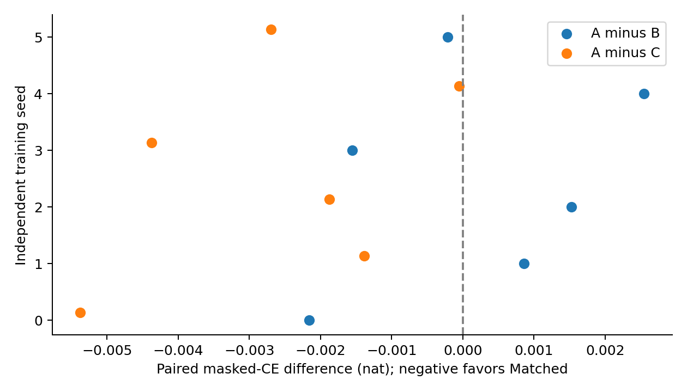

[primary_metrics.csv](geometry-aligned-conditioning/evidence/primary_metrics.csv)、[paired_seed_effects.csv](geometry-aligned-conditioning/evidence/paired_seed_effects.csv)与18份complete记录给出数值；[原分析/绘图](../scripts/research20260921/evaluate_study.py)。图中点不是独立MC父场，表中宏平均不能掩盖任务反转；不事后选择一个任务宣布全局胜利。

### 数据、模型、统计

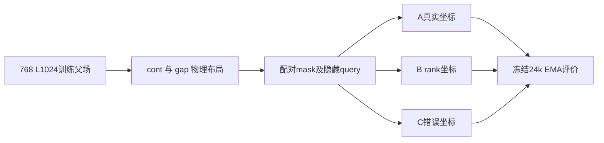

seed91001–91006；dense 1,976,706参数（d128/4头/7块/MLP4、RoPE10000、dropout0）。W16/24/32/48，continuous与gap1/2/4/8等权8周期；18,432token/update，对应batch72/32/18/8。AdamW(.9,.95)、wd.05、clip1、EMA.999；1000warmup到3e−4后余弦到3e−5；masked CE/t，t均匀.01–1，2%全MASK；final EMA，无checkpoint选择。训练768/验证256父场按MC链拆分。

新评价MC seed20260922，4链×128=512，burn40/间隔4；条件任务共享父场、四个t(.2/.5/.8/.95)及两个mask重复。query/mask嵌套于父场，只有六个训练seed，512×query不是更多训练复现。逐seed效应优先；早期区间的具体重抽层级以冻结协议为准，不追认为后来G/I的更大层级设计。

生成每模型896图、共16,128图：cont48=128/64=256/96=128、heldgap32=256、stride10W48=128，S0 cosine²256步、T1、无MC校正。条件CE不等于生成质量；生成长程误差仍大。约7.842h实测完成；这不是后续fine-geometry确认轮。

### D/E 为什么归在这里

| 冻结诊断 | 新训练 / 新MC | 操作 | 解释边界 |
|---|---|---|---|
| D context/joint | 0 / 0 | 单可见点、teacher forcing、3×3 cavity、采样步数；新增4,992图 | 新采样不是新模型复制 |
| E mechanism | 0 / 0 | 990 context、306 frequency、1620 information单元，144attention记录 | 局部频率响应不唯一识别RoPE机制 |

D中A的3×3顺序KL约.00918，row-parallel约.10780、all-parallel约.23704；对应独立因子基线约.09667/.22251。**局部顺序能力不能推成完整图正确性或“信息利用百分比”。** E改变背景MASK、clock和频率，发现输入依赖但不证明哪一个是唯一原因。它们使用旧权重、旧参考，是本campaign的解释性诊断，不是18模型的再次训练复现。原CSV、协议和三图分别在 [D](geometry-aligned-conditioning/diagnostics/context-joint) 与 [E](geometry-aligned-conditioning/diagnostics/mechanism)。

**支持：**模型在部分布局使用几何。**不支持：**真实坐标普遍胜出、正确联合分布、尺度不变或动态世界模型。

### 证据、参数与可用性

[完整机器证据与协议索引](geometry-aligned-conditioning/EVIDENCE.md) · [逐文件来源/编辑SHA](geometry-aligned-conditioning/provenance.json) · [科学路径及未公开材料](geometry-aligned-conditioning/withheld-manifest.json) · [本地核验回执](geometry-aligned-conditioning/backup-verification.json)。

公开仓库不包含所有checkpoint、MC父场或bulk generation；从权重重跑与核对统计是不同复现层级。请先读[数据可用性](DATA_AVAILABILITY.md)和[复现说明](REPRODUCING.md)。

[返回研究证据地图](README.md)。

---

## 上下文一致性续训

Historical alias: **F**；两seed容量筛选为开发诊断 · ID `adaptive_research_20260922` · 2026-09-22

**Question:** 惩罚全上下文/子上下文预测差异，能否把条件一致性转化为更好的长程生成？**Design:** 六个A旧checkpoint各分三支。**Main result:** 一致性改善但主生成收益未确认；个别条件任务恶化。**Status:** 完成、主门未通过。

| 分支 | 改变什么 | 起点及共同控制 |
|---|---|---|
| F0 | full-context query CE | 同一A24k，完整恢复，追加12k到36k |
| F1 | .5 full CE + .5 subset CE | 同物理样本、mask、query及训练预算 |
| F2 | F1 + symmetric JS，λ16 | 同上；子集保留visible/query，移除部分未观测上下文 |

| 预定义结果 | 实测 | 判定 |
|---|---|---|
| 主J：三长程任务NRMSE等权；F2−F1 | −.006257，95% [−.033096,+.020535] | 未确认收益 |
| J各组均值 | F0 .219861，F1 .225078，F2 .218821 | 小均值差不代替区间 |
| stride10条件CE（次要）F2−F1 | +.001368，95% [.000796,.002037] | **恶化** |

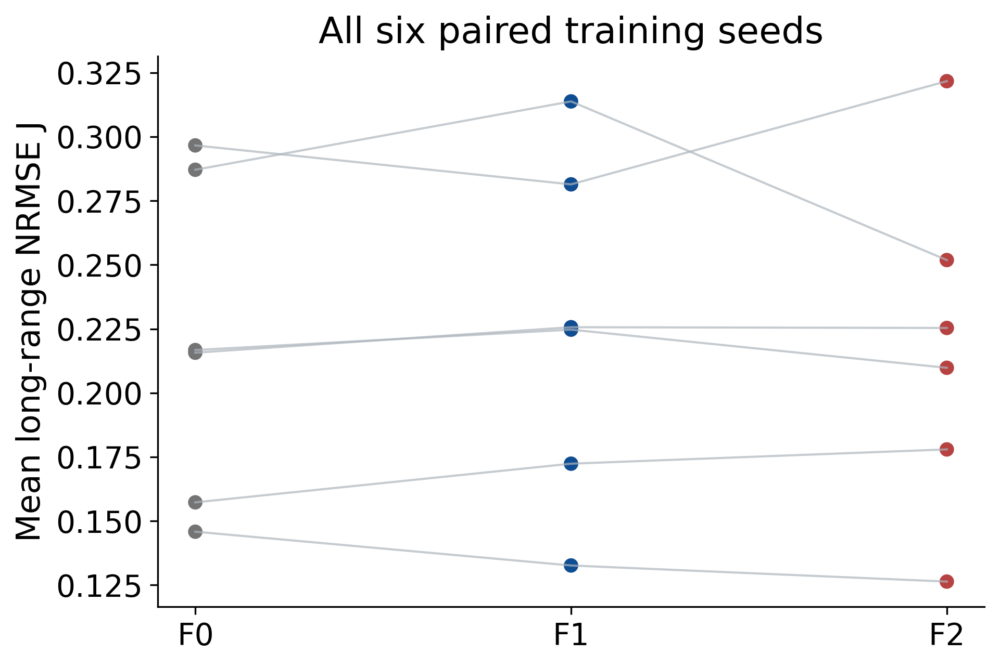

[交叉不确定性结果](context-consistency-training/evidence/final_analysis/crossed_uncertainty.json)、[绘图数据](context-consistency-training/evidence/final_analysis/figures/curve_bands.json)及[分析/绘图代码](../scripts/research20260921/finalize_adaptive_campaign.py)。主J由W96的r25–48、heldgap5/7与stride10的r≥129三段定义，不事后调整distance band。

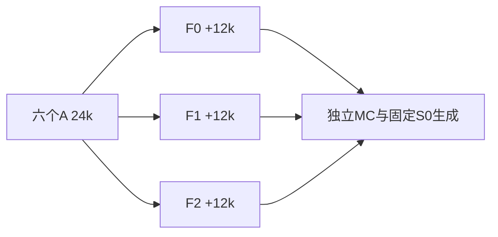

### 参数与统计

原1,976,706参数dense、RoPE10000、dropout0；BF16/FP32 loss，AdamW(.9,.95)、wd.05、clip1、EMA.999。续训warm400，lr3e−5→1e−4→3e−5。18,432基础token/update，六seed91001–6，1000步块交错；F1/F2额外前向，**不能称FLOPs相同**。子集比例.125/.25/.5/.75/1，保留共同64query，λ只以训练梯度标定（比例约.129），不是测试调参；固定36k EMA。

继承训练父池，评价新8链×128=1024MC；7生成任务每模型2560，共46,080图/2880shards，固定S0 256、T1。六训练lineage×MC链/父场时间块×生成16图shard交叉bootstrap，实际主块8的2000次，块4/16各1000；query/crop不是独立seed。区间原记录注明小簇数下探索性，不宣称跨任务同时覆盖。另有96条on-policy轨迹诊断，只解释失败，不改主判断。

数值口径：表的−.006257来自[原始配对点估计](context-consistency-training/evidence/main_summary.json)；bootstrap摘要`F2_minus_F1_mean`约−.005385是重抽分布均值，不是换了实验结果。公开归档明确区分二者，并纠正旧叙述的末位舍入与重复数口径。

### 开发筛选与负结果

先用两seed把d128/4头改为d192/6头（7块，4,439,170参数，fresh24k），J从.2863→.3082、.2513→.3256变差，因此其余四seed没启动，保留小模型。**这不是六seed容量确认，也不混入F主统计。** 记录在 [capacity](context-consistency-training/evidence/capacity)。

F2改善模型自身上下文一致性，但自洽不等于准确，生成主CI跨0且部分CE变差。实际约13.493h；18续训分支继承六A lineages，不能和A当作独立训练总体合并。本轮不支持“正则化已修复joint分布”。

### 证据、参数与可用性

[完整机器证据与协议索引](context-consistency-training/EVIDENCE.md) · [逐文件来源/编辑SHA](context-consistency-training/provenance.json) · [科学路径及未公开材料](context-consistency-training/withheld-manifest.json) · [本地核验回执](context-consistency-training/backup-verification.json)。

公开仓库不包含所有checkpoint、MC父场或bulk generation；从权重重跑与核对统计是不同复现层级。请先读[数据可用性](DATA_AVAILABILITY.md)和[复现说明](REPRODUCING.md)。

[返回研究证据地图](README.md)。

---

## 固定背景的几何响应与联合一致性

Historical identifier `fixed_geometry_joint_20260923` · 2026-09-23 · **冻结诊断，不是训练轮**

**Question:** 在固定spin、观测信息量、query和跨度后，只改变可见点与坐标的对应关系，模型能否跟随MC条件真值？模型自己的顺序一致性与准确性是否一致？

**Design:** A/B/C与F0/F1/F2共36个冻结checkpoint、六原始lineage；复用F的1024MC。新训练=0、新MC=0、新生成=0。**Result:** A明显利用真实几何，但更大上下文与joint/order一致性仍有缺口；这是诊断证据，不升级为新确认性复现。

| 对照 | 保持什么 | 改变什么 |
|---|---|---|
| 不等gap布局对 | 坐标集合、spin、多重集、query、clock、总span | visible spin的物理位置对应 |
| A/B/C | 任务与参考相同 | 原训练坐标语义 |
| F0/F1/F2 | 六A lineage继承 | 已完成的一致性续训配方 |

| 诊断结果（95%探索区间） | 数值 | 解释 |
|---|---|---|
| A−B 几何响应RMSE | −.28128 [−.29487,−.26418] | A更接近真实响应 |
| A−C 几何响应RMSE | −.33775 [−.35503,−.31911] | 同上 |
| A响应gain | cont48约.867，W96约.240 | 大上下文响应衰减 |
| F2−F1 W96 sequential KL | −.06101 [−.08360,−.04347] | 准确性改善 |
| 同对比 order TV | +.01707 [.01023,.02562] | **顺序一致性恶化** |

[point_estimates.json](fixed-background-geometry-response/evidence/analysis/point_estimates.json)、[crossed_uncertainty.json](fixed-background-geometry-response/evidence/analysis/crossed_uncertainty.json)、[plot_data.npz](fixed-background-geometry-response/evidence/analysis/plot_data.npz)；[分析/作图](../scripts/research20260921/analyze_fixed_geometry_joint_20260923.py)。

112 cases×20输入×36模型=80,640预测，含20个不等gap几何对；参考零场翻转对称化。两query joint KL是有限MC局部表上的比较，不是完整图的精确joint NLL。六seed和8链独立重抽，链内块8、1000次，块4/16各500；256平移及query嵌套于父场，不是新增独立样本。无预注册family-wise成功门，所有诊断区间保持探索性标签。

冻结网络均1,976,706参数；A/B/C24k、F36k EMA，未改权重、优化器或sampling设置。约16m11s完成。该实验有独立“控制背景后几何响应”的科学问题，故独立目录；它仍然**不是新的训练重复**。不能把response gain解释为普遍信息利用率，不能把低顺序TV等同于准确分布。

### 证据、参数与可用性

[完整机器证据与协议索引](fixed-background-geometry-response/EVIDENCE.md) · [逐文件来源/编辑SHA](fixed-background-geometry-response/provenance.json) · [科学路径及未公开材料](fixed-background-geometry-response/withheld-manifest.json) · [本地核验回执](fixed-background-geometry-response/backup-verification.json)。

公开仓库不包含所有checkpoint、MC父场或bulk generation；从权重重跑与核对统计是不同复现层级。请先读[数据可用性](DATA_AVAILABILITY.md)和[复现说明](REPRODUCING.md)。

[返回研究证据地图](README.md)。

---

## 稀疏条件训练

Historical alias **T0/T1/T2** · ID `sparse_conditioning_20260923` · 2026-09-23

**Question:** 普通遮盖训练是否缺少低K条件能力；补充稀疏任务能否同时改善局部joint和长程生成？**Design:** 六F0-36k checkpoint各分三支，追加4k到40k。**Main result:** T1相对T0的两主指标和保留门通过；order TV仍恶化。**Status:** 有限预定任务通过，不是联合分布已正确。

| 臂 | 75%共同普通目标 | 25%辅助目标 | 模型身份 |
|---|---|---|---|
| T0 | 普通masked CE/t | 另一普通CE/t | 同F0完整恢复+4k |
| T1 | 同左 | K=1/2/4/8/16/32，hard labels，32near+32uniform查询 | 同上 |
| T2 | 同左 | K≤2用训练池LOCO soft physics，其余同T1 | 同上；评价MC不用于标签 |

| 预定义主比较 T1−T0 | 效应及95%CI | 原判定 |
|---|---|---|
| W128 sequential KL | −.161660 [−.188394,−.135402] | 通过 |
| W128 G49–64 NRMSE | −.224743 [−.299697,−.099112] | 通过 |
| 保留任务 | 原门通过 | 不以其他任务代替 |
| order TV（次要） | +.014905 [.012331,.017206] | **变差** |

[完整统计](sparse-conditioning-training/evidence/analysis/crossed_uncertainty.json)、[plot_data](sparse-conditioning-training/evidence/analysis/plot_data.npz)与[分析代码](../scripts/research20260921/finalize_sparse_conditioning_20260923.py)。CE仍不是精确KL，表中局部sequential KL依赖MC局部参考表。

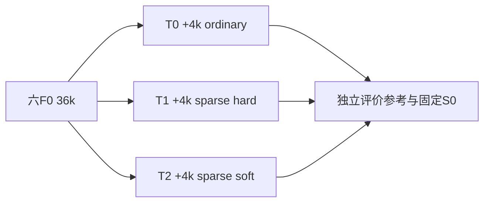

### 重建设置

dense1,976,706参数，d128/4头/7块、RoPE10000、dropout0，AdamW(.9,.95)、wd.05、clip1、EMA.999，固定final EMA。六lineage91001–6，W24/48/96、batch16/4/1；每更新两个9216token前向，合18,432。continuation lr与完整恢复状态以[实际run_protocol](sparse-conditioning-training/evidence/run_protocol.json)及冻结训练代码为准，不重新初始化优化器。

新评价MC seed2026092401，8链×128=1024，116cases×2clock、6个bank。生成每模型W128=128，W96/W48/stride10各64，共320；18模型5,760图/360个16图shard。主交叉重抽包含六训练seed、MC链/时间块和生成shard：块8的1000次，块4/16各500；query和平移不是独立seed。

### 负结果与历史

T2没有稳定额外收益；joint风险改善不保证order TV改善。训练预算固定4k，没有为结果延长。初稿更多生成任务在正式启动前因16.41h预测改为上述冻结范围；不是事后丢弃坏结果。实测约7.799h，839/839必需科学路径本地覆盖。

这里T0/T1/T2是9月稀疏续训，**不是早期L64采样器的T0/T3**。后续R和Bridge的失败不会抹去这轮通过，但说明生成收益跨设计/参考并非必然稳定。18分支仍继承六训练lineage。

### 证据、参数与可用性

[完整机器证据与协议索引](sparse-conditioning-training/EVIDENCE.md) · [逐文件来源/编辑SHA](sparse-conditioning-training/provenance.json) · [科学路径及未公开材料](sparse-conditioning-training/withheld-manifest.json) · [本地核验回执](sparse-conditioning-training/backup-verification.json)。

公开仓库不包含所有checkpoint、MC父场或bulk generation；从权重重跑与核对统计是不同复现层级。请先读[数据可用性](DATA_AVAILABILITY.md)和[复现说明](REPRODUCING.md)。

[返回研究证据地图](README.md)。

---

## Sparse mask × query-placement factorial

Historical alias **R00/R01/R10/R11** · ID `mask_query_factorial_20260924` · 2026-09-24

**Question:** 上轮收益来自稀疏mask还是near-query，二者是否交互？**Design:** 六F0-36k基座×2×2，追加4k。**Main result:** KL获益但原多重比较校正后的生成门未过。**Status:** 完成，合取主门失败。

| 臂 | 辅助mask | 辅助query | 共同控制 |
|---|---|---|---|
| R00 | ordinary | uniform | 同F0、完整raw/EMA/AdamW/RNG恢复、+4k到40k |
| R01 | ordinary | near | 同上 |
| R10 | sparse K | uniform | 同上 |
| R11 | sparse K | near | 同上 |

R从F0分支，**不从T的40k接着训练**；使用新训练流。所有R辅助CE不除以t，不能把R00当T0的逐位复现。物理训练流/初始化按seed配对；64查询槽在隐藏点不足时可重复，重复不增加独立样本。

| 预定义主比较 | 局部sequential KL差，98.75%CI | W128 G49–64 NRMSE差，98.75%CI | 合取 |
|---|---|---|---|
| R10−R00：sparse效应 | −.156301 [−.182838,−.133513] | −.196626 [−.372084,+.012976] | **未通过** |
| R11−R10：near-query增量 | −.014932 [−.024146,−.005470] | +.000797 [−.090677,+.076985] | **未通过** |

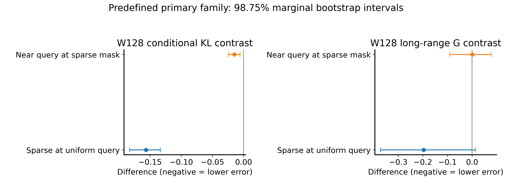

[完整交叉统计](mask-query-factorial/evidence/analysis/crossed_uncertainty.json)、[原图数据](mask-query-factorial/evidence/analysis/plot_data.npz)、[分析代码](../scripts/research20260921/finalize_mask_query_factorial_20260924.py)。四主比较采用98.75%区间；R10生成的95%更乐观也不能替换原门。

### 设置与独立单位

1,976,706参数dense、128/4/7、RoPE10000、dropout0，AdamW(.9,.95)、wd.05、clip1、EMA.999；固定4k追加、18,432token/update，普通/辅助训练结构和lr详见[实际协议](mask-query-factorial/evidence/run_protocol.json)及源码。不能按validation选checkpoint。

新参考seed2026092411，8×128=1024父场；每模型W12896图、cont48及stride10各64，共224，24模型5,376图/336shard；**无W96生成**。S0cos²256/T1/noMC correction。六训练seed×MC链/父场时间块×16图shard，主块8的4000次、块4/16各1000。mask/query嵌套不增加seed。保留门通过，order一致性不全改善。

实测约9.292h，888/888必需路径本地核验；重复last与明示scratch权重排除，不排除正式final。结论是稀疏目标有局部准确性证据，生成确认仍未达原门；不能以条件结果宣称完整联合生成改善。

### 证据、参数与可用性

[完整机器证据与协议索引](mask-query-factorial/EVIDENCE.md) · [逐文件来源/编辑SHA](mask-query-factorial/provenance.json) · [科学路径及未公开材料](mask-query-factorial/withheld-manifest.json) · [本地核验回执](mask-query-factorial/backup-verification.json)。

公开仓库不包含所有checkpoint、MC父场或bulk generation；从权重重跑与核对统计是不同复现层级。请先读[数据可用性](DATA_AVAILABILITY.md)和[复现说明](REPRODUCING.md)。

[返回研究证据地图](README.md)。

---

## 独立参考下的生成确认

Historical alias **Bridge** · ID `generation_bridge_20260924` · 2026-09-24

**Question:** R中有利的生成点估计，换独立MC参考并增加配对生成样本后能否确认？**Design:** 冻结R00/R10/R11的18个40k模型；不训练。**Main result:** 两个完整区间均跨0。**Status:** 确认门失败；不是再训练失败。

| 部分 | 模型 | 参考 / RNG | 角色 |
|---|---|---|---|
| A：条件覆盖 | 原R frozen | 复用旧R MC，33banks×42conditions/model | 探索性任务地图 |
| B：生成确认 | 同18 frozen | 新MC2026092441；新配对采样RNG | 预定义确认，不能并入旧图增加样本 |

| 主W128 G49–64 NRMSE | 效应 | 原98.75%联合CI | 判定 |
|---|---:|---|---|
| R10−R00 | −.165002 | [−.373930,+.054615] | 未通过 |
| R11−R10 | −.020991 | [−.102467,+.055739] | 未通过 |

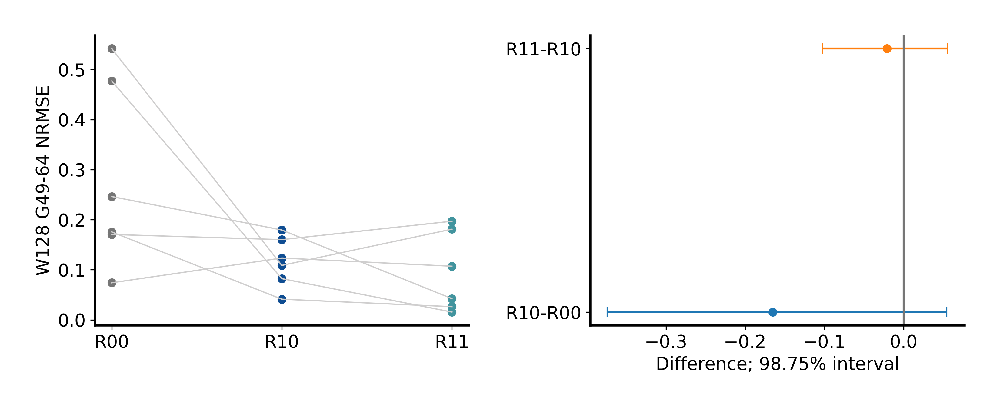

[generation_uncertainty.json](independent-generation-bridge/evidence/analysis/generation_uncertainty.json)、[generation_point.npz](independent-generation-bridge/evidence/analysis/generation_point.npz)、[分析及作图](../scripts/research20260921/run_generation_bridge_20260924.py)。fixed-model区间可能为负，但主推断还包含训练seed不确定性，不能换区间宣布成功。

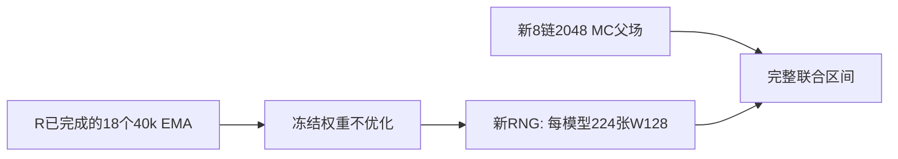

每模型224张W128，共4,032图/252×16shards；S0cos²256、T1、无MC校正。新MC8链×256=2048，固定burn/spacing/QA；原模型结构仍dense1,976,706参数，原训练步数40k，优化器在此**不运行**。

主层级：六原训练lineage×MC链/时间块×图shard；块8的2000次，块4/16各1000；fixed-model、seed-only、MC-only、sampling-only各1000为分解。探索条件部分每bank64父场（8链×8）、64query、块2的2000次/95%点区间；不是主family检验。

实测约6.791h，1182/1182科学路径本地覆盖。新参考和新sampling RNG增强对旧权重的评价，**不会把六training lineages变成十二**。有利点估计仍应保留，但不能说生成收益已独立训练复现，也不能把较低NRMSE说成正确分布。

### 证据、参数与可用性

[完整机器证据与协议索引](independent-generation-bridge/EVIDENCE.md) · [逐文件来源/编辑SHA](independent-generation-bridge/provenance.json) · [科学路径及未公开材料](independent-generation-bridge/withheld-manifest.json) · [本地核验回执](independent-generation-bridge/backup-verification.json)。

公开仓库不包含所有checkpoint、MC父场或bulk generation；从权重重跑与核对统计是不同复现层级。请先读[数据可用性](DATA_AVAILABILITY.md)和[复现说明](REPRODUCING.md)。

[返回研究证据地图](README.md)。

---

## Size × physical-spacing factorial

Historical alias: **G** · ID `core_geometry_factorial_20260925` · 2026-09-25

**Question:** 训练时增加容器尺寸或真实物理间距覆盖，分别是否改善条件外推？细间距排列在保留总跨度后还贡献多少？

**Design:** 六个新 seed × 五组，同结构、12k 更新。**Main result:** H1/H2 通过原门；H3 未通过。**Status:** 计算与本地核验完成，但不是三主假设全部成功。

### 先看预定义主结果

负值有利于 G11；单位为 conditional CE 的 nats/query，**不是 joint NLL 或精确 KL**。每个主任务先等权平均 K=2/32/512。

| 主假设 | 真正改变的变量 / 任务 | 均值差 | 原定 98.333333% CI | 实质门：上界 < −0.002 |
|---|---|---:|---|---|
| H1: G11−G10 | 同多尺寸训练，加入真实 spacing；W48 held gaps | −0.066041 | [−0.080240, −0.054136] | **通过** |
| H2: G11−G01 | 同 spacing 多样性，加入 size 覆盖；W96 continuous | −0.008908 | [−0.011889, −0.005704] | **通过** |
| H3: G11−G11S | 同物理数据/跨度，保留细间距排列；W48 held gaps | −0.001163 | [−0.002792, +0.000238] | **未通过**，方向亦未确认 |

图直接复用正式分析；竖线为 0 与 −0.002。来源：[crossed_uncertainty.json](size-spacing-factorial/evidence/analysis/crossed_uncertainty.json)、[conditional_point.npz](size-spacing-factorial/evidence/analysis/conditional_point.npz)、[主 bootstrap 原数组提取](size-spacing-factorial/evidence/analysis/conditional_bootstrap_block2_primary_projection.npz)；绘图：[core_geometry_factorial_analysis.py](../scripts/research20260921/core_geometry_factorial_analysis.py)。提取只去掉大型 `arm_means`，不重新抽样、不改主数组。

H3 不是“证明细几何无用”：区间既跨 0，也越过 −0.002，未落入等效区间。六 seed 的点差均为负、另一个配对 t 分析更乐观，**不能替换原定同时包含 MC 不确定性的主区间**。

### 为什么需要 2×2 和第五组

| 臂 | 训练有效边长 W | 物理采样间距 | 输入坐标 | fresh / 参数 / 更新 |
|---|---|---|---|---|
| G00 | 48 | continuous | 真实坐标 | fresh / 1,976,706 / 12k |
| G10 | 16/24/32/48 | continuous | 真实坐标 | 同上 |
| G01 | 48 | continuous + 非均匀 gaps | 真实坐标 | 同上 |
| G11 | 16/24/32/48 | continuous + 非均匀 gaps | 逐样本真实坐标 | 同上 |
| G11S | 与 G11 相同 | **同一份 G11 物理 spin/data 流** | 保留总跨度，内部均匀化 | 同上 |

G11−G10 隔离 spacing 覆盖；G11−G01 隔离 size 覆盖；2×2 interaction 问二者是否协同。第五组不属于完整 2×2：它检验给定同样物理观测后，网络是否使用**细排列**而不只是总跨度。

对长度 W 的坐标轴，span-only 定义为 $x_i=i(x_{W-1}-x_0)/(W-1)$。unit/rank 坐标则是 $x_i=i$；非连续布局中二者不同，不能把 G11S 写成 unit-coordinate baseline。两组 continuous 时输入自然相同。

六 seed 为 92501–92506；同 seed 五组初始化配对，训练更新数/监督配方配对；**五组并不共享完全相同物理训练数据**，因为 size/spacing 本身是干预。只有 G11/G11S 的完整物理数据、mask、query、t 配对。

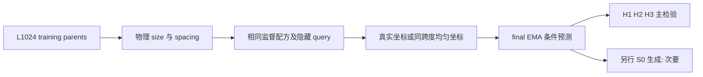

### 训练与数据身份

原 dense：d128、4 heads、7 blocks、MLP×4、2D RoPE base10000、dropout0，valid MASK 参加 attention，PAD 不参加。AdamW(.9,.95)、wd.05、clip1、EMA.999；750 步 warmup 到 3e−4，余弦到 3e−5。BF16 训练、FP32 loss/evaluation；每更新18,432 token；32周期75%普通/25%稀疏，稀疏更新总512隐藏 query 槽。4k/8k EMA 用于学习诊断，**固定12k final EMA**决定结果，不挑 checkpoint。

训练池继承 L1024 的 768 个训练父场与独立256验证父场。评价新 MC seed2026092511，8链×128=1024父场，4 random/2 plus/2 minus 初始化；参考不回流训练。固定 Wolff burn40、间隔4及协议 QA，不采到通过。

30个条件 bank = 6几何×5K，128父场/bank（每链16个，原序列间隔8），每父场64隐藏 query；共900预测单元。训练 gap 多重集使用1/2/4/8，held 使用3/6，按冻结整数计数构造跨度；完整定义见协议与代码，不能把“W96”误作相同物理跨度。

### 误差条来自哪里

六配对训练 seed 与8条 MC链独立重抽；链内按选定父场时间顺序块长2，主20,000次。块长1/4、seed-only、MC-only各10,000次为敏感性。三个主区间采用 Bonferroni 98.333333%；query、K和crop不是独立训练重复。两个 continuous 保留门各97.5%上界≤+.005，均通过。无预设 learning-incomplete 标记，但这不是收敛证明。

### 次要结果：明确的反例和 tradeoff

| 结果 | 观察 | 不允许的改写 |
|---|---|---|
| **W96 held-gap 反例** | G01平均CE 0.597356 < G11 0.600037 | 多尺寸×多间距在所有任务协同 |
| held-gap W96 interaction | +0.003072，95% [+.000368,+.006038] | 用 continuous W96 的有利 interaction 代替它 |
| continuous W96 interaction | −0.008583，方向有利 | 任意尺度上的一致协同 |
| W96生成 G25–48 NRMSE | G00 .962560；G10 .757280；G01 .759949；G11 .305383；G11S .598294 | 更低 NRMSE = 正确分布 |
| G11−G11S 生成差 | −.292911，95% [−.425566,−.155013] | 重新判定条件 H3 通过 |
| 物理 tradeoff | G11 signed m bias −.042960，energy bias +.036703；G00/G10 energy约+.005794/+.005615 | 所有指标越小越好；忽略偏差目标为0 |

生成是每模型64张W96，共1,920图/120 shards，S0 cosine-squared 256步、温度1、无MC校正；三臂对比的图级 RNG 配对。生成 bootstrap 包含训练 seed、MC链/时间块和16图shard，不把1,920图当1,920训练重复。**没有 W128 生成实验。** 数值见 [paired_contrasts.csv](size-spacing-factorial/evidence/analysis/paired_contrasts.csv)、[generation_point.npz](size-spacing-factorial/evidence/analysis/generation_point.npz) 与原统计 JSON。

### 历史与结论边界

最初10h预算门没有通过，后续12h执行窗口有显式版本/授权；不是隐藏改样本量。正式计算约7.428h、含预检预算约7.731h，本地科学备份1459/1459路径核验；见公开 provenance/备份记录。G 后还有 I/J/精确局部实验，**G 是重要 factorial，不是时间上最新一轮**。

支持：指定条件任务中 size 与真实 spacing 训练覆盖的作用。未建立：普遍细几何实质收益、scale invariance、RoPE 是唯一机制、联合分布正确或老师整体构想得到完整验证。

### 证据、参数与可用性

[完整机器证据与协议索引](size-spacing-factorial/EVIDENCE.md) · [逐文件来源/编辑SHA](size-spacing-factorial/provenance.json) · [科学路径及未公开材料](size-spacing-factorial/withheld-manifest.json) · [本地核验回执](size-spacing-factorial/backup-verification.json)。

公开仓库不包含所有checkpoint、MC父场或bulk generation；从权重重跑与核对统计是不同复现层级。请先读[数据可用性](DATA_AVAILABILITY.md)和[复现说明](REPRODUCING.md)。

[返回研究证据地图](README.md)。

---

## 细几何、总跨度与随机坐标的识别

Historical alias **I-F/I-S/I-R** · ID `geometry_identification_20260926` · 2026-09-26

**Question:** G-H3未决后，真实细排列相对span-only及保留坐标多重集的随机排列，各有多大条件收益？**Design:** 六新seed×三臂fresh12k，共用全部物理训练流。**Main result:** P2实质门通过、P1只有方向；合取失败。

| 臂 | 物理data/mask/query/t | 坐标 | 训练 |
|---|---|---|---|
| I-F | 同seed三臂配对 | 真实细排列 | fresh12k，92601–92606 |
| I-S | 同上 | 保留总跨度，内部均匀 | 同上 |
| I-R | 同上 | 独立随机排列，同坐标多重集 | 同上，坐标RNG独立 |

| 主H48 held K512 | CE差 | 原97.5%CI | 上界<−.002实质门 |
|---|---:|---|---|
| P1: F−S | −.002182 | [−.002994,−.001332] | **未通过**，方向通过 |
| P2: F−R | −.003512 | [−.004369,−.002664] | 通过 |

[统计汇总](fine-geometry-identification/evidence/analysis/summary.json)、[原图数据](fine-geometry-identification/evidence/analysis/plot_data.npz)、[原分析](../scripts/research20260926/identification_analysis.py)。P1点估计超过.002并不够：门比较的是**区间上界**。

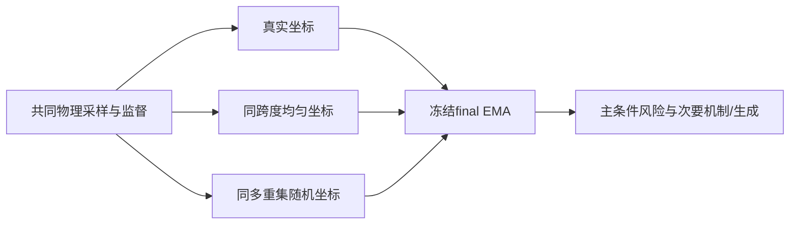

### 参数、数据与统计

原dense1,976,706，128/4/7/MLP4、RoPE10000、dropout0；继承G的12k/18,432token/32步75%普通25%稀疏、512query槽配方，AdamW(.9,.95)、wd.05、clip1、EMA.999、750warmup3e−4余弦到3e−5。4k/8k EMA诊断，12k final EMA固定。三臂连续布局输入相同；不是从G权重续训。

新MC2026092611，16×128=2048父场、8random/4plus/4minus，四项QA通过。37banks；H48六K用全2048，其余31bank用256（16链×16）；64隐藏query。666逻辑单元、1098实际前向：R非均匀布局4套原生坐标**先平均loss，不平均概率**，也不把四套当独立父场。

两主20k块8，块4/16及seed-only/MC-only各10k；次要256父场块2/1/4；4个continuous保留门各98.75%上界≤+.005均过，无预定learning标记。六seed、MC链、父场时间块分层重抽，query嵌套。

### 必须保留的负面证据

- **H96 K512，F−R=+.011427，95% [.004857,.018114]：真实坐标更差。** 不能把H48主结果泛化为全尺度收益。
- 162个MASK扩容单元显示背景有效MASK可改变预测；不是invalid PAD，也不能唯一归因attention分母。
- 80低K布局对、每父场256共同平移八状态表；K2粗几何按visible模式后验加权。它是有限MC局部真值，不是全分布精确KL；rare<.01及undefined显式记录，不报“信息利用百分比”。
- 次要生成18×128 W96=2304图/144shard：F−S若干指标改善，但F−R短程NRMSE差+.020117的方向不利，其他指标混合；signed magnetization/energy以0为目标。

正式计算6.874h，预算含预检6.994h，40包2,164,852,006字节、1752/1752本地覆盖。支持指定高K任务上真实排列相对随机的作用；没有建立普遍fine-geometry实质收益、正确joint生成或老师整体idea。

### 证据、参数与可用性

[完整机器证据与协议索引](fine-geometry-identification/EVIDENCE.md) · [逐文件来源/编辑SHA](fine-geometry-identification/provenance.json) · [科学路径及未公开材料](fine-geometry-identification/withheld-manifest.json) · [本地核验回执](fine-geometry-identification/backup-verification.json)。

公开仓库不包含所有checkpoint、MC父场或bulk generation；从权重重跑与核对统计是不同复现层级。请先读[数据可用性](DATA_AVAILABILITY.md)和[复现说明](REPRODUCING.md)。

[返回研究证据地图](README.md)。

---

## Observed-only key/value 干预

Historical alias **J** · ID `observed_context_intervention_18h_20260927` · 2026-09-27

**Question:** 排除未观测MASK作为attention key/value，能否修复扩容脆弱性而保留局部预测能力？**Design:** 继续训练C与从零S两条不同谱系；**唯一主检验属于S**。**Main result:** S主CI跨0，正式局部能力门也失败。结构不变性通过不等于模型准确。

| cohort / 臂 | 权重起点 | key/value来源 | 固定训练 |
|---|---|---|---|
| C-D / C-O | 六I-F12k，完整raw/EMA/AdamW/RNG恢复 | D全部valid；O仅observed ±1 | 各+4k至16k |
| S-D / S-O | 六新seed92711–92716，配对初始化 | 同上 | 各fresh24k |
| B0 | 六I-F12k | 原D规则 | 冻结参考，不是第25个新模型 |

所有valid位置仍可作query；K0按样本回退。两臂物理data、mask、query、t与监督配对；只改K/V来源规则，不顺便改坐标、dropout或参数数。

| 结果层级 | H96held K512 CE差 | 95%交叉CI | 判定 |
|---|---:|---|---|
| **唯一主：S-O−S-D** | −.003938 | [−.009605,+.001279] | 方向/实质上界<−.005均未过 |
| 辅助：C-O−C-D | +.004573 | [+.002213,+.006619] | 干预反而更差 |
| 辅助：C-O−B0 | +.002840 | [+.000520,+.004843] | 不能称相对起点有进步 |

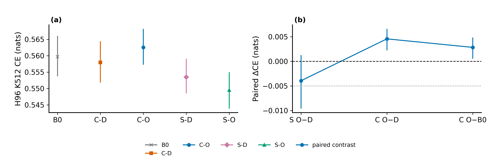

[gates.json](observed-key-value-intervention/evidence/analysis/gates.json)、[core_summary.json](observed-key-value-intervention/evidence/analysis/core_summary.json)、[绘图数据目录](observed-key-value-intervention/evidence/analysis/plot_data)、[原绘图代码](../scripts/research20260927/intervention_figures.py)。C的结果不能挽救S，也不能把两个cohort合并成12个独立paired seed。

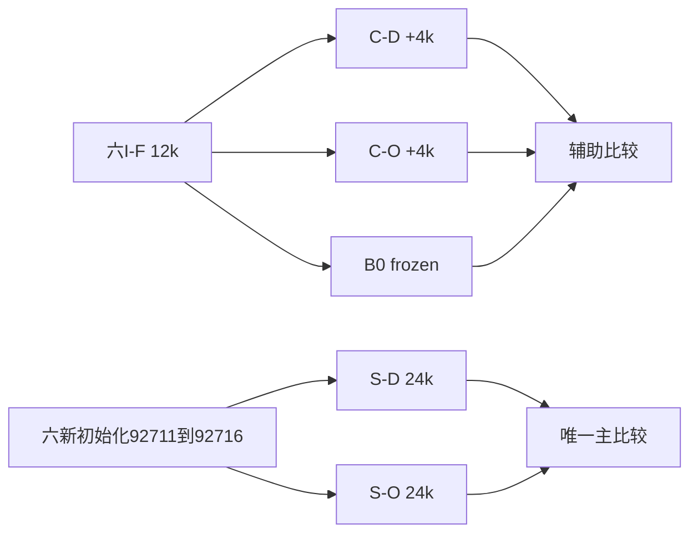

### 设置与误差层级

1,976,706参数dense，128/4/7/MLP4、RoPE10000；AdamW(.9,.95)、wd.05、clip1、EMA.999、BF16训练/FP32loss。C峰值1e−4 warm400、S峰值3e−4 warm1500，余弦末端3e−5；18,432token/update、32周期75/25、512隐藏槽；C先4k再S24k，每1000步交错，总336,000更新。固定final EMA，全部24final锁定后才评价S12k次要快照，不能按val挑checkpoint。

新MC2026092711，16链×256=4096、8random/4plus/4minus；固定burn40/间隔4、QA不通过不延长。H96/H48核心用4096父场×64query；continuous子集256；oracle64背景×16模式×3K×3视图。30最终身份+12S12k，共888正式预测，含验证共1656文件/827,520输入。**生成=0。**

主20k块8；块4/16、seed-only、MC-only各10k，LOO/t/端点稳定全部保留；六训练seed与16MC链独立重抽。S三保留各98.333333%，阈值.002/.005/.005；C六保留99.166667%，分别报告。保留通过不意味着唯一主检验通过。主bootstrap SD约.002844，精度目标未达；只看MC-only会过于乐观。

### 结构通过但科学失败

| 检查 | 结果 | 含义 |
|---|---|---|
| O固定t扩容概率漂移≤2e−5 | 最大约2.62e−6 | K/V屏蔽按设计生效，**非准确性** |
| C-O三K局部Gibbs KL上界≤.01 | 全部未过；约.0627/.0769/.0362 | 正式配方能力不足 |
| S-O同门 | 全部未过；约.0408/.0242/.0191 | 不能只责怪C旧初始化 |
| K1及同符号K2几何响应 | 0或近0 | 后续结构审计解释的盲点，不是所有K都无几何能力 |

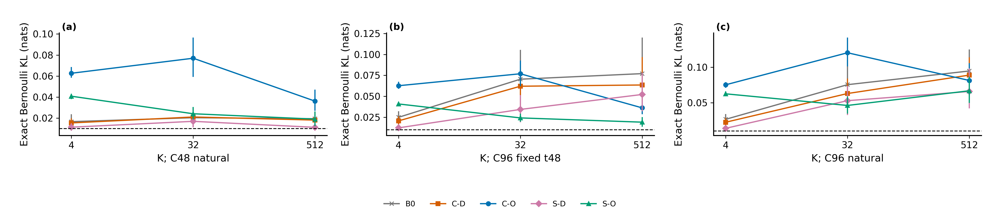

坐标只进入Q/K旋转，V无显式坐标；当所有observed token相同且没有其他位置内容时，O的相同V加权会失去相关位置区分。该有限构造反例不能泛化为所有attention网络错误。后续[精确局部能力](exact-local-capability/README.md)把结构与学习问题拆开。

历史v1是未执行的12h设计；v2正式18h含fresh S与更大MC。`all_64_backgrounds_independent`旧字段在K4任务上措辞过强：实际相同输入可重复，不是64独立物理信息；保留原结果、另作更正。约9.412h预算至远端统计，09-28 09:28本地备份完成；70包、1994/1994路径。不能把本轮负结果说成老师全部idea被否定。

### 证据、参数与可用性

[完整机器证据与协议索引](observed-key-value-intervention/EVIDENCE.md) · [逐文件来源/编辑SHA](observed-key-value-intervention/provenance.json) · [科学路径及未公开材料](observed-key-value-intervention/withheld-manifest.json) · [本地核验回执](observed-key-value-intervention/backup-verification.json)。

公开仓库不包含所有checkpoint、MC父场或bulk generation；从权重重跑与核对统计是不同复现层级。请先读[数据可用性](DATA_AVAILABILITY.md)和[复现说明](REPRODUCING.md)。

[返回研究证据地图](README.md)。

---

## 精确局部条件能力与结构反例

Historical aliases **Basic stages1/2，E1/E2/E3** · ID `basic_capability_stages12_20260928` · 2026-09-28

**Question:** J失败究竟是否涉及结构不可表示、训练配方不足或评价错误？**Design:** 分离结构测试、fresh精确目标训练、冻结旧记录复核。**Result:** 原dense D可学好4×4精确任务；O存在特定结构盲点；扩容仍失败。

| 部分 | 实际动作 | 新训练 / 参考 |
|---|---|---|
| E1 | 非零输出头的D/O结构测试 | 无O训练；非训练正确性/表示测试 |
| E2 | 3个fresh D，K1/K2/K4精确软标签 | 92811–92813，各2048 CPU更新 |
| E3 | 读J的36预测、3bank、12旧包复核 | 只读CPU，非新模型或MC |

| 预定能力检查 | 结果 | 不能扩大为 |
|---|---|---|
| E1 O-K1误差下界 | .088380 > .05 | 所有K/所有attention都不行 |
| E2 final raw，三seed×K1hold/K2hold/K4 | 9/9通过；最大KL约.005210 | EMA或旧J配方也通过 |
| EMA完整能力门 | 0/3 | 事后用EMA替代raw |
| 8×8 K4扩容（固定/自然t） | 最大概率误差约.2079/.1762/.1964级，未过 | 4×4拟合意味着普遍容器泛化 |

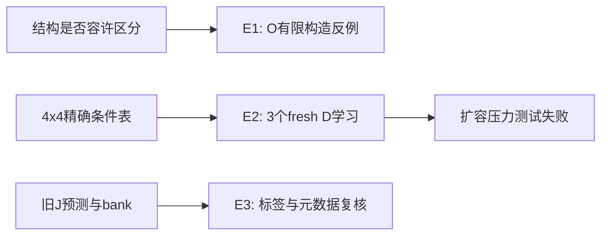

来源：[final_summary.json](exact-local-capability/evidence/final_summary.json)、[structural_summary.json](exact-local-capability/evidence/structural_summary.json)、[完整独立审计](exact-local-capability/evidence/independent_final_audit_v1.json)、[精确标签构造](../scripts/research20260928/exact_ising.py)。此轮用结果表和流程图；不拿预检人工图冒充正式训练结果。

### 足以重建的设置

原dense1976706参数，d128/4头/7块、MLP4、RoPE10000，FP32 CPU、无AMP/TF32、dropout0；AdamW(.9,.95)、wd.05、clip1、EMA.999；warm128到3e−4后余弦到3e−5；batch48，K1/K2/K4各16，精确soft CE。固定2048 final **raw**，无checkpoint选择。三新初始化，不续训J。

βc、零场、4×4开边界65536状态精确枚举。K1=120条（80train/40hold）、K2=1680（1152/528）、K4=64；按D4对称组拆分。能力门逐seed逐任务max KL≤.01、max概率误差≤.05。K4四邻全可见，公式sigmoid(2β邻居和)，可由符号计数解决，因此它不是充分几何识别证据。K1/K2保留原4×4物理系统，不无依据扩到大系统。

MC=0、generation=0，无抽样误差条伪装成MC精度。三seed只证明这些固定重复和任务的通过，不能作广泛成功率保证。E3标签差0，但纠正了J“64背景独立”的元数据过强表述；不重写J历史统计。

6144更新，约28m08至备份；147成员/120,787,654字节的本地归档包括原始上下文材料，所以**不整体上传该包**。公开科学标签、预测、参数、来源和审计，私人通信排除。下一问是局部条件真值不变时，容器扩展为什么破坏D的已学能力。

### 证据、参数与可用性

[完整机器证据与协议索引](exact-local-capability/EVIDENCE.md) · [逐文件来源/编辑SHA](exact-local-capability/provenance.json) · [科学路径及未公开材料](exact-local-capability/withheld-manifest.json) · [本地核验回执](exact-local-capability/backup-verification.json)。

公开仓库不包含所有checkpoint、MC父场或bulk generation；从权重重跑与核对统计是不同复现层级。请先读[数据可用性](DATA_AVAILABILITY.md)和[复现说明](REPRODUCING.md)。

[返回研究证据地图](README.md)。

---

## 局部条件的上下文尺寸对照

Historical aliases **A4/B46，旧D冻结因素诊断** · ID `dense_multisize_control_20260928` · 2026-09-28

**Question:** 保留dense，训练多一个容器尺寸，能否改善扩容时准确性？**Design:** 旧模型因素诊断+三fresh配对seed，不混作一个统计总体。**Main result:** 固定clock下有相对改善，12×12绝对门仍0/3。

| 组 | K4有效训练尺寸 | K1/K2 | 其他控制 |
|---|---|---|---|
| A4 | 总是4×4 | 原4×4 | fresh，92821–92823，同初始化/标签/监督，2048更新 |
| B46 | 4×4/6×6交替 | 同左 | 同上；只扩K4上下文 |
| D1冻结诊断 | 旧Basic三D，不训练 | 不改变物理真值 | N16/32/64×外围坐标×clock，78预测+6PAD |

| 预定义结果 | A4 | B46 | 判定 |
|---|---:|---:|---|
| 12×12 K4、固定t=.75平均精确KL | .091713 | .049923 | 三seed配对差均≤−.005 |
| 配对差均值 / SD / MCSE | — | −.041790 / .003621 / .002091 | 描述三重复，不虚构大样本CI |
| B46@12逐seed绝对能力 | — | **0/3** | 未解决 |
| B46@8固定t | — | 均通过，meanKL约.000144 | 局部正结果 |
| B46@8自然t | — | 均未过，meanKL约.034132 | clock tradeoff |

完整逐seed结果在 [final_summary.json](local-context-size-diagnostic/evidence/final_summary.json)。（三seed描述统计，不是六seed确认性实验。）

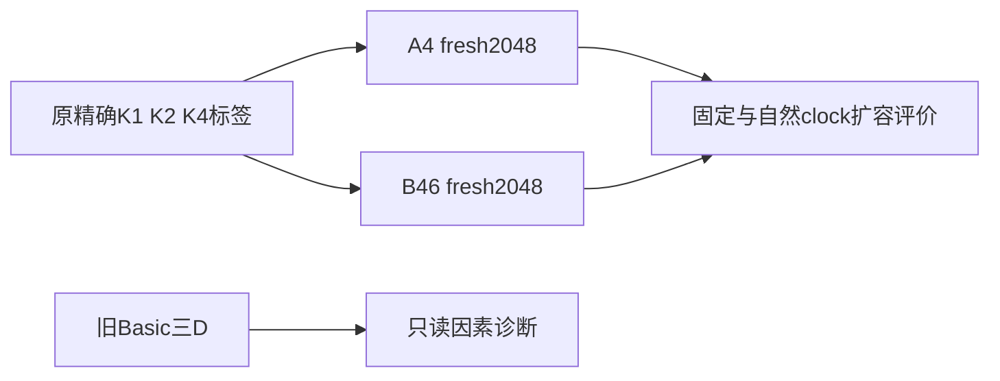

### 参数与解释

原1976706参数dense、128/4/7、RoPE10000，FP32 CPU无AMP/TF32，AdamW(.9,.95)、wd.05、clip1、EMA.999；warm128峰3e−4余弦末3e−5；batch48、K1/K2/K4各16，两个微批32+16；2048 **raw**主权重，EMA仅次要。新6模型合12,288更新，MC=0、generation=0。完整有效设置：[execution_protocol_3h_v1.json](local-context-size-diagnostic/evidence/execution_protocol_3h_v1.json)与[源码](../scripts/research20260928_multisize/run_multisize.py)。

真值仍是βc零场局部条件：K1/K2只在真实4×4；K4四邻全可见使外部MASK扩容不改变局部真值。三保留任务通过，训练4/6及固定clock8改善，但12仍失败。尺寸、外围坐标与clock都可影响预测；invalid PAD控制不变。**这些现象不能唯一识别attention分母、RoPE或time embedding为根因。** K4可计数解，促成后续非计数G8任务。

### 历史预算不能省略

最初2h门失败，正式模型0；随后显式3h授权沿用17:29:33原计时起点。管理v1路径错误发生在训练lock之前，v2只修管理路径，未修改科学配方；17:38正式、18:41结束。313成员/280,314,390字节本地包，另保留停止证据。不能把所有时间都说成连续成功运行，更不能把此轮与旧Basic混成独立六seed主检验。

### 证据、参数与可用性

[完整机器证据与协议索引](local-context-size-diagnostic/EVIDENCE.md) · [逐文件来源/编辑SHA](local-context-size-diagnostic/provenance.json) · [科学路径及未公开材料](local-context-size-diagnostic/withheld-manifest.json) · [本地核验回执](local-context-size-diagnostic/backup-verification.json)。

公开仓库不包含所有checkpoint、MC父场或bulk generation；从权重重跑与核对统计是不同复现层级。请先读[数据可用性](DATA_AVAILABILITY.md)和[复现说明](REPRODUCING.md)。

[返回研究证据地图](README.md)。

---

## 固定 clock 的上下文尺寸泛化

Historical alias: **N/W · 6h** · ID `dense_multisize_canonical_6h_20260930` · 2026-09-30

**Question:** 保留 dense 和真实单位坐标，把训练容器覆盖从4/6扩大到4/6/8/12，是否能在20×20容器推断未见局部边界排列？

**Design:** 六个 fresh 配对 seed、每臂8k、全程 t=.75、精确软标签。**Main result:** 相对改善很大，绝对能力仍失败。**Status:** 完整归档，不是完整科学门通过。

| 预定义主判定 | 实测 | 结果 |
|---|---|---|
| G8 test @20中心，final raw，mean KL(W−N) | −0.083144；95%配对t [−0.089534,−0.076755] | 上界<−.005，实质门通过 |
| 各臂平均精确 KL | N=.092391，W=.009247 | 平均下降约89.99%，**不是信息利用百分比** |
| W逐seed max KL≤.01 且 max概率误差≤.05 | **0/6** | 绝对门失败；完整合取门失败 |
| 三保留任务及结构控制 | 均通过 | 不挽救主绝对失败 |
| 预设MCSE目标≤.002 | .002486 | 精度目标未达到；不补 seed |

[final_summary.json](canonical-context-size-generalization/evidence/final_summary.json) 保存600单元的全部指标、主统计、敏感性和失败。[主图数据](canonical-context-size-generalization/evidence/analysis/plot_data/03_primary_paired.npz)与[原绘图代码](../scripts/research20260930_6h/sm6_analysis.py)可追溯；图不是从PDF截图。

### 真正只改了什么

| 设置 | N narrow | W wide | 共同控制 |
|---|---|---|---|
| K4/G8有效边长周期 | 4/6/4/6 | 4/6/8/12 | 分配张量都4/6/8/12；N多余为invalid PAD |
| clock | .75 | .75 | 不是 native vs canonical 比较 |
| 初始化/数据/监督 | 配对 | 配对 | 六新seed93061–93066；phase0/1实际输入相同，2/3有效上下文不同 |
| 训练身份 | fresh，8k | fresh，8k | 非旧12h scratch续训；12模型96,000更新 |
| K1/K2 | 原4×4 | 原4×4 | 不把小系统标签错误搬为大系统边缘真值 |

### 真值、模型与训练预算

β=log(1+√2)/2、零场、单位耦合。G8隐藏2×2腔体，八邻边界可见，枚举16个隐藏状态求精确概率；给定完整边界，扩大外围MASK容器不改变局部真值。1024条/72个D4×flip组，以固定hash拆为696训练、160验证、168测试；同组所有变换不跨split。K1 80/40、K2 1152/528、K4 64继承精确bank。

原dense 1,976,706参数，128宽/4头/7块/MLP×4，RoPE10000，dropout0；FP32，无AMP/TF32。AdamW(.9,.95)，wd.05、clip1、foreach=false，512warmup到3e−4后余弦到3e−5；EMA.999仅次要。每步K1/K2/K4/G8各32，总128、两个64微批；固定8k **raw**主权重，4k/6k raw+EMA快照只在final锁定后评价。各组平均有效token不同（2688/5184），不能声称有效计算量相同。

### 统计和反例

主风险为固定168模式的均匀平均，**不是 Ising 自然出现频率加权风险**。独立单位是六个配对训练seed，不是129,600条预测。主t(df5)95%，20k配对seedbootstrap、6个LOO、64符号翻转为敏感性；后者依赖对称/可交换性。Bootstrap不增加独立样本。

三个保留任务K1hold/K2hold/K4@4各用单侧98.333333%上界≤+.002，另要求W逐seed绝对门。6k→8k训练尺寸G8val改善>.002是learning_incomplete规则：无标记，不代表已证明收敛。W训练/验证模式通过，但训练尺寸上的**测试模式也只有5/6**全部通过，不能把全部错误唯一归因于大尺寸。W@16绝对门1/6，@20及@24为0/6。

相同query、相同4正4负的patterns240/85，真值 .185730/.814270，差 .628539；只计数必然不能同时准确。这是预定功能检查，单对响应不能替代全部测试模式。

总600正式NPZ/129,600行，另120 PAD/平移/联合重排控制对/13,920配对行。MC=0，生成=0。精确局部Bernoulli KL合法；不能将其解释套到之前MC估计的条件CE。

### 执行及局限

预算05:21开始，05:31正式，08:24全部final，08:27统计，08:46备份，09:02报告交付（UTC+8）；约3h41完成交付，未为凑6h追加实验。4包768,708,147字节，本地闭环1863/1863路径；`formal.stdout`打包后0→115字节由管理增量覆盖，科学统计未重跑。原12h实验仍为未启动。

本轮只支持固定clock下训练尺寸覆盖的增量收益。它没有检验 native clock 优越性、真实spacing外推、任意局部图或联合生成，更没有解决绝对准确性或证明老师完整idea。

### 证据、参数与可用性

[完整机器证据与协议索引](canonical-context-size-generalization/EVIDENCE.md) · [逐文件来源/编辑SHA](canonical-context-size-generalization/provenance.json) · [科学路径及未公开材料](canonical-context-size-generalization/withheld-manifest.json) · [本地核验回执](canonical-context-size-generalization/backup-verification.json)。

公开仓库不包含所有checkpoint、MC父场或bulk generation；从权重重跑与核对统计是不同复现层级。请先读[数据可用性](DATA_AVAILABILITY.md)和[复现说明](REPRODUCING.md)。

[返回研究证据地图](README.md)。

---

## Size × clock factorial：预算停止预检

Historical alias **12h** · ID `dense_size_clock_geometry_12h_20260930` · 2026-09-30

**Question:** 多尺寸训练和固定clock分别能否改善精确局部条件泛化？**Design:** 计划六seed×2×2×24k。**Actual status:** **正式未启动：0个正式final、0个正式测试预测。** 这不是主假设失败，也不是下一轮6h的中途缩减。

| 计划臂 | 有效尺寸 | clock |
|---|---|---|
| A | 4/6 | native：1−K/Nvalid |
| B | 4/6 | canonical：.75 |
| C | 4/6/8/12 | native |
| D | 4/6/8/12 | canonical |

| 实际完成的预检 | 结果 | 不能当作 |
|---|---|---|
| 数学/恢复/人工3240单元fixture | 通过 | 正式模型泛化 |
| 两个2048步scratch，64条train-only G8 | maxKL约5.33e−7 / 1.63e−6 | 六seed确认或test性能 |
| 真实更新均速 | .108157秒 | 已完成576k训练 |
| 保守总投影 | **26.486h > 12h** | 12小时任务正式完成 |

[launch_gate.json](preflights/size-clock-factorial/evidence/launch_gate.json)、[update_timing.json](preflights/size-clock-factorial/evidence/update_timing.json)、[源码](../scripts/research20260930/sg_preflight.py)。计划原dense1976706参数FP32，AdamW(.9,.95)、wd.05、clip1、EMA.999、warm512峰3e−4到3e−5、batch128、raw24k主；这些是**计划值**。无正式MC或生成。

G8隐藏2×2、八点边界、16状态精确求和，1024条按72个D4×flip组拆696/160/168；这个预先确定的拆分被后续6h原样继承，不继承scratch权重。首次GPU预检优化器设备问题修正在冻结前，随后预算停止记录完整保留；不重置旧预算、不静默减seed。

03:47预检起点、04:03预算失败、04:07备份（UTC+8）。尚无可评价的正式主终点；所有人工/拟合图不能放进正式实验结果列。[后续独立新设计](canonical-context-size-generalization/README.md)缩为两组×六seed×8k、只问固定clock下的size覆盖。

### 证据、参数与可用性

[完整机器证据与协议索引](preflights/size-clock-factorial/EVIDENCE.md) · [逐文件来源/编辑SHA](preflights/size-clock-factorial/provenance.json) · [科学路径及未公开材料](preflights/size-clock-factorial/withheld-manifest.json) · [本地核验回执](preflights/size-clock-factorial/backup-verification.json)。

公开仓库不包含所有checkpoint、MC父场或bulk generation；从权重重跑与核对统计是不同复现层级。请先读[数据可用性](DATA_AVAILABILITY.md)和[复现说明](REPRODUCING.md)。

[返回研究证据地图](README.md)。

---
