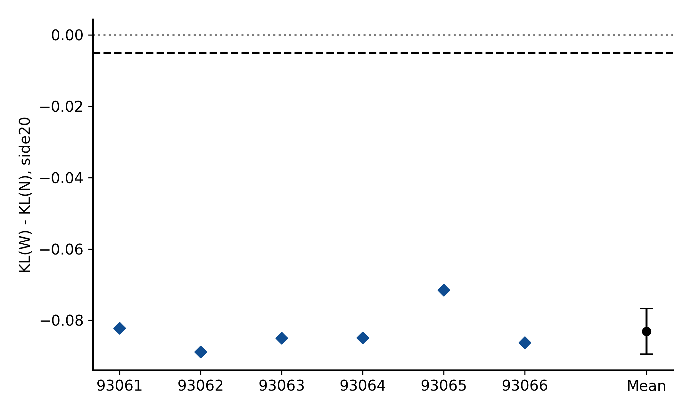
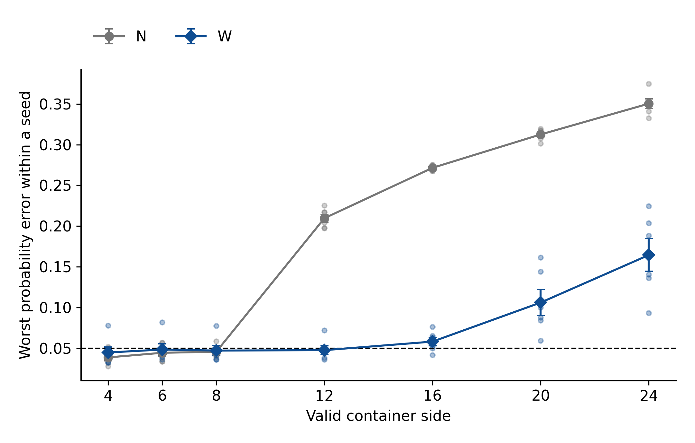
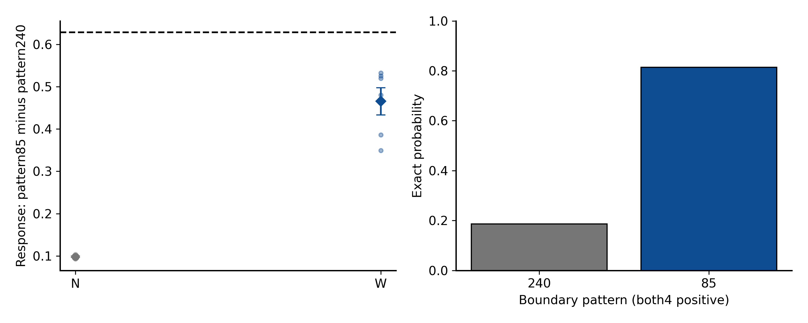

# 固定 clock 的上下文尺寸泛化

Historical alias: **N/W · 6h** · ID `dense_multisize_canonical_6h_20260930` · 2026-09-30

**Question:** 保留 dense 和真实单位坐标，把训练容器覆盖从4/6扩大到4/6/8/12，是否能在20×20容器推断未见局部边界排列？

**Design:** 六个 fresh 配对 seed、每臂8k、全程 t=.75、精确软标签。**Main result:** 相对改善很大，绝对能力仍失败。**Status:** 完整归档，不是完整科学门通过。

| 预定义主判定 | 实测 | 结果 |
|---|---|---|
| G8 test @20中心，final raw，mean KL(W−N) | −0.083144；95%配对t [−0.089534,−0.076755] | 上界<−.005，实质门通过 |
| 各臂平均精确 KL | N=.092391，W=.009247 | 平均下降约89.99%，**不是信息利用百分比** |
| W逐seed max KL≤.01 且 max概率误差≤.05 | **0/6** | 绝对门失败；完整合取门失败 |
| 三保留任务及结构控制 | 均通过 | 不挽救主绝对失败 |
| 预设MCSE目标≤.002 | .002486 | 精度目标未达到；不补 seed |

[final_summary.json](evidence/final_summary.json) 保存600单元的全部指标、主统计、敏感性和失败。[主图数据](evidence/analysis/plot_data/03_primary_paired.npz)与[原绘图代码](../../scripts/research20260930_6h/sm6_analysis.py)可追溯；图不是从PDF截图。

## 真正只改了什么

| 设置 | N narrow | W wide | 共同控制 |
|---|---|---|---|
| K4/G8有效边长周期 | 4/6/4/6 | 4/6/8/12 | 分配张量都4/6/8/12；N多余为invalid PAD |
| clock | .75 | .75 | 不是 native vs canonical 比较 |
| 初始化/数据/监督 | 配对 | 配对 | 六新seed93061–93066；phase0/1实际输入相同，2/3有效上下文不同 |
| 训练身份 | fresh，8k | fresh，8k | 非旧12h scratch续训；12模型96,000更新 |
| K1/K2 | 原4×4 | 原4×4 | 不把小系统标签错误搬为大系统边缘真值 |

## 真值、模型与训练预算

β=log(1+√2)/2、零场、单位耦合。G8隐藏2×2腔体，八邻边界可见，枚举16个隐藏状态求精确概率；给定完整边界，扩大外围MASK容器不改变局部真值。1024条/72个D4×flip组，以固定hash拆为696训练、160验证、168测试；同组所有变换不跨split。K1 80/40、K2 1152/528、K4 64继承精确bank。

原dense 1,976,706参数，128宽/4头/7块/MLP×4，RoPE10000，dropout0；FP32，无AMP/TF32。AdamW(.9,.95)，wd.05、clip1、foreach=false，512warmup到3e−4后余弦到3e−5；EMA.999仅次要。每步K1/K2/K4/G8各32，总128、两个64微批；固定8k **raw**主权重，4k/6k raw+EMA快照只在final锁定后评价。各组平均有效token不同（2688/5184），不能声称有效计算量相同。

## 统计和反例

主风险为固定168模式的均匀平均，**不是 Ising 自然出现频率加权风险**。独立单位是六个配对训练seed，不是129,600条预测。主t(df5)95%，20k配对seedbootstrap、6个LOO、64符号翻转为敏感性；后者依赖对称/可交换性。Bootstrap不增加独立样本。

三个保留任务K1hold/K2hold/K4@4各用单侧98.333333%上界≤+.002，另要求W逐seed绝对门。6k→8k训练尺寸G8val改善>.002是learning_incomplete规则：无标记，不代表已证明收敛。W训练/验证模式通过，但训练尺寸上的**测试模式也只有5/6**全部通过，不能把全部错误唯一归因于大尺寸。W@16绝对门1/6，@20及@24为0/6。

相同query、相同4正4负的patterns240/85，真值 .185730/.814270，差 .628539；只计数必然不能同时准确。这是预定功能检查，单对响应不能替代全部测试模式。

总600正式NPZ/129,600行，另120 PAD/平移/联合重排控制对/13,920配对行。MC=0，生成=0。精确局部Bernoulli KL合法；不能将其解释套到之前MC估计的条件CE。

## 执行及局限

预算05:21开始，05:31正式，08:24全部final，08:27统计，08:46备份，09:02报告交付（UTC+8）；约3h41完成交付，未为凑6h追加实验。4包768,708,147字节，本地闭环1863/1863路径；`formal.stdout`打包后0→115字节由管理增量覆盖，科学统计未重跑。原12h实验仍为未启动。

本轮只支持固定clock下训练尺寸覆盖的增量收益。它没有检验 native clock 优越性、真实spacing外推、任意局部图或联合生成，更没有解决绝对准确性或证明老师完整idea。

## 证据、参数与可用性

[完整机器证据与协议索引](EVIDENCE.md) · [逐文件来源/编辑SHA](provenance.json) · [科学路径及未公开材料](withheld-manifest.json) · [本地核验回执](backup-verification.json)。

公开仓库不包含所有checkpoint、MC父场或bulk generation；从权重重跑与核对统计是不同复现层级。请先读[数据可用性](../DATA_AVAILABILITY.md)和[复现说明](../REPRODUCING.md)。

[返回研究证据地图](../README.md)。
