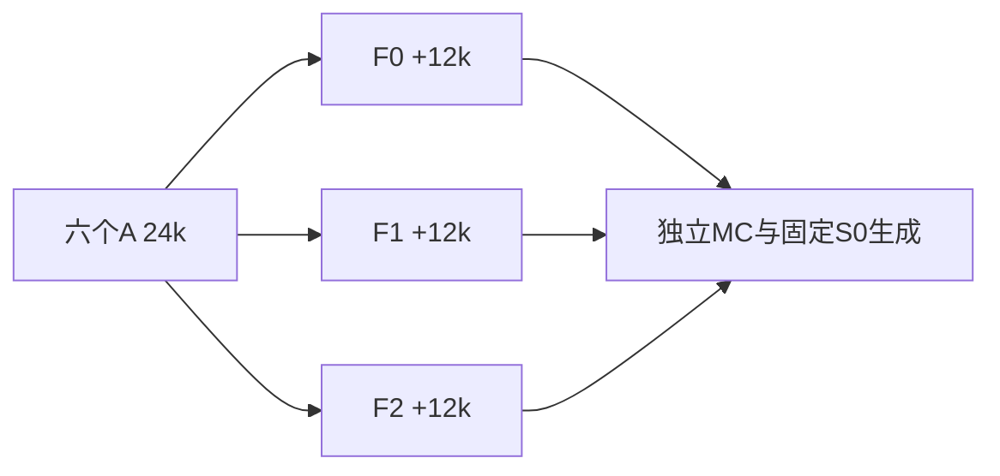

# 上下文一致性续训

Historical alias: **F**；两seed容量筛选为开发诊断 · ID `adaptive_research_20260922` · 2026-09-22

**Question:** 惩罚全上下文/子上下文预测差异，能否把条件一致性转化为更好的长程生成？**Design:** 六个A旧checkpoint各分三支。**Main result:** 一致性改善但主生成收益未确认；个别条件任务恶化。**Status:** 完成、主门未通过。

| 分支 | 改变什么 | 起点及共同控制 |
|---|---|---|
| F0 | full-context query CE | 同一A24k，完整恢复，追加12k到36k |
| F1 | .5 full CE + .5 subset CE | 同物理样本、mask、query及训练预算 |
| F2 | F1 + symmetric JS，λ16 | 同上；子集保留visible/query，移除部分未观测上下文 |

| 预定义结果 | 实测 | 判定 |
|---|---|---|
| 主J：三长程任务NRMSE等权；F2−F1 | −.006257，95% [−.033096,+.020535] | 未确认收益 |
| J各组均值 | F0 .219861，F1 .225078，F2 .218821 | 小均值差不代替区间 |
| stride10条件CE（次要）F2−F1 | +.001368，95% [.000796,.002037] | **恶化** |

[交叉不确定性结果](evidence/final_analysis/crossed_uncertainty.json)、[绘图数据](evidence/final_analysis/figures/curve_bands.json)及[分析/绘图代码](../../scripts/research20260921/finalize_adaptive_campaign.py)。主J由W96的r25–48、heldgap5/7与stride10的r≥129三段定义，不事后调整distance band。

## 参数与统计

原1,976,706参数dense、RoPE10000、dropout0；BF16/FP32 loss，AdamW(.9,.95)、wd.05、clip1、EMA.999。续训warm400，lr3e−5→1e−4→3e−5。18,432基础token/update，六seed91001–6，1000步块交错；F1/F2额外前向，**不能称FLOPs相同**。子集比例.125/.25/.5/.75/1，保留共同64query，λ只以训练梯度标定（比例约.129），不是测试调参；固定36k EMA。

继承训练父池，评价新8链×128=1024MC；7生成任务每模型2560，共46,080图/2880shards，固定S0 256、T1。六训练lineage×MC链/父场时间块×生成16图shard交叉bootstrap，实际主块8的2000次，块4/16各1000；query/crop不是独立seed。区间原记录注明小簇数下探索性，不宣称跨任务同时覆盖。另有96条on-policy轨迹诊断，只解释失败，不改主判断。

数值口径：表的−.006257来自[原始配对点估计](evidence/main_summary.json)；bootstrap摘要`F2_minus_F1_mean`约−.005385是重抽分布均值，不是换了实验结果。公开归档明确区分二者，并纠正旧叙述的末位舍入与重复数口径。

## 开发筛选与负结果

先用两seed把d128/4头改为d192/6头（7块，4,439,170参数，fresh24k），J从.2863→.3082、.2513→.3256变差，因此其余四seed没启动，保留小模型。**这不是六seed容量确认，也不混入F主统计。** 记录在 [capacity](evidence/capacity/)。

F2改善模型自身上下文一致性，但自洽不等于准确，生成主CI跨0且部分CE变差。实际约13.493h；18续训分支继承六A lineages，不能和A当作独立训练总体合并。本轮不支持“正则化已修复joint分布”。

## 证据、参数与可用性

[完整机器证据与协议索引](EVIDENCE.md) · [逐文件来源/编辑SHA](provenance.json) · [科学路径及未公开材料](withheld-manifest.json) · [本地核验回执](backup-verification.json)。

公开仓库不包含所有checkpoint、MC父场或bulk generation；从权重重跑与核对统计是不同复现层级。请先读[数据可用性](../DATA_AVAILABILITY.md)和[复现说明](../REPRODUCING.md)。

[返回研究证据地图](../README.md)。
