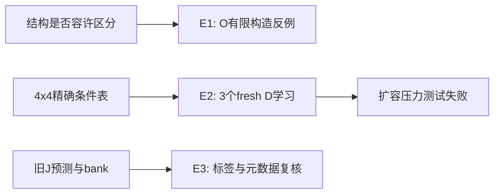

# 精确局部条件能力与结构反例

Historical aliases **Basic stages1/2，E1/E2/E3** · ID `basic_capability_stages12_20260928` · 2026-09-28

**Question:** J失败究竟是否涉及结构不可表示、训练配方不足或评价错误？**Design:** 分离结构测试、fresh精确目标训练、冻结旧记录复核。**Result:** 原dense D可学好4×4精确任务；O存在特定结构盲点；扩容仍失败。

| 部分 | 实际动作 | 新训练 / 参考 |
|---|---|---|
| E1 | 非零输出头的D/O结构测试 | 无O训练；非训练正确性/表示测试 |
| E2 | 3个fresh D，K1/K2/K4精确软标签 | 92811–92813，各2048 CPU更新 |
| E3 | 读J的36预测、3bank、12旧包复核 | 只读CPU，非新模型或MC |

| 预定能力检查 | 结果 | 不能扩大为 |
|---|---|---|
| E1 O-K1误差下界 | .088380 > .05 | 所有K/所有attention都不行 |
| E2 final raw，三seed×K1hold/K2hold/K4 | 9/9通过；最大KL约.005210 | EMA或旧J配方也通过 |
| EMA完整能力门 | 0/3 | 事后用EMA替代raw |
| 8×8 K4扩容（固定/自然t） | 最大概率误差约.2079/.1762/.1964级，未过 | 4×4拟合意味着普遍容器泛化 |

来源：[final_summary.json](evidence/final_summary.json)、[structural_summary.json](evidence/structural_summary.json)、[完整独立审计](evidence/independent_final_audit_v1.json)、[精确标签构造](../../scripts/research20260928/exact_ising.py)。此轮用结果表和流程图；不拿预检人工图冒充正式训练结果。

## 足以重建的设置

原dense1976706参数，d128/4头/7块、MLP4、RoPE10000，FP32 CPU、无AMP/TF32、dropout0；AdamW(.9,.95)、wd.05、clip1、EMA.999；warm128到3e−4后余弦到3e−5；batch48，K1/K2/K4各16，精确soft CE。固定2048 final **raw**，无checkpoint选择。三新初始化，不续训J。

βc、零场、4×4开边界65536状态精确枚举。K1=120条（80train/40hold）、K2=1680（1152/528）、K4=64；按D4对称组拆分。能力门逐seed逐任务max KL≤.01、max概率误差≤.05。K4四邻全可见，公式sigmoid(2β邻居和)，可由符号计数解决，因此它不是充分几何识别证据。K1/K2保留原4×4物理系统，不无依据扩到大系统。

MC=0、generation=0，无抽样误差条伪装成MC精度。三seed只证明这些固定重复和任务的通过，不能作广泛成功率保证。E3标签差0，但纠正了J“64背景独立”的元数据过强表述；不重写J历史统计。

6144更新，约28m08至备份；147成员/120,787,654字节的本地归档包括原始上下文材料，所以**不整体上传该包**。公开科学标签、预测、参数、来源和审计，私人通信排除。下一问是局部条件真值不变时，容器扩展为什么破坏D的已学能力。

## 证据、参数与可用性

[完整机器证据与协议索引](EVIDENCE.md) · [逐文件来源/编辑SHA](provenance.json) · [科学路径及未公开材料](withheld-manifest.json) · [本地核验回执](backup-verification.json)。

公开仓库不包含所有checkpoint、MC父场或bulk generation；从权重重跑与核对统计是不同复现层级。请先读[数据可用性](../DATA_AVAILABILITY.md)和[复现说明](../REPRODUCING.md)。

[返回研究证据地图](../README.md)。
