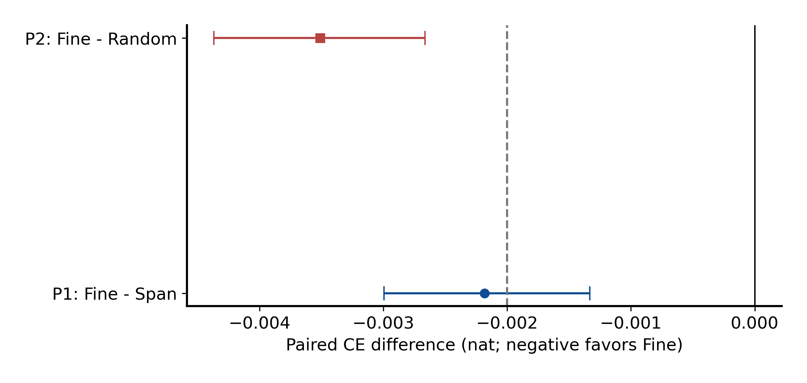
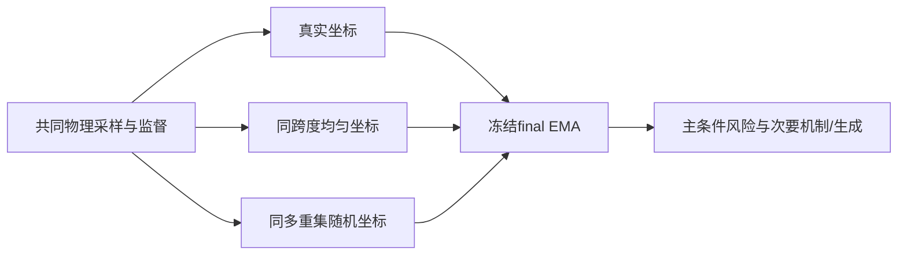
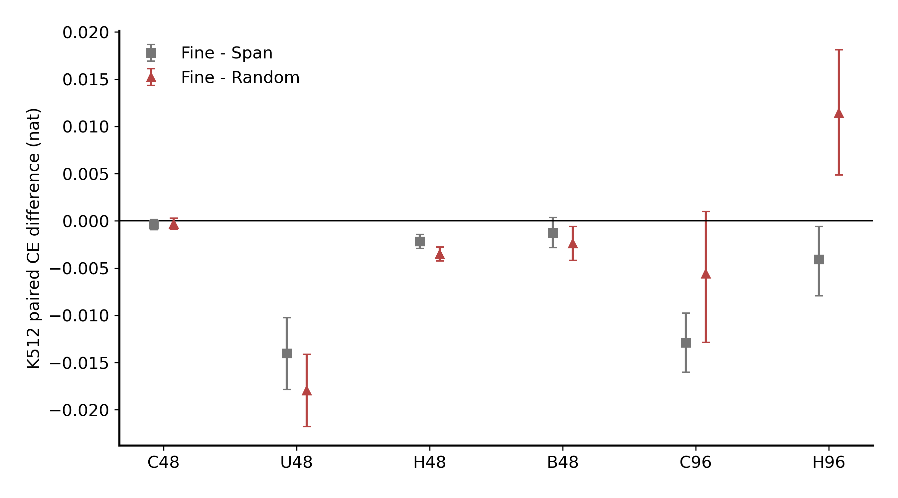

# 细几何、总跨度与随机坐标的识别

Historical alias **I-F/I-S/I-R** · ID `geometry_identification_20260926` · 2026-09-26

**Question:** G-H3未决后，真实细排列相对span-only及保留坐标多重集的随机排列，各有多大条件收益？**Design:** 六新seed×三臂fresh12k，共用全部物理训练流。**Main result:** P2实质门通过、P1只有方向；合取失败。

| 臂 | 物理data/mask/query/t | 坐标 | 训练 |
|---|---|---|---|
| I-F | 同seed三臂配对 | 真实细排列 | fresh12k，92601–92606 |
| I-S | 同上 | 保留总跨度，内部均匀 | 同上 |
| I-R | 同上 | 独立随机排列，同坐标多重集 | 同上，坐标RNG独立 |

| 主H48 held K512 | CE差 | 原97.5%CI | 上界<−.002实质门 |
|---|---:|---|---|
| P1: F−S | −.002182 | [−.002994,−.001332] | **未通过**，方向通过 |
| P2: F−R | −.003512 | [−.004369,−.002664] | 通过 |

[统计汇总](evidence/analysis/summary.json)、[原图数据](evidence/analysis/plot_data.npz)、[原分析](../../scripts/research20260926/identification_analysis.py)。P1点估计超过.002并不够：门比较的是**区间上界**。

## 参数、数据与统计

原dense1,976,706，128/4/7/MLP4、RoPE10000、dropout0；继承G的12k/18,432token/32步75%普通25%稀疏、512query槽配方，AdamW(.9,.95)、wd.05、clip1、EMA.999、750warmup3e−4余弦到3e−5。4k/8k EMA诊断，12k final EMA固定。三臂连续布局输入相同；不是从G权重续训。

新MC2026092611，16×128=2048父场、8random/4plus/4minus，四项QA通过。37banks；H48六K用全2048，其余31bank用256（16链×16）；64隐藏query。666逻辑单元、1098实际前向：R非均匀布局4套原生坐标**先平均loss，不平均概率**，也不把四套当独立父场。

两主20k块8，块4/16及seed-only/MC-only各10k；次要256父场块2/1/4；4个continuous保留门各98.75%上界≤+.005均过，无预定learning标记。六seed、MC链、父场时间块分层重抽，query嵌套。

## 必须保留的负面证据

- **H96 K512，F−R=+.011427，95% [.004857,.018114]：真实坐标更差。** 不能把H48主结果泛化为全尺度收益。
- 162个MASK扩容单元显示背景有效MASK可改变预测；不是invalid PAD，也不能唯一归因attention分母。
- 80低K布局对、每父场256共同平移八状态表；K2粗几何按visible模式后验加权。它是有限MC局部真值，不是全分布精确KL；rare<.01及undefined显式记录，不报“信息利用百分比”。
- 次要生成18×128 W96=2304图/144shard：F−S若干指标改善，但F−R短程NRMSE差+.020117的方向不利，其他指标混合；signed magnetization/energy以0为目标。

正式计算6.874h，预算含预检6.994h，40包2,164,852,006字节、1752/1752本地覆盖。支持指定高K任务上真实排列相对随机的作用；没有建立普遍fine-geometry实质收益、正确joint生成或老师整体idea。

## 证据、参数与可用性

[完整机器证据与协议索引](EVIDENCE.md) · [逐文件来源/编辑SHA](provenance.json) · [科学路径及未公开材料](withheld-manifest.json) · [本地核验回执](backup-verification.json)。

公开仓库不包含所有checkpoint、MC父场或bulk generation；从权重重跑与核对统计是不同复现层级。请先读[数据可用性](../DATA_AVAILABILITY.md)和[复现说明](../REPRODUCING.md)。

[返回研究证据地图](../README.md)。
