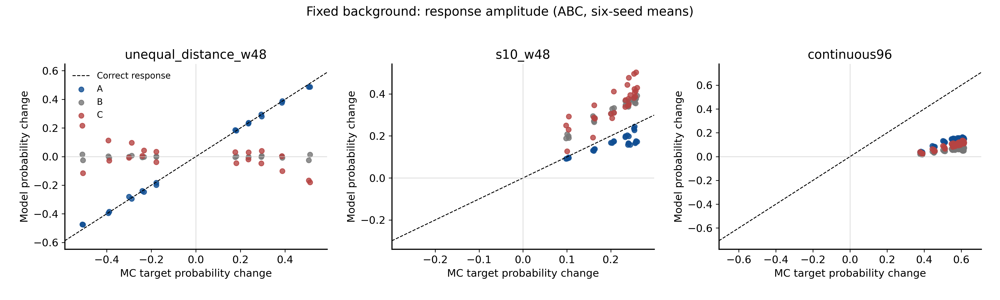
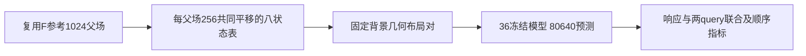

# 固定背景的几何响应与联合一致性

Historical identifier `fixed_geometry_joint_20260923` · 2026-09-23 · **冻结诊断，不是训练轮**

**Question:** 在固定spin、观测信息量、query和跨度后，只改变可见点与坐标的对应关系，模型能否跟随MC条件真值？模型自己的顺序一致性与准确性是否一致？

**Design:** A/B/C与F0/F1/F2共36个冻结checkpoint、六原始lineage；复用F的1024MC。新训练=0、新MC=0、新生成=0。**Result:** A明显利用真实几何，但更大上下文与joint/order一致性仍有缺口；这是诊断证据，不升级为新确认性复现。

| 对照 | 保持什么 | 改变什么 |
|---|---|---|
| 不等gap布局对 | 坐标集合、spin、多重集、query、clock、总span | visible spin的物理位置对应 |
| A/B/C | 任务与参考相同 | 原训练坐标语义 |
| F0/F1/F2 | 六A lineage继承 | 已完成的一致性续训配方 |

| 诊断结果（95%探索区间） | 数值 | 解释 |
|---|---|---|
| A−B 几何响应RMSE | −.28128 [−.29487,−.26418] | A更接近真实响应 |
| A−C 几何响应RMSE | −.33775 [−.35503,−.31911] | 同上 |
| A响应gain | cont48约.867，W96约.240 | 大上下文响应衰减 |
| F2−F1 W96 sequential KL | −.06101 [−.08360,−.04347] | 准确性改善 |
| 同对比 order TV | +.01707 [.01023,.02562] | **顺序一致性恶化** |

[point_estimates.json](evidence/analysis/point_estimates.json)、[crossed_uncertainty.json](evidence/analysis/crossed_uncertainty.json)、[plot_data.npz](evidence/analysis/plot_data.npz)；[分析/作图](../../scripts/research20260921/analyze_fixed_geometry_joint_20260923.py)。

112 cases×20输入×36模型=80,640预测，含20个不等gap几何对；参考零场翻转对称化。两query joint KL是有限MC局部表上的比较，不是完整图的精确joint NLL。六seed和8链独立重抽，链内块8、1000次，块4/16各500；256平移及query嵌套于父场，不是新增独立样本。无预注册family-wise成功门，所有诊断区间保持探索性标签。

冻结网络均1,976,706参数；A/B/C24k、F36k EMA，未改权重、优化器或sampling设置。约16m11s完成。该实验有独立“控制背景后几何响应”的科学问题，故独立目录；它仍然**不是新的训练重复**。不能把response gain解释为普遍信息利用率，不能把低顺序TV等同于准确分布。

## 证据、参数与可用性

[完整机器证据与协议索引](EVIDENCE.md) · [逐文件来源/编辑SHA](provenance.json) · [科学路径及未公开材料](withheld-manifest.json) · [本地核验回执](backup-verification.json)。

公开仓库不包含所有checkpoint、MC父场或bulk generation；从权重重跑与核对统计是不同复现层级。请先读[数据可用性](../DATA_AVAILABILITY.md)和[复现说明](../REPRODUCING.md)。

[返回研究证据地图](../README.md)。
