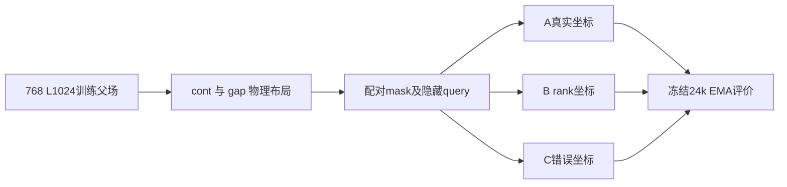

# 几何对齐条件学习与冻结诊断

Historical aliases: **A/B/C，D/E诊断** · ID `geometry_alignment_20260921` · 2026-09-21

**Question:** 真实物理坐标是否比 rank 或错误坐标更有助于稀疏条件外推？**Design:** 六seed三组fresh训练，随后在冻结模型上诊断。**Main result:** 任务之间排序反转；没有普遍真实坐标优势。**Status:** 完成，结论限定于具体任务。

| 臂 | 唯一坐标差异 | 共同控制 | 训练 |
|---|---|---|---|
| A | 逐样本真实物理坐标 | 同seed初始化、物理data、mask、augmentation配对 | fresh 24k |
| B | unit/rank坐标，丢失真实间距 | 同上 | fresh 24k |
| C | 独立错误坐标流 | 同上；C坐标RNG独立 | fresh 24k |

| 预定条件任务 | A CE | B CE | C CE | 阅读方式 |
|---|---:|---:|---:|---|
| W32 held gaps5/7 | .499457 | .506381 | .507590 | A较好 |
| W48 stride10 | .543789 | .536529 | .540909 | **A反而最差** |
| 两任务宏平均 | .521623 | .521455 | .524249 | A−B六seed三正三负 |

[primary_metrics.csv](evidence/primary_metrics.csv)、[paired_seed_effects.csv](evidence/paired_seed_effects.csv)与18份complete记录给出数值；[原分析/绘图](../../scripts/research20260921/evaluate_study.py)。图中点不是独立MC父场，表中宏平均不能掩盖任务反转；不事后选择一个任务宣布全局胜利。

## 数据、模型、统计

seed91001–91006；dense 1,976,706参数（d128/4头/7块/MLP4、RoPE10000、dropout0）。W16/24/32/48，continuous与gap1/2/4/8等权8周期；18,432token/update，对应batch72/32/18/8。AdamW(.9,.95)、wd.05、clip1、EMA.999；1000warmup到3e−4后余弦到3e−5；masked CE/t，t均匀.01–1，2%全MASK；final EMA，无checkpoint选择。训练768/验证256父场按MC链拆分。

新评价MC seed20260922，4链×128=512，burn40/间隔4；条件任务共享父场、四个t(.2/.5/.8/.95)及两个mask重复。query/mask嵌套于父场，只有六个训练seed，512×query不是更多训练复现。逐seed效应优先；早期区间的具体重抽层级以冻结协议为准，不追认为后来G/I的更大层级设计。

生成每模型896图、共16,128图：cont48=128/64=256/96=128、heldgap32=256、stride10W48=128，S0 cosine²256步、T1、无MC校正。条件CE不等于生成质量；生成长程误差仍大。约7.842h实测完成；这不是后续fine-geometry确认轮。

## D/E 为什么归在这里

| 冻结诊断 | 新训练 / 新MC | 操作 | 解释边界 |
|---|---|---|---|
| D context/joint | 0 / 0 | 单可见点、teacher forcing、3×3 cavity、采样步数；新增4,992图 | 新采样不是新模型复制 |
| E mechanism | 0 / 0 | 990 context、306 frequency、1620 information单元，144attention记录 | 局部频率响应不唯一识别RoPE机制 |

D中A的3×3顺序KL约.00918，row-parallel约.10780、all-parallel约.23704；对应独立因子基线约.09667/.22251。**局部顺序能力不能推成完整图正确性或“信息利用百分比”。** E改变背景MASK、clock和频率，发现输入依赖但不证明哪一个是唯一原因。它们使用旧权重、旧参考，是本campaign的解释性诊断，不是18模型的再次训练复现。原CSV、协议和三图分别在 [D](diagnostics/context-joint/) 与 [E](diagnostics/mechanism/)。

**支持：**模型在部分布局使用几何。**不支持：**真实坐标普遍胜出、正确联合分布、尺度不变或动态世界模型。

## 证据、参数与可用性

[完整机器证据与协议索引](EVIDENCE.md) · [逐文件来源/编辑SHA](provenance.json) · [科学路径及未公开材料](withheld-manifest.json) · [本地核验回执](backup-verification.json)。

公开仓库不包含所有checkpoint、MC父场或bulk generation；从权重重跑与核对统计是不同复现层级。请先读[数据可用性](../DATA_AVAILABILITY.md)和[复现说明](../REPRODUCING.md)。

[返回研究证据地图](../README.md)。
