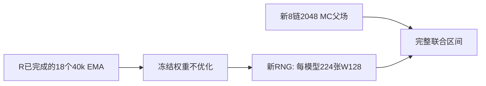

# 独立参考下的生成确认

Historical alias **Bridge** · ID `generation_bridge_20260924` · 2026-09-24

**Question:** R中有利的生成点估计，换独立MC参考并增加配对生成样本后能否确认？**Design:** 冻结R00/R10/R11的18个40k模型；不训练。**Main result:** 两个完整区间均跨0。**Status:** 确认门失败；不是再训练失败。

| 部分 | 模型 | 参考 / RNG | 角色 |
|---|---|---|---|
| A：条件覆盖 | 原R frozen | 复用旧R MC，33banks×42conditions/model | 探索性任务地图 |
| B：生成确认 | 同18 frozen | 新MC2026092441；新配对采样RNG | 预定义确认，不能并入旧图增加样本 |

| 主W128 G49–64 NRMSE | 效应 | 原98.75%联合CI | 判定 |
|---|---:|---|---|
| R10−R00 | −.165002 | [−.373930,+.054615] | 未通过 |
| R11−R10 | −.020991 | [−.102467,+.055739] | 未通过 |

[generation_uncertainty.json](evidence/analysis/generation_uncertainty.json)、[generation_point.npz](evidence/analysis/generation_point.npz)、[分析及作图](../../scripts/research20260921/run_generation_bridge_20260924.py)。fixed-model区间可能为负，但主推断还包含训练seed不确定性，不能换区间宣布成功。

每模型224张W128，共4,032图/252×16shards；S0cos²256、T1、无MC校正。新MC8链×256=2048，固定burn/spacing/QA；原模型结构仍dense1,976,706参数，原训练步数40k，优化器在此**不运行**。

主层级：六原训练lineage×MC链/时间块×图shard；块8的2000次，块4/16各1000；fixed-model、seed-only、MC-only、sampling-only各1000为分解。探索条件部分每bank64父场（8链×8）、64query、块2的2000次/95%点区间；不是主family检验。

实测约6.791h，1182/1182科学路径本地覆盖。新参考和新sampling RNG增强对旧权重的评价，**不会把六training lineages变成十二**。有利点估计仍应保留，但不能说生成收益已独立训练复现，也不能把较低NRMSE说成正确分布。

## 证据、参数与可用性

[完整机器证据与协议索引](EVIDENCE.md) · [逐文件来源/编辑SHA](provenance.json) · [科学路径及未公开材料](withheld-manifest.json) · [本地核验回执](backup-verification.json)。

公开仓库不包含所有checkpoint、MC父场或bulk generation；从权重重跑与核对统计是不同复现层级。请先读[数据可用性](../DATA_AVAILABILITY.md)和[复现说明](../REPRODUCING.md)。

[返回研究证据地图](../README.md)。
