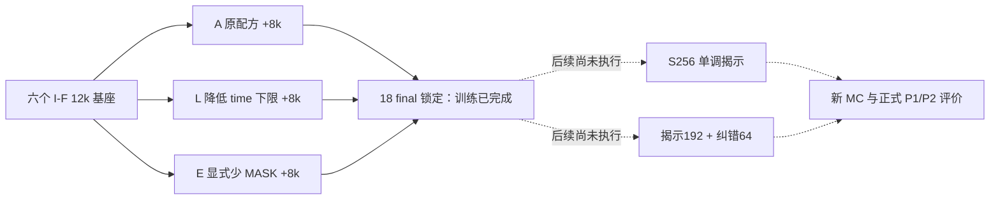

# 末期 MASK 覆盖与已提交自旋纠错

**Late-mask coverage and committed-spin correction** · Historical arm aliases **A/L/E**

Experiment ID `endpoint_mask_sampler_disentanglement_20261001` · 2026-10-01

| 30 秒摘要 | 当前事实 |
|---|---|
| Question | 末期只剩少量 MASK 的训练覆盖，与生成后能否修正已提交自旋，能否解释长程生成偏差？ |
| Design | 六个旧 I-F 基座各分三条匹配续训分支；原方案随后比较两种等调用预算采样器 |
| Completed | **18/18 分支 × 8,000 追加更新 = 144,000 更新**；18 个可恢复 final、36 个 4k/6k EMA |
| Main result | **尚无 P1/P2 科学结果**。新 MC、正式条件评价、生成和最终分析均未执行 |
| Status | `training_complete_evaluation_pending`，不是整轮完成或科学主门通过 |

正式训练于 **12:03:34.857–14:40:56.457（UTC+8）** 完成，墙钟 **2小时37分21.600秒**。
原 12h 预算从 06:29:17.948 开始，截止 18:29:17.948；预检与等待未被删去或重置。
本页是训练阶段的科学档案，不用训练 loss 代替尚不存在的生成结果。

## 真正改变了什么

比例均指更新次数。M 是 MASK 数；历史 sparse 的 K 是 visible 数，**少 MASK 和少 visible 是相反的条件区间**。

| 训练臂 | 普通遮盖 | 少 visible 的原 sparse | 显式少 MASK | 训练身份 |
|---|---|---|---|---|
| A · original-support | 75%，t∈[.01,1] | 25%，原规则 | 无 | I-F 12k → 20k |
| L · lower-time-floor | 75%，t∈[.002,1] | 25%，同 A | 无 | 相同 seed 的同一基座 |
| E · explicit-late-mask | 50%，t∈[.002,1] | 25%，同 A | 25%，均匀选合法 M | 相同 seed 的同一基座 |

三臂共享 clean parent、crop、物理 geometry、augmentation、更新序号和同 seed 初始状态；
干预更新的 mask、time 和监督分配**有意不同**。L/E 未替换更新的 native 输入一致；
三臂 sparse 更新一致。E−L 识别的是覆盖策略增量，不能进一步称为单独识别了绝对 M 的因果效应。

这是 [I 轮](../fine-geometry-identification/README.md) 的六条谱系分支，
不是 J-C 的 16k 再续训，也不是最新 N/W 精确局部模型；**18 分支不等于18个独立 fresh seed**。

## 主结果留空，而不是改换指标

下表是原定未来检验，不是本阶段已得到的结果。

| 预定义比较 | 终点 / 实质门 | 效应与区间 | 当前决定 |
|---|---|---|---|
| P1：E,S256 − A,S256 | W96 G25–48 NRMSE；区间上界 < −.05 | 未计算 | 尚未评价 |
| P2：E,R256 − E,S256 | 相同终点与实质门 | 未计算 | 尚未评价 |
| 方向门 | 上界 < 0，但未达到 −.05 | 未计算 | 尚未评价 |
| 条件能力、旧任务和物理保留 | 原协议的 KL/CE、短程、能量和磁化门 | 未计算 | 尚未评价 |

未来主比较要求六条配对 lineage 的 t 区间与 seed→图、MC chain→parent block 的
联合 bootstrap 区间同时通过；两主比较各用97.5%双侧区间。图、crop、query 和
sampling RNG 都不增加独立训练 seed 数。条件 CE 不是 joint NLL，局部精确 KL 不是整图 KL。

## 可重建的训练设置

| 设置 | 实际执行 |
|---|---|
| Seeds / steps | 92601–92606；18分支各追加8k，到 global20k；1k块固定轮换8轮 |
| Model | 原 dense Transformer，1,976,706参数；d128、4 heads、7 blocks、MLP ratio4、dropout0 |
| Position | 真物理坐标，2D RoPE base10000；MASK是有效、可被注意的token |
| Data | 复用768训练/256验证 L1024父场；原split、continuous/train-gap、D4/flip；没有新 MC |
| Width / batch | 16/24/32/48；72/32/18/8；18,432 input tokens/update，32步周期 |
| Total budget | 144,000 updates，2,654,208,000 input tokens；不是独立科学样本数 |
| Optimizer | 完整恢复 AdamW moments，β=(.9,.95)、wd=.05、clip1 |
| LR | 256步由3e−5升至1e−4，随后余弦降至1e−5；新的共同续训日程 |
| Precision | BF16 autocast；FP32参数/loss/optimizer；TF32关闭；严格 deterministic |
| Runtime condition | CUBLAS_WORKSPACE_CONFIG=:4096:8；CPU/CUDA、NumPy、Python RNG均保留 |
| EMA / selection | .999；4k/6k EMA用于未来学习诊断；8k final EMA预定为主评价，无选点/加步 |
| Final contents | raw、EMA、AdamW、所有 RNG、step/seed/arm、协议和累计输入摘要 |

E 从 {1,2,4,8,16,32} 中选择满足 M/W²≤.02 的 M，均匀无放回选择 MASK 位置；
`t_model=max(M/W²,.002)`，loss 每图为 masked CE/M 再按 batch 平均。
普通更新仍为 masked CE/t/18,432，2%全MASK；sparse保持512 hidden query槽位归一化。
因此不同臂最后一个 batch 的 loss **不能直接用作科学效果排名**。

## 历史失败、边界与尚未执行的内容

| 事件 | 保留的事实 / 正确解释 |
|---|---|
| 初期恢复不逐位一致 | 全臂诊断中默认设置仅5/18完全逐位一致，13/18未满足完整门（含仅优化器不同）；正式冻结前启用严格确定性后全部18个通过 |
| BF16 推理精度门失败 | 固定validation上最大概率差 .0055757165 > .005；平均CE差约 .0000205963 < .001。不是训练发散或主假设失败 |
| 全流程原时间门失败 | FP32 W96 16图×256调用技术测速113.381秒/shard；单W96原计划已约9.826h，不能保证含训练/MC/统计/备份的12h闭环 |
| 后续执行范围更正 | 明确改为只完成18分支训练；原预算起点和截止不变；不是把失败的全流程门改为通过 |
| 当前知识缺口 | 尚不知道训练覆盖是否改善条件能力或联合生成，repair是否优于等256调用揭示，以及物理量是否存在tradeoff |

原计划的 S256 与 reveal192-repair64、2,048个新MC父场、6,912张正式生成、384张旧基座clock诊断、
546份条件预测、majority/decimation诊断和最终六图，**均不能列作本阶段已完成成果**。
技术测速和人工 fixture 不算正式生成样本；本阶段正式新生成数为0。
本设计的 neural repair 不保证 Ising 联合分布平稳性；majority 数据诊断也不等于 RG 训练或 inverse-RG 验证。

## 证据与复现

| 训练阶段验收 | 已验证的范围 |
|---|---|
| 全输入重建 | 144,000条 physical/native/supervision hash、M和model time均逐条重建一致；CPU审计344.401秒 |
| 恢复与身份 | 18 final 的raw/EMA/AdamW全有限、optimizer step20k、RNG字段及累计digest；36 EMA身份/有限性/SHA |
| 配对 | 六seed三臂同基座/初始化，全程物理配对；L/E未替换更新与三臂sparse native输入配对 |
| 冻结文件 | 40个source/data SHA未改变；final lock与全部18个final一致 |
| 本地备份 | 新包128成员逐一核验；与初始包及六旧基座合并，173/173科学路径、字节、SHA全覆盖 |
| 本地完成时间 | 联合核验 14:57:52.854（UTC+8）；从最初预算起点计8小时28分35秒，含预检和等待 |

本轮公开63份来源证据副本，另有派生的 [phase_status](evidence/phase_status.json)
和 [branch_inventory](evidence/branch_inventory.json)。
[完整证据索引](EVIDENCE.md) → [全输入审计](evidence/training_phase_full_audit_v1.json) →
[checkpoint元数据](evidence/training_checkpoint_metadata_v1.json) →
[实际run协议](evidence/run_protocol.json) / [effective config](evidence/effective_config.json) /
[原科学代码](../../scripts/research20261001/run_training_phase.py)。
完整设计见[公开科学方案](protocol/SCIENTIFIC_PLAN_ZH.md)；其历史design_only状态不覆盖实际run身份。

**普通Git不含54个权重文件、144k原始训练日志或大训练父场。**
它们保存在经核验的保管者备份，新包 `training_phase_complete_v1.tar.gz` 为869,900,945字节，
SHA-256 `353d999f6cfe0091cfe9b3dc62088504e3350435f27c31b2699281873a54bea7`。
逐路径/大小/SHA和归档成员映射见[数据清单](withheld-manifest.json)；
[整包/成员回执](backup-verification.json)和[联合覆盖](evidence/training_phase_independent_union_v1.json)
不等于公开下载服务。同D盘独立目录不是异地灾备；需要文件时通过仓库issue提供experiment ID、member和SHA请求。

公开副本与原冻结字节的差别在[来源账本](provenance.json)显式记录；私有讨论来源、机器路径已移除，
计划E行的游离文字“我还是”仅在公开副本校订，原计划SHA不变。原方案正文与授权原件不在原路径直接公开，
全流程源码中的历史冻结检查需要取回这些身份材料，或在隔离的新复现目录创建明确的新协议；
**当前仓库不是一个命令即可原样重跑的完整原始镜像。**

后续评价需另一个明确的执行窗口；本阶段不自动追加。未来正式结果图尚不存在，本页不用人工fixture图替代。

### 自审：主张—证据—边界

| 维度 | 本页处理 |
|---|---|
| 贡献 | 提出分离训练覆盖与采样纠错的问题，不声称已证明有效 |
| 写作清晰度 | 设计表和谱系图优先；M与K、continued与fresh分开 |
| 实验强度 | 六配对lineage，不把18分支或144k更新当独立重复 |
| 评价完整性 | P1/P2、保留与物理tradeoff明确未执行；没有伪造CI |
| 方法边界 | BF16训练不等于BF16推理门通过；repair无平稳性保证，majority不是RG训练 |

“训练完整”由审计、final lock和备份支持；“改善生成/条件能力”仍需要新评价证据。

[返回研究证据地图](../README.md) · [数据可用性](../DATA_AVAILABILITY.md) · [复现层级](../REPRODUCING.md)
