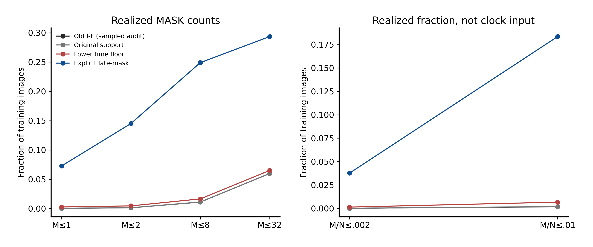
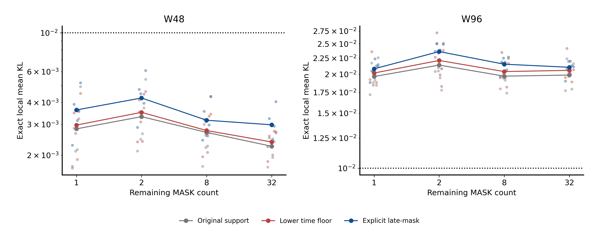
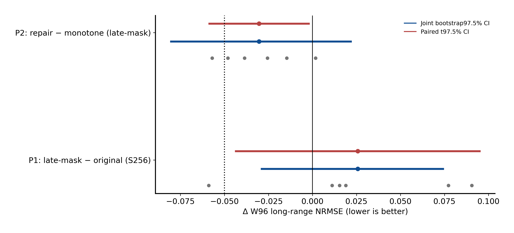
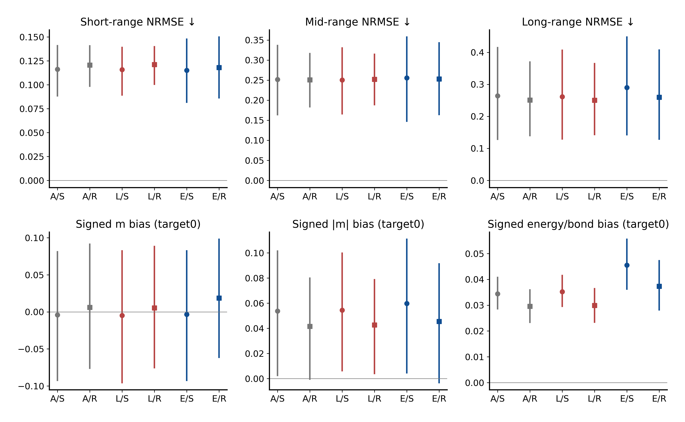
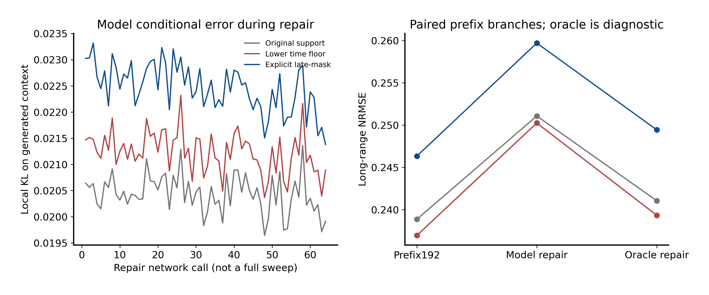
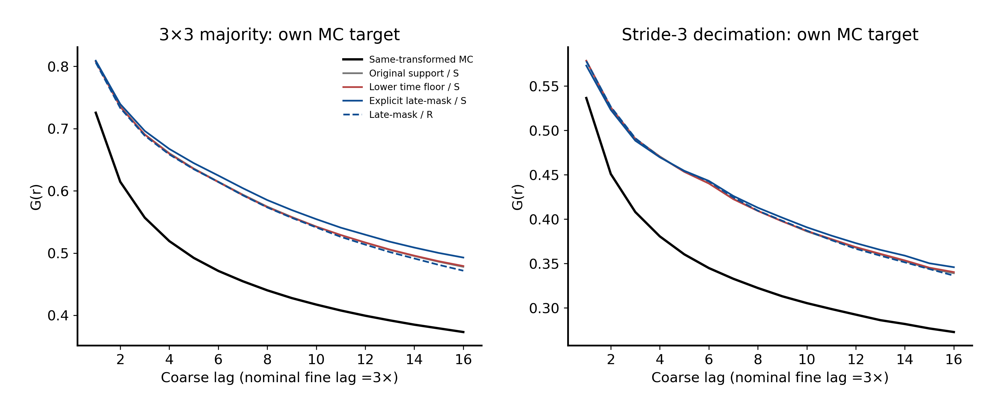

# Figure evidence and captions

Predefined primary effects remain separate from all secondary diagnostics.

## 01_mask_coverage

Observed cumulative coverage. Historical I-F uses6144 reconstructed updates, not a full replay; new arms use all logs. Sparse-visible updates are included and are not late-mask examples.

## 02_local_conditional_ability

Exact nearest-neighbor conditional KL; dots are six inherited training lineages, lines are means. The.01 line is an accuracy threshold, not proof of correct joint generation; formal simultaneous upper bounds are in summary.json.

## 03_predefined_primary

Two predeclared effects. Each requires both interval upper bounds below−.05 for practical success. Six gray points are lineages; secondary diagnostics do not replace these endpoints.

## 04_physical_tradeoffs

W96 estimates and secondary95% joint intervals. S=monotone256, R=reveal192+repair64. Signed moments and energy target0, not uniformly lower values. Formal absolute-bias non-degradation gates are separate.

## 05_committed_repair_diagnostics

Model and analytic Gibbs branches share the same prefix, position schedule and uniforms. Oracle is not a learned-model result or an upper bound. The prefix comparison spends additional compute and cannot replace equal256-call P2.

## 06_true_coarse_graining

All model/MC fields receive the same operator within each panel. Curves are means; inferential intervals are in secondary arrays. Majority is not decimation or a same-beta nearest-neighbor Ising law; this figure is not RG-training validation.

