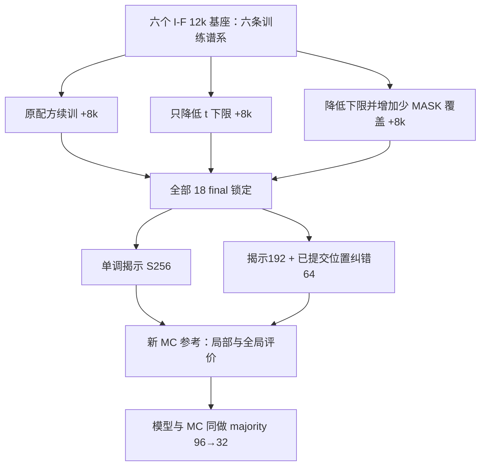

> Public archival copy. Historical planning/status text is preserved; consult the campaign README for actual execution and final decisions. Infrastructure identifiers are redacted. Relative links below are historical source identifiers. Original SHA and every transformation are recorded in provenance.json.

# 下一阶段：末期 MASK 训练覆盖 × 已生成自旋纠错

日期：2026-10-01。版本：设计候选 v1。公开语义名称：**Late-mask coverage and committed-spin correction**。

**状态：仅设计；未实现正式 runner、未做本轮 GPU 测速、未启动训练/MC、未冻结预注册、未获本轮执行授权。** 本文不修改任何已完成实验的协议或结论，也不是上一轮的续跑命令。

## 0. 三十秒摘要

| 项目 | 建议 |
|---|---|
| 要回答的问题 | 生成偏差有多少可由“训练很少遇到末期少量 MASK”和“已生成自旋不能修正”解释？ |
| 主设计 | 六条 I-F 模型谱系，各分三条匹配续训分支；每个 final 用两种等模型调用预算的采样器评价，即 **3 × 2** |
| 训练规模 | 18 个 continuation，每个追加 8,000 步；总 144,000 次更新；不是 18 个独立 fresh seed |
| 主要评价 | W96 长程相关误差；另设短程、能量、磁化及条件能力检查，防止“只修好一条曲线” |
| 正式生成 | W96 每单元 128 张、W48 每单元 64 张，共 6,912 张；六条训练谱系配对 |
| RG 的位置 | 本轮对模型和 MC 同做真正 3×3 majority coarse-graining，检查粗尺度误差；**不把它冒充 RG 训练或 inverse-RG 已验证** |
| RTX4090 预算 | 中心估计约 **9 小时**，对外按 **9–10 小时**安排，建议预留 **12 小时**；启动前必须重新测速通过时间门 |
| 这轮不做 | 换 backbone、加参数、同时引入 RG 训练、W128 大规模生成、按结果挑 checkpoint/seed、把小幅显著性写成全分布正确 |

这不是“再试一批参数”。设计要求：无论正负，都能区分训练覆盖、条件预测能力、采样计算分配与全局相关结构，并据此决定是否继续投入。

## 1. 科学动机与已核对的实现前提

本公开副本移除私人讨论来源与时间定位表；训练覆盖、采样纠错、局部与长程统计及真实粗粒化的科学检验完整保留。

### 已核对的代码事实

- I 轮普通训练：`t ~ Uniform(.01, 1)`，2% 样本改为全 MASK；原 25% sparse-conditioning 是**少可见点、多 MASK**，与本轮的**少 MASK、多可见点**相反。训练数据 (`historical source: ../../scripts/research20260926/identification_data.py`)
- I 轮 S0：余弦平方 256 步，`model_t=max(t,.01)`；已 reveal 的位置不会再更新。训练/采样实现 (`historical source: ../../scripts/research20260926/identification_training.py`)
- `confidence_remask` 的历史名字不证明具有 committed-token correction；现有 S2 还包含 checkerboard refinement。新 kernel 要按实际状态转移命名。旧采样代码 (`historical source: ../../ism_diffusion/stage2_sampling.py`)
- `t=.002` 在 48²、96²、128² 分别对应平均 4.608、18.432、32.768 个 MASK，**不等于“只剩两个”**。Bernoulli masking 下更小的实际 M 仍可能发生，训练不足应看暴露频数，不能写成严格不可能。
- 最新 N/W 六小时实验只研究 fixed-clock 局部精确任务、没有生成，不能直接用它的模型替换本轮生成基座。该轮边界 (`historical source: ../../experiments/canonical-context-size-generalization/README.md`)

## 2. 实验谱系与归因单位

选择全部六个 I-F final：92601–92606，各自原来 fresh 12k。理由是有可恢复的 raw/EMA/AdamW/RNG、配对记录和真实物理坐标；**不是因为它们在生成上已经通过，也不挑其中最好的 seed**。

三组是 continuation；主效应的独立训练谱系数仍为六，不是十八。每张图的随机数是 sampling replication，不是新的训练 replication。新 MC 只用于评价，与训练父场独立；粗粒化后的样本继续继承原父场 ID，不能加算独立样本。

基座来源：I 轮协议 (`historical source: ../../experiments/fine-geometry-identification/evidence/run_protocol.json`)、完成/解释 (`historical source: GEOMETRY_IDENTIFICATION_RESULTS_20260926_ZH.md`)、本地已核验 `training_s92601_I-F_v1` 至 `training_s92606_I-F_v1` 六包。执行前仍须逐个核对 final 成员 SHA、身份、step=12000 与完整恢复字段。

## 3. 三组训练：真正改变什么

下表中的比例是**更新次数比例**。各组使用相同 clean parent、crop、geometry、augmentation、update index；只有预定义的 corruption policy 不同，因此不能声称干预位置的 noisy input/mask/t 也相同。

| 项目 | `original-support`（A） | `lower-time-floor`（L） | `explicit-late-mask`（E） |
|---|---|---|---|
| 基座/追加步数 | 同一 seed 的 I-F / 8k | 相同 | 相同 |
| 普通 Bernoulli mask 更新 | 75%，t∈[.01,1] | 75%，t∈[.002,1] | 50%，t∈[.002,1] |
| 历史少可见点更新 | 25%，保持原规则 | 相同 | 相同 |
| 显式少 MASK 更新 | 无 | 无 | 25%，下述固定 M 规则 |
| 普通更新中全 MASK 概率 | 2% | 2% | 2%（仅普通更新） |
| 尺寸/物理 geometry /坐标 | 均继承 I-F | 相同 | 相同 |
| 监督归一化 | 继承原 ordinary / sparse | 相同定义 | endpoint 每张图取 masked CE 平均 |

E 是一个**末期覆盖训练策略**，改变了状态频率以及各噪声区间的监督分配；不是声称只改一个浮点阈值。L 用来判别仅调下限能解释多少效果。E−L 仍是覆盖策略的增量，不可进一步冒称单独识别了“绝对 MASK 个数”与“比例”中哪一个起因果作用。

### 显式少 MASK 更新的精确定义

令 N=W²，M 表示 MASK 数；避免用历史 K（可见点数）指代 M。

1. 允许集合 `M ∈ {1,2,4,8,16,32}`，同时要求 `M/N <= .02`。因此 W16/24/32/48 的集合分别为 `{1,2,4}`、`{1,2,4,8}`、`{1,2,4,8,16}`、全部六值。
2. 在允许集合内按样本均匀抽 M；在 N 个位置中无放回均匀选择 M 个 MASK，其余全 visible。**不使用标签/难度/模型置信度选位置。**
3. 物理取样同时包含 continuous 与原 train-gap，不新增宽度、spacing 或 held-out geometry。
4. 记录 `q_mask=M/N` 和 `t_model=max(q_mask,.002)` 两个字段；不得把时间输入与实际剩余数混成一个变量。
5. 每样本 loss 为 `sum_mask CE / M`，再对 batch 平均。这等于以实际包含概率 `M/N` 作原 masked-loss 的归一化；**不可误用被截断后的 t_model 作分母而压低小 M 的监督权重**。
6. A/L 的普通更新仍用 `sum(mask*CE/t)/18432`，保持期望尺度；原 sparse 更新仍用 512 槽位归一化。记录每组实际监督数、loss 与梯度分布，承认有限样本梯度方差不完全相同。

### 固定工程与优化参数

| 参数 | 预定值 |
|---|---|
| Backbone | 原 dense Transformer；1,976,706 参数；d=128，4 heads，7 blocks，MLP ratio=4，dropout=0 |
| 坐标 | 原 I-F 真物理坐标，2D RoPE base=10000；MASK 为有效 token；不新增位置机制 |
| 宽度 / batch | W=16/24/32/48；每更新 18,432 token，对应 batch=72/32/18/8 |
| 几何 | 连续与 train-gap 各半；原 I 的 gap 多重集/随机排列/D4/spin flip 不变 |
| 排程 | 32 步周期，八个宽度×几何单元各四次；A/L 三普通一 sparse，E 两普通一 endpoint 一 sparse |
| 分支交错 | 每分支 1,000 步一个块，18 分支轮换八轮；seed 与 arm 的循环次序事先固定 |
| 优化器 | 恢复 raw、EMA、AdamW moments、所有 RNG；betas=(.9,.95)，wd=.05，clip=1；不重置优化器 |
| 续训 LR | 新的共同 schedule：256 步从 3e−5 线性到 1e−4，随后余弦下降至 1e−5；不是冒称延续旧 12k 的 LR 曲线 |
| 精度 | FP32 参数/loss/optimizer，BF16 autocast；TF32 关闭；环境与 determinism/attention backend 全部记录 |
| EMA / 选点 | .999；只用追加 8k 后 final EMA 作主评价；4k/6k EMA 只诊断学习进展 |
| 父场 | 继承原训练 768 个 L1024 父场，原 validation 256 个；核对 split/链/来源 SHA，未通过不能启动 |
| 训练总量 | 18×8000=144,000 更新，2,654,208,000 input tokens；不等于同数量独立监督样本 |

所有 final 锁定后才做正式生成和 test 比较。验证曲线不用于追加步数或换 checkpoint。

## 4. 两种采样器：相同调用预算，不偷加算力

所有正式采样：temperature=1；时间输入下限**共同为 .002**；完整有效网格；沿用开放轴的统计定义，不宣称新周期边界目标。

| 方法 | 网络调用 | 已提交位置能改变？ | 回答的问题 |
|---|---:|---|---|
| `monotone-256`（S256） | 256 次余弦平方揭示 | 否 | 共同的新低 clock 基线 |
| `reveal192-repair64`（R256） | 192 次揭示 + 64 次纠错 | 是 | 同预算，把部分时间花在纠错是否更好？ |
| `prefix-192` | R256 中间产物，不额外调用 | 否 | 纠错前后同一图发生了什么？不是独立复制 |
| `oracle-repair64` | 同 prefix 上 64 次解析局部 Gibbs 更新，**不调用模型** | 是 | 正确局部条件下的同长度纠错参照；仅诊断 |

S256 和 R256 的 reveal 都从全 MASK 走到全 reveal；末尾时间显式置 0。即使提前没有 MASK，也按预定调用日程计费，记录总调用/有效调用及墙钟。将来若优化提前退出，必须另作同成本说明，不能静默改变公平性。**等网络调用不等于严格等墙钟**：repair 的选点/记录开销另报；若它更慢，不得把“等256调用”写成“相同秒数”。

**S256 此处不是历史 S0 的逐位重放**：clock floor 已由 .01 改为 .002。为避免把这个变化误归给训练，阶段 0 额外给六个冻结基座各生成 32 对 W96 图，比较 floor=.01 与 .002；仅诊断、不用于挑主设置。

### repair64 的明确 kernel

每次修正从已完整生成的场出发：

1. 在网格内部（排除最外一圈）交替选棋盘黑/白色；由独立 RNG 在该颜色中均匀无放回选位置，不按置信度选择。
2. W96 每次选 M=32，W48 每次 M=8；所选点无最近邻相邻关系，所有四个最近邻均 visible。
3. 保存其旧值，再置 MASK；令 `t_model=max(M/W²,.002)`；做一次网络前向，按预测 Bernoulli 独立采样新值，其他位置不动。重复 64 次。
4. 记录被重新 mask 的 committed ID、旧/新值、实际 changed 数、预测概率、四邻居和 RNG 身份。随机抽样结果可以等于旧值；不能强制翻转。
5. 不把网络值当精确 Gibbs 条件，不声称此 kernel 保持目标联合分布。边界不能被纠正是本设计的明确限制，边界/中心统计同时保留。

同样的 mask 日程和均匀随机数应用于 oracle 分支：

\[
p_*(s_i=+1\mid s_{\partial i})=\operatorname{sigmoid}\bigl(2\beta_c\sum_{j\in\partial i}s_j\bigr),\qquad
\beta_c=\tfrac12\log(1+\sqrt2).
\]

此式只用于**连续、最近邻、零场 Ising 的内部点，且四邻居均给定**；不能用于 held-gap、majority 粗粒化场或边界缺邻居情形。对这种位置集合，解析条件可并行更新。有限 64 次更新不保证从坏初态达到平衡，也不是质量上界。oracle 使用真实物理知识，其改善不得算作神经模型成果。

本方案的 repair 是可审计的诊断 kernel，**不是 ReMDM 论文实现复现，也不继承其理论保证**。若未来声称新的通用采样方法，还要独立实现并比较已有 principled remasking 基线。

## 5. 分阶段实施与技术停止门

### 阶段 0：核对覆盖、恢复与采样语义

先做技术 fixture/测速并冻结全部方案，再生成下面的正式冻结模型诊断。技术预检只用人工或 validation fixture，不访问新 test 终点；阶段0的384张图先保存轨迹，正式物理比较在全部18 final锁定后统一计算。这里的阶段顺序不能被用来先看test结果再改分组。

预定输出，而不是按诊断好坏挑下一组：

- 每条旧 I-F 流按固定 seed 分层重建 1,024 个训练更新（共 6,144），统计每个宽度、ordinary/sparse、M 桶及 t 桶暴露。明确这是抽样审计，不称旧 72k 更新全重放。
- 六基座各 32 对 W96 floor=.01/.002，共 384 张冻结诊断生成；记录 late trajectory 的 nominal t / model t / M / committed fraction。
- 以预先固定的 16 个父场、两宽度、四 M、两 clock 检查六基座：1,536 次条件图输入。只读已有文件的审计与新增 GPU 评价分开计时。
- CPU 人工 fixture：MASK 不泄漏、M 正确、棋盘无邻接、四邻居 oracle、D4/flip、image RNG 批量一致性、commit→MASK 真的发生。
- 小型 2×2/3×3 枚举 fixture 验证解析内部/条件 Gibbs 的平稳分布与状态转移；不据此给近似神经 kernel 颁发平稳性证明。
- GPU 技术预检：恢复后下一步与不中断副本的 raw/EMA/optimizer 比对；三臂全类型 forward/update；完整 256-call W48/W96 shard16、FP32 条件预测、日志/传输/校验真实耗时。
- 数值预检：固定256个validation输入对比BF16与FP32，max概率差≤.005、平均CE差绝对值≤.001；不合格须重审精度与预算，不临时切精度后沿用旧时间门。最终条件bank用FP32，生成用经检查的BF16概率流程，两种精度标签保留。

技术门失败可修复后重新冻结**新方案**；时间已经消耗不能隐去。科学诊断差并非跳过某个 seed 的理由。若发现基座文件、父场 split 或所谓末期语义与本文不一致，先修订说明并请求方向，不盲目开训。

### 阶段 1：三组匹配续训

18 个模型固定各 8k；全程记录 finite loss/grad、监督数、LR、M/t 暴露和输入 hash。每组物理数据相同；A/L 的 uniform variate 共用、映射到不同区间；E 与 L 未替换的 ordinary/sparse 更新逐输入一致。被替换的 endpoint 更新不能伪造“同 mask 配对通过”。

### 阶段 2：冻结后的条件能力与生成

**条件能力 bank**：新的 MC 中按每链等间隔选 16 个父场，共 256；W48/W96 × M=1/2/8/32，内部同色非邻接 MASK。18 模型共 `18×2×4×256=36,864` 图输入；每个 masked 点具有上述精确局部真值。保存 CE/Brier/KL/概率误差，KL 仅在这个合法精确设置计算。

**邻居模式压力测试**：每宽度固定四个背景，穷举中心四邻居 16 种符号；中心为唯一 MASK，共 `18×2×4×16=2,304` 图输入。报告最坏误差，但有限 128 个测试输入不是全状态空间保证。

**旧能力保留**：C48 K115、C48 K1152、H48 held-gap K512，各 256 父场、64 hidden query；共 `18×3×256=13,824` 图输入。此处 K 是 visible count；结果是 CE，不是精确 joint KL。

**学习诊断**：4k/6k/8k EMA，在独立 validation 的 128 父场、W48、四个 M 上评价；共 `18×3×4×128=27,648` 图输入。6k→8k 的平均局部 KL 改善仍 >.002 标记 `learning_incomplete`，只限制负解释，不追加更新。

**生成**：

| 范围 | 数量 | 独立性说明 |
|---|---:|---|
| W96 final | 6 seeds×3训练臂×2 sampler×128=4,608 | 主生成结果 |
| W48 final | 6×3×2×64=2,304 | 尺寸内生成保留/反例 |
| 阶段0 W96 | 6×2 clock×32=384 | 旧模型诊断，不并入正式新训练均值 |
| R256 的 prefix192 | 18×(128+64)=3,456 | 来自同条轨迹，无新增网络调用，不算独立样本 |
| oracle64 | 同样3,456 | prefix 分叉；解析物理参照，非网络生成成绩 |

图级 RNG 按 `(lineage,width,image_id,role,step)` 显式键控；跨训练臂共享外生抽样数，repair 与 reveal 分流；不得让 shard/batch 组织改变每张图随机数。S256 和 R256 日程不同，共同随机数是方差控制，不意味着路径相同。

## 6. 新 MC、数据切分与可核查的误差条

新 reference master seed 拟定 2026100111；16 链×128=2,048 个 L1024 父场；8 random/4 plus/4 minus；4 CPU workers；沿用固定 Wolff burn40、间隔4、adapt3、pilot128。不可“采到 QA 通过”。

energy、abs(m)、m²、G25–48 的 split-Rhat≤1.1、各链 ESS≥16；检查链轨迹、符号遍历及链间差异。未通过则主结论标记参考不可靠并停止正式判定，不悄悄加链、删链或加 burn-in。

每个父场预先固定一个 96×96 continuous crop；W48 是其预定中心子窗，majority32 是同一 W96 的变换。裁片及 query 不作为独立 MC replicate。主参考为 L1024 周期父场中的窗口，不把 W96 当独立周期小系统；生成统计使用同样开放轴/非 wrap 计数。

新 role roots 拟定：training stream=2026100121，bank/crop=2026100131，generation=2026100141，repair=2026100142，bootstrap=2026100151。冻结时须检查与既有 run 身份不冲突。

### 统计层级

- 主科学单位是六条配对 training lineage。每条下的图独立 RNG，但同模型，不把 128 图当 128 次训练复制。
- 主报告同时给六个 seed 的值、平均差、配对 t 区间，以及 **seed→图、MC chain→连续 parent block** 的联合 bootstrap。
- 两个主比较分别给 **97.5% 双侧区间**（Bonferroni 家族控制，方向判定因此偏保守）。联合 bootstrap 20k，MC block8；block4/16、seed-only、image-only、MC-only 各10k。共享参考在同一重抽中共用，不能对两臂独立重抽 reference。
- 主决策要求配对 t 与 block8 联合 bootstrap 均满足阈值；敏感性若方向反转，标记不稳健。LOO 六次与全部 64 个配对符号翻转作诊断；符号翻转分辨率有限，不强求其单独达到修正后的 p 阈值。
- 这不是六 seed 条件下严格覆盖率保证。报告 reference-only 波动与 bootstrap Monte Carlo 误差；后者大不等于科学标准误大，不能混称 MCSE。
- 小区间不能证明等效。相同基座的三分支不合并为18个seed。不会因为检验未过就补图/补seed。

## 7. 主终点、实质门与保护性检查

主终点固定为 W96 的 G(r) 在 r=25…48 的 NRMSE，沿用既有开放轴相关定义与 ratio-of-pair-sums 聚合：

\[
E_{25:48}=\frac{\sqrt{\frac1{24}\sum_{r=25}^{48}(G_\theta(r)-G_{MC}(r))^2}}
{\max\{\sqrt{\frac1{24}\sum_{r=25}^{48}G_{MC}(r)^2},10^{-12}\}}.
\]

按 seed 先聚合图，再计算误差；不得先算每张图 NRMSE 再平均而换定义。

| 类型 | 预定义比较/门 | 支持的解释 |
|---|---|---|
| 主 P1：训练覆盖 | `E,S256 − A,S256` 的区间上界 < −.05 | 末期覆盖策略带来有实质量级的长程误差改善 |
| 主 P2：纠错 | `E,R256 − E,S256` 的区间上界 < −.05 | 同调用预算下，为已提交位置分配纠错有实质收益 |
| 主方向但未实质 | 上界<0，未低于−.05 | 有方向证据，但未达到本轮事前实质标准 |
| 次要归因 | L−A；E−L；A/L 上的 R−S；`(E,R−E,S)−(A,R−A,S)` | 区分降低下限、覆盖增量和交互；不能替换主终点 |
| 轨迹诊断 | 每个 R 的 after−prefix；oracle after−prefix；修正 KL/能量轨迹 | 不额外算独立样本，不能倒推唯一原因 |

`.05 NRMSE` 是本轮预设的工程实质门，不是物理常数或由 t 下限推出的理论界。另报 .02/.10 灵敏度，但不改正式结论。若两个主门都过且下述保护通过，才称“本设置下训练覆盖与纠错双证据”；某一个失败照实保留，不由次要结果救回。

### 防止修好长程却破坏其他性质

1. **条件能力**：E 的八个 `(W,M)` 精确 bank mean KL 各给 99.375% 单侧上界（8门 Bonferroni），阈值 .01；逐 seed 报压力测试 max probability error，观察门 .05。后者仅对有限测试集。能力门失败不擦掉生成正结果，但不能说“模型已学对、剩下纯是 sampler”。
2. **旧任务保留**：E−A 的三项 CE 单侧98.333333%上界≤+.005；保持原任务身份及共用父场。
3. **物理保留**：对拟宣称有效的 P1/P2 对比，在 W96 检查短程 G1–8 NRMSE、能量 absolute bias、abs(m) absolute bias，退化容限依次 .02、.01、.02，单侧98.333333%上界；两个主分支均宣称整体改进时，再对两分支的六门统一用99.166667%上界。signed bias 本身仍完整报告，目标是0而不是越低越好。
4. 同时报告中程 G9–24、m、m²、W48 尺寸内结果，以及 W96 full-window/预定中心48/边缘带结果。W48曲线只报告r=1…24，分段为1–4/5–12/13–24，另列G1–8便于局部比较；不能把W96的25–48段生搬到W48。W48 的退化必须写入主摘要，不能只画有利 W96。
5. 不因上述有限统计量接近就写“正确联合分布”“精确 likelihood”“世界模型通过”。本轮仍是静态 Ising、特定训练谱系和预算下的机制研究。

## 8. 真正的 RG 检查：本轮做到哪里

对**全部** W96 正式生成及新 MC crop 预定义同一算子：

\[
[T_3(s)]_{ab}=\operatorname{sign}\!\left(\sum_{u,v=0}^{2}s_{3a+u,3b+v}\right),\qquad 96\times96\to32\times32.
\]

九个 ±1 不会 tie。主视图固定左上对齐、非重叠块；另在同一96场内，以起点`(0,1,2)×(0,1,2)`分别取90×90子窗→30×30，九起点统计的平均作为原点敏感性，嵌套在同一父场，不能当九倍样本。

| 变换 | 用途 | 比较的 reference |
|---|---|---|
| Majority3 | 真正 coarse-graining，检查团簇/粗尺度结构 | **Majority3(MC)** |
| Decimation3 | 只取每3格一个，说明其不等于 majority | **Decimation3(MC)** |
| 原始场 | 细尺度主评价 | 原始 MC crop |

majority 后 G 的预定 bands 为1–2/3–8/9–16 coarse格；同时保存全曲线，横轴同时标 coarse lag 与名义3倍fine间距。比较 m、m²、abs(m) 和相邻相关；粗场的 nearest-neighbor energy-like 量只是统计量，**不称原 beta_c 最近邻 Hamiltonian 的真实能量**。

不要直接比较两种算子下 NRMSE 的大小来排“哪种 RG 更正确”；各自的目标分布不同。也不强迫 majority 曲线与原始同 beta 小晶格重合。数据处理是精确的，但有限窗口/离散 block map 不保证所有统计量完全尺度不变。

这一部分无需额外神经前向，属于主 campaign 的**预定义多尺度诊断**，不是新的训练 replication。它落实了老师“真的对数据做 block-spin”的建议，但**尚未检验用 RG 数据训练是否改善外推**。

## 9. 结果出来后，怎样决定下一步

| 观察 | 合理结论 | 下一步，不自动执行 |
|---|---|---|
| L改善，E无额外收益 | 单纯降低时间覆盖下限已解释部分问题 | 固定低下限，扩大独立验证；不神化精确 M 采样 |
| E的条件KL明显改善，但生成不改善 | 局部能力修好了，尚未转化为联合生成 | 检查早期大尺度决策、条件相容性与更有原则的 sampler |
| R优于S256且不伤物理门 | 同预算已提交位置纠错有效 | 进入独立 fresh-seed 确认；不要把本轮续训当 fresh 复制 |
| R优于prefix192但不优于S256 | 纠错有作用，但不如把同算力用于揭示 | 不宣布 sampler 胜出 |
| oracle改善、模型repair不改善 | 指向局部条件误差或错误上下文上的鲁棒性问题 | 做有针对性的能力/上下文检查；不是唯一因果证明 |
| oracle也不改善 | 这64步/这种局部 kernel 没显示收益 | 检查混合速度与早期全局结构；不能断言所有纠错无效 |
| 长程变好但能量/磁化退化 | 物理 tradeoff | 本轮整体门失败；保留两边结果 |
| fine局部接近、majority大尺度仍差 | 错误集中在粗尺度的证据增强 | 优先设计独立 RG 训练/coarse-to-fine campaign |
| 全部未决且learning_incomplete | 当前预算不足以作强负结论 | 先评估是否值得预注册新的更长训练，不能原地加步 |

即使主门失败，本轮也应交付全部误差来源和反例，而不是又回到“也许再加训练会好”的开放循环。

## 10. RTX4090 时间预算：来自什么证据

硬件假设：一张24GB RTX4090、约10 vCPU/60GB RAM；训练和推理串行占GPU，MC使用4 CPU workers并行；本轮没有实时核验服务器可用性、租期或新环境速度。

### 已核验的历史数值

| 历史来源 | 实测/记录 | 如何使用 |
|---|---:|---|
| I 轮 GPU 预检 | 216k updates 预测训练11856.09s，即约.05489s/update | 同骨干、同18432 token的邻近代理，不当本轮实测速率 |
| I-F 六个完成记录 | 每模型128张W96、256步，264.208–264.662s | 约2.066s/图；不是统计脚本的“generation timing” |
| I 轮16图预检 | 33.1747s/shard | W96基本成本，需加repair/日志的新开销 |
| I 轮新MC | 2048 L1024父场4891.18s | 约1.36h CPU；能与训练重叠，不能再机械相加 |
| 原W48/W96条件预测代理 | .007997/.028988s/图输入 | FP32 batch2；不是训练或BF16生成速度 |

预算的逐项数量、来源摘要和情景算式见机器可读设计 (`historical source: ENDPOINT_MASK_SAMPLER_DISENTANGLEMENT_CONFIG_20261001.json`)及预算审计 (`historical source: ENDPOINT_MASK_SAMPLER_DISENTANGLEMENT_BUDGET_20261001.json`)。

| 环节 | 中心规划 | 保守情景 |
|---|---:|---:|
| 全类型预检/覆盖审计 | .50h | .50h |
| 18×8k续训（含新策略约10%开销） | 2.42h | 3.00h |
| 新MC（与训练重叠） | 约1.5–1.8h，不另加 | 1.81h，不另加 |
| W96正式 + floor诊断（4992图） | 3.16h | 3.64h |
| W48正式（2304图） | .51h | 1.33h |
| 条件/学习/压力测试 | .39h | .56h |
| 统计、RG诊断及图 | .50h | .67h |
| checkpoint/预测写入余量 | .50h | .58h |
| 备份、逐成员SHA、联合覆盖和看图 | .75h | .75h |
| **合计** | **约8.7h** | **约11.0h** |

W48生成尚无本轮实测：中心暂按W96的35%计，保守直接按W96历史耗时计；**这不是声称 Transformer 按边长线性缩放**。训练按.075s/update、W96按42s/shard的保守情景也不是绝对上界。新记录、磁盘争用或网络慢仍可能超出。

因此建议 **预计9–10小时，预留12小时**，不承诺6小时完成。这里包含机器计算、正式新MC、统计及本地闭环；**不含尚未编写的新代码、人工开发调试和用户审批等待的提前日历工时**。若执行后出现等待，其时间必须算进已启动预算，不能重置。当前保守情景11.0h虽低于12h，却高于下述10.5h启动门，所以**此刻并没有完成启动可行性验证**。

启动门候选：从第一次本轮GPU预检起计12h；实际全类型测速重算后，总预测≤10.5h才正式启动，余1.5h作为额外意外空间。预计无法满足则停在预检，先改为明确的新版本并获同意；不能悄悄砍seed、图片、主评价或备份。运行中不为凑满预算加任务。自动停止只针对本轮精确PID/进程组，绝不碰旧作业。

## 11. RG训练与 inverse-RG：独立下一模块，不隐藏在时间估计中

老师19–21分钟的建议确实还包含“**用粗粒化数据训练**”；本轮第8节只是先定位粗尺度误差，没有完全检验这个建议。要直接检验它，应另开协议，避免本轮同时更改训练mask、sampler、数据目标和架构。

建议下一模块分两级：

1. **RG数据学习**：固定本轮明确选定且另行冻结的mask/sampler，比较 fine-only 与 fine+真实majority3 数据；模型显式标记scale level/transform，使 coarse token 不被误当同beta原始spin。共享参数量和fine监督量；同时设fine replay/算力匹配对照。主评价仍在同一个fine test目标，coarse CE只与自己的真reference比较，不能跨熵不同的任务排优劣。
2. **条件逆映射**：训练 `p(fine | T3(fine))`，与 unconditional fine model 比较；另设 shuffled coarse（跨父场置换）负对照。每个coarse条件生成多份fine样本；检验重粗粒化一致率、细尺度统计与条件多样性。不可拿单张原fine的像素重建误差当唯一成功指标，不把硬约束带来的100%一致率冒充学会物理分布。

raw/coarse/所有crop均按同一原parent/chain分组切分。块算子、level表示和条件注入必须先人工toy验证，之后才能给可冻结的完整训练预算。

**本轮9–10h不包含这两个新训练模块。** 对它们现在报一个精准4090小时数不可靠：新条件输入/训练尺寸尚未实现测量。若只做第8节RG诊断，其计算已计入本轮；若要求下一次直接同时执行RG训练，应先单独补齐架构、对照与测速，不把未测工作塞进12h承诺。

## 12. 实施验收、产物与报告要求

候选新输出根：`artifacts/endpoint_mask_sampler_disentanglement_20261001`。这是名称建议；本次未创建运行目录或锁。

必须完整保留：

- immutable设计/config、实际effective config、授权、环境、时间门、source/data/base SHA；设计状态与实际run状态分开存储。
- 18可恢复final（raw/EMA/AdamW/RNG）+36个4k/6k EMA、全部144k更新日志、三臂物理配对和有意不同mask的证据。
- 新2048父场/16链轨迹/QA、全部bank与真值、36864局部+2304压力+13824保留+27648学习+1536阶段0条件输入身份。
- 正式6912图、阶段0的384图、3456 prefix及3456 oracle对照；原始spin、RNG、逐图物理统计、repair轨迹；不将中间图重复计独立样本。
- 主/敏感性/保留/能力/learning flags、真实majority与decimation数据、plot_data、逐文件manifest。
- 至少六张主图：M/t暴露；局部KL；六seed主效应；能量/磁化tradeoff；repair前后/解析参照；raw→majority粗尺度误差。主次/探索分栏，负结果在摘要出现。
- 备份按整包与成员SHA核验，科学manifest联合逐路径覆盖；检查所有最终图，不用preflight图替代。C盘留≥2GiB，下载与独立副本占用按实测检查，不删旧数据腾空间。
- 总报告记录真实开始/结束/备份完成时间、算力口径、未达门及限制。是否公开载荷、GitHub提交按后续执行/发布授权处理；不上传私人转写、连接信息或凭据。

### 设计自审与尚待完成的门

| 维度 | 本次处理 | 尚未完成 |
|---|---|---|
| 研究贡献 | 定位两个故障来源；不包装已有remasking为新算法 | 需要新实验，当前无效果结论 |
| 可读/可重建 | 参数、谱系、mask/clock/loss区别、计数与预算显式化 | 新runner及独立代码审查 |
| 实验强度 | 六配对谱系、实质门、绝对能力与物理tradeoff | 不保证六seed检验功效 |
| 对照完整 | literal低t组、prefix、等NFE、解析oracle、RG双算子 | 若要宣称通用方法，还缺正式ReMDM等基线 |
| 方法正确性 | 不假定神经repair保持目标；边界与coarse-law限制明确 | 恢复、CPU/GPU fixture、峰值内存/耗时均待新测 |

## 13. 参考资料与解释边界

- 本仓库 I 轮实现 (`historical source: ../../scripts/research20260926/identification_training.py`)、数据分配 (`historical source: ../../scripts/research20260926/identification_data.py`)、统计定义 (`historical source: ../../scripts/research20260926/identification_statistics.py`)：本轮历史事实与预算基线。
- [MaskGIT 官方 parallel_decode](https://github.com/google-research/maskgit/blob/main/maskgit/libml/parallel_decode.py)：已known token的处理需读代码，不从“remask”名字推断。
- [Wang等，Remasking Discrete Diffusion Models with Inference-Time Scaling](https://arxiv.org/abs/2503.00307)及[官方代码](https://github.com/kuleshov-group/remdm)：已提交token修正和推理算力分配有先行研究；它不自动验证本文的简化repair kernel。
- [Kennedy，Renormalization group maps for Ising models in lattice gas variables](https://arxiv.org/abs/0905.2601)：majority变换后的有效相互作用不能一般地简化成原beta最近邻模型；因此粗场必须有经过相同变换的MC参考。

外部资料于本次设计时查核；不从语言模型或其他图像任务的提升外推本项目一定有效。
