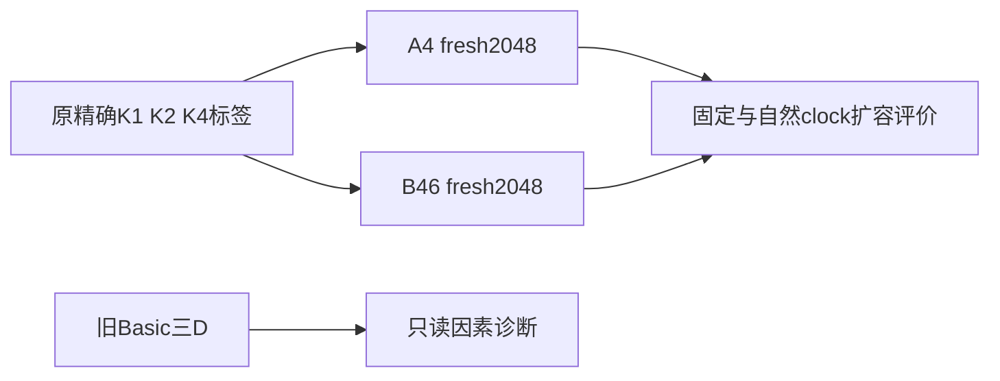

# 局部条件的上下文尺寸对照

Historical aliases **A4/B46，旧D冻结因素诊断** · ID `dense_multisize_control_20260928` · 2026-09-28

**Question:** 保留dense，训练多一个容器尺寸，能否改善扩容时准确性？**Design:** 旧模型因素诊断+三fresh配对seed，不混作一个统计总体。**Main result:** 固定clock下有相对改善，12×12绝对门仍0/3。

| 组 | K4有效训练尺寸 | K1/K2 | 其他控制 |
|---|---|---|---|
| A4 | 总是4×4 | 原4×4 | fresh，92821–92823，同初始化/标签/监督，2048更新 |
| B46 | 4×4/6×6交替 | 同左 | 同上；只扩K4上下文 |
| D1冻结诊断 | 旧Basic三D，不训练 | 不改变物理真值 | N16/32/64×外围坐标×clock，78预测+6PAD |

| 预定义结果 | A4 | B46 | 判定 |
|---|---:|---:|---|
| 12×12 K4、固定t=.75平均精确KL | .091713 | .049923 | 三seed配对差均≤−.005 |
| 配对差均值 / SD / MCSE | — | −.041790 / .003621 / .002091 | 描述三重复，不虚构大样本CI |
| B46@12逐seed绝对能力 | — | **0/3** | 未解决 |
| B46@8固定t | — | 均通过，meanKL约.000144 | 局部正结果 |
| B46@8自然t | — | 均未过，meanKL约.034132 | clock tradeoff |

完整逐seed结果在 [final_summary.json](evidence/final_summary.json)。（三seed描述统计，不是六seed确认性实验。）

## 参数与解释

原1976706参数dense、128/4/7、RoPE10000，FP32 CPU无AMP/TF32，AdamW(.9,.95)、wd.05、clip1、EMA.999；warm128峰3e−4余弦末3e−5；batch48、K1/K2/K4各16，两个微批32+16；2048 **raw**主权重，EMA仅次要。新6模型合12,288更新，MC=0、generation=0。完整有效设置：[execution_protocol_3h_v1.json](evidence/execution_protocol_3h_v1.json)与[源码](../../scripts/research20260928_multisize/run_multisize.py)。

真值仍是βc零场局部条件：K1/K2只在真实4×4；K4四邻全可见使外部MASK扩容不改变局部真值。三保留任务通过，训练4/6及固定clock8改善，但12仍失败。尺寸、外围坐标与clock都可影响预测；invalid PAD控制不变。**这些现象不能唯一识别attention分母、RoPE或time embedding为根因。** K4可计数解，促成后续非计数G8任务。

## 历史预算不能省略

最初2h门失败，正式模型0；随后显式3h授权沿用17:29:33原计时起点。管理v1路径错误发生在训练lock之前，v2只修管理路径，未修改科学配方；17:38正式、18:41结束。313成员/280,314,390字节本地包，另保留停止证据。不能把所有时间都说成连续成功运行，更不能把此轮与旧Basic混成独立六seed主检验。

## 证据、参数与可用性

[完整机器证据与协议索引](EVIDENCE.md) · [逐文件来源/编辑SHA](provenance.json) · [科学路径及未公开材料](withheld-manifest.json) · [本地核验回执](backup-verification.json)。

公开仓库不包含所有checkpoint、MC父场或bulk generation；从权重重跑与核对统计是不同复现层级。请先读[数据可用性](../DATA_AVAILABILITY.md)和[复现说明](../REPRODUCING.md)。

[返回研究证据地图](../README.md)。
