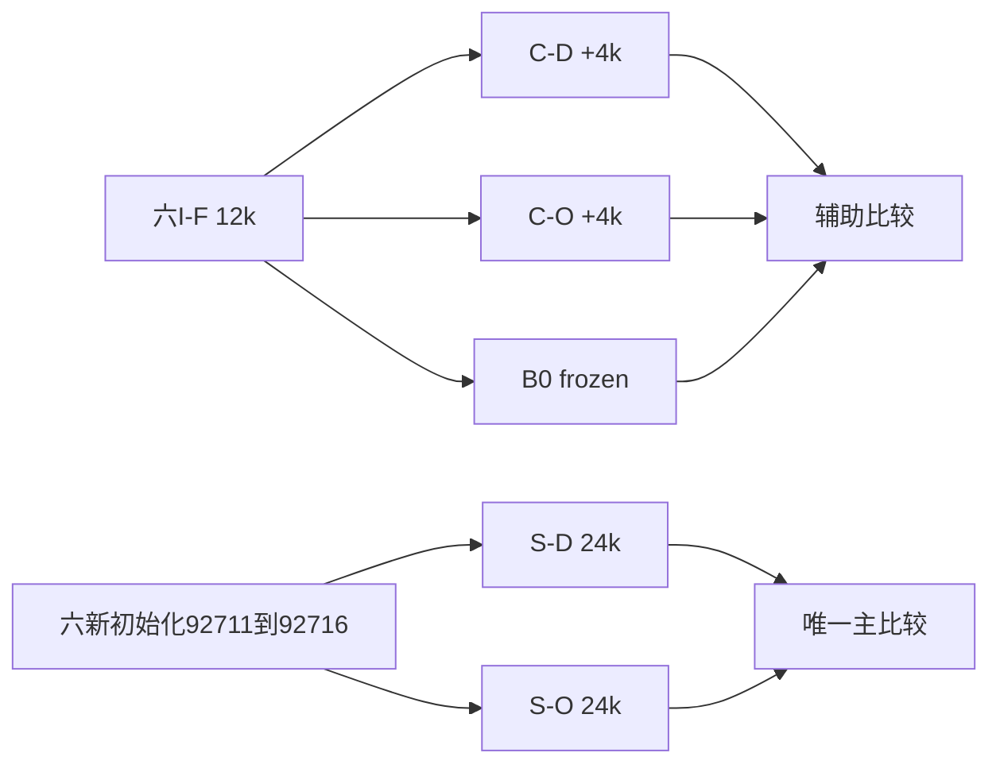

# Observed-only key/value 干预

Historical alias **J** · ID `observed_context_intervention_18h_20260927` · 2026-09-27

**Question:** 排除未观测MASK作为attention key/value，能否修复扩容脆弱性而保留局部预测能力？**Design:** 继续训练C与从零S两条不同谱系；**唯一主检验属于S**。**Main result:** S主CI跨0，正式局部能力门也失败。结构不变性通过不等于模型准确。

| cohort / 臂 | 权重起点 | key/value来源 | 固定训练 |
|---|---|---|---|
| C-D / C-O | 六I-F12k，完整raw/EMA/AdamW/RNG恢复 | D全部valid；O仅observed ±1 | 各+4k至16k |
| S-D / S-O | 六新seed92711–92716，配对初始化 | 同上 | 各fresh24k |
| B0 | 六I-F12k | 原D规则 | 冻结参考，不是第25个新模型 |

所有valid位置仍可作query；K0按样本回退。两臂物理data、mask、query、t与监督配对；只改K/V来源规则，不顺便改坐标、dropout或参数数。

| 结果层级 | H96held K512 CE差 | 95%交叉CI | 判定 |
|---|---:|---|---|
| **唯一主：S-O−S-D** | −.003938 | [−.009605,+.001279] | 方向/实质上界<−.005均未过 |
| 辅助：C-O−C-D | +.004573 | [+.002213,+.006619] | 干预反而更差 |
| 辅助：C-O−B0 | +.002840 | [+.000520,+.004843] | 不能称相对起点有进步 |

[gates.json](evidence/analysis/gates.json)、[core_summary.json](evidence/analysis/core_summary.json)、[绘图数据目录](evidence/analysis/plot_data/)、[原绘图代码](../../scripts/research20260927/intervention_figures.py)。C的结果不能挽救S，也不能把两个cohort合并成12个独立paired seed。

## 设置与误差层级

1,976,706参数dense，128/4/7/MLP4、RoPE10000；AdamW(.9,.95)、wd.05、clip1、EMA.999、BF16训练/FP32loss。C峰值1e−4 warm400、S峰值3e−4 warm1500，余弦末端3e−5；18,432token/update、32周期75/25、512隐藏槽；C先4k再S24k，每1000步交错，总336,000更新。固定final EMA，全部24final锁定后才评价S12k次要快照，不能按val挑checkpoint。

新MC2026092711，16链×256=4096、8random/4plus/4minus；固定burn40/间隔4、QA不通过不延长。H96/H48核心用4096父场×64query；continuous子集256；oracle64背景×16模式×3K×3视图。30最终身份+12S12k，共888正式预测，含验证共1656文件/827,520输入。**生成=0。**

主20k块8；块4/16、seed-only、MC-only各10k，LOO/t/端点稳定全部保留；六训练seed与16MC链独立重抽。S三保留各98.333333%，阈值.002/.005/.005；C六保留99.166667%，分别报告。保留通过不意味着唯一主检验通过。主bootstrap SD约.002844，精度目标未达；只看MC-only会过于乐观。

## 结构通过但科学失败

| 检查 | 结果 | 含义 |
|---|---|---|
| O固定t扩容概率漂移≤2e−5 | 最大约2.62e−6 | K/V屏蔽按设计生效，**非准确性** |
| C-O三K局部Gibbs KL上界≤.01 | 全部未过；约.0627/.0769/.0362 | 正式配方能力不足 |
| S-O同门 | 全部未过；约.0408/.0242/.0191 | 不能只责怪C旧初始化 |
| K1及同符号K2几何响应 | 0或近0 | 后续结构审计解释的盲点，不是所有K都无几何能力 |

坐标只进入Q/K旋转，V无显式坐标；当所有observed token相同且没有其他位置内容时，O的相同V加权会失去相关位置区分。该有限构造反例不能泛化为所有attention网络错误。后续[精确局部能力](../exact-local-capability/README.md)把结构与学习问题拆开。

历史v1是未执行的12h设计；v2正式18h含fresh S与更大MC。`all_64_backgrounds_independent`旧字段在K4任务上措辞过强：实际相同输入可重复，不是64独立物理信息；保留原结果、另作更正。约9.412h预算至远端统计，09-28 09:28本地备份完成；70包、1994/1994路径。不能把本轮负结果说成老师全部idea被否定。

## 证据、参数与可用性

[完整机器证据与协议索引](EVIDENCE.md) · [逐文件来源/编辑SHA](provenance.json) · [科学路径及未公开材料](withheld-manifest.json) · [本地核验回执](backup-verification.json)。

公开仓库不包含所有checkpoint、MC父场或bulk generation；从权重重跑与核对统计是不同复现层级。请先读[数据可用性](../DATA_AVAILABILITY.md)和[复现说明](../REPRODUCING.md)。

[返回研究证据地图](../README.md)。
