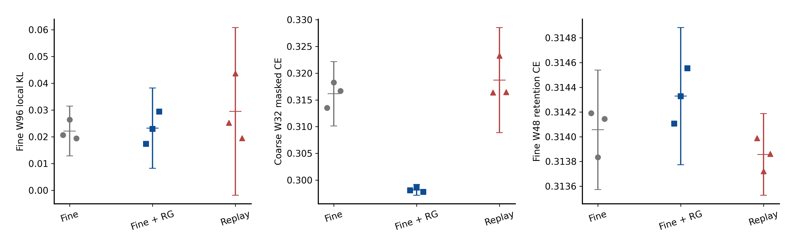
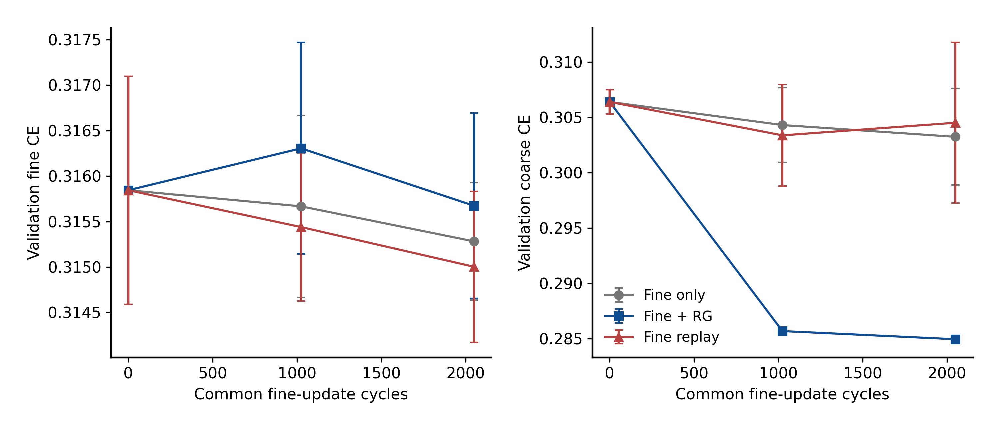

# RG 先导正式图与阅读说明

三张图均是唯一正式运行产生的原始文件，没有重绘或选择谱系。
三份 PNG 和三份 PDF 已逐一实际检查，见 [视觉核验](closure/visual_review_v1.json)。
下列统计均为三条配对旧谱系的探索性描述，不作确认性成功声明。

## 三臂绝对分数

[原 PDF](evidence/analysis/01_all_arms.pdf)。点为每条谱系，横短线为均值，误差线为各臂
跨三个谱系的描述性 t 95% 区间，不是臂间配对差区间。KL 的 t 近似下限可以小于零，
这不表示观测到了负 KL。只在同一面板比较 CE，不跨尺度比较不同目标的熵。

## RG 相对等计算重放的配对差

[原 PDF](evidence/analysis/02_paired_differences.pdf)。负值有利于 RG。蓝点为三个谱系，
黑线为配对 t 95% 区间，红线为 2000 次 seed→MC chain→循环 block4 bootstrap 95% 区间。
W96 主差两区间跨零；粗尺度三个谱系一致改善；细 W48 CE 存在小幅代价。

## 固定初始中点终点学习分数

[原 PDF](evidence/analysis/03_fixed_learning.pdf)。横轴是共同细更新周期，fine_only 每周期
一次更新，RG 与 replay 各两次。均值与 t 95% 区间来自同一三谱系；没有依据曲线选 checkpoint。
中点之后仍有变化，不能据此声称充分收敛，也未据此加步。

[完整结果](RESULTS_ZH.md) · [原始英文图注](evidence/analysis/figure_captions.json)
