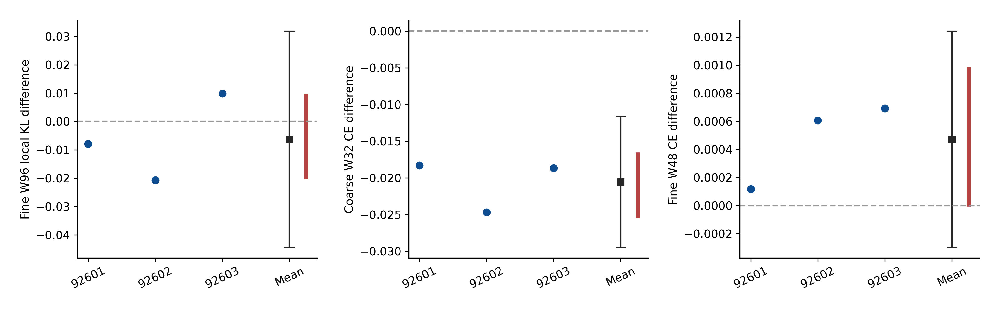

# RG 粗尺度数据训练与细尺度迁移

本轮把真实 3×3 多数投票粗粒化数据加入训练，比较它与等更新量的细尺度重放。
**粗尺度条件预测学到了，但尚未确认细尺度 W96 的迁移收益。**
这是三条旧训练谱系的短程探索性先导，不是逆 RG、联合生成或固定点验证。

| 项目 | 已核验事实 |
|---|---|
| 模型 | 三个旧 I-F 12k EMA 基座 × 三臂，共九个模型；新增零尺度嵌入，AdamW/RNG 重置 |
| 三臂 | fine_only 2048 更新；fine_plus_rg 与 fine_replay 各 4096 更新，每谱系相同 |
| 完成 | 30720 更新，9 final、9 midpoint EMA，297 个 FP32 预测文件 |
| 主比较 | W96 平均精确局部 KL：RG − replay = −0.006254；两类 95% 区间均跨零 |
| 粗尺度 | 同一粗尺度目标的 CE：RG 0.298164，replay 0.318719；三个谱系均改善 |
| 细尺度代价 | W48 局部 KL 和留存 CE 相比 replay 均有小幅变差点估计；不能称全面无损 |
| 完整性 | 三项 CPU 审计通过；两处逐成员备份、454/454 路径联合覆盖、三图 PNG/PDF 实际检查 |

固定主终点为 W96、M=1/8/32 的等权平均精确局部 KL，越低越好。
三谱系主差分别为 −0.007924、−0.020705、+0.009867，存在方向反转。
配对 t 95% 区间为 [−0.044396, +0.031888]，联合 seed→chain→block4
bootstrap 95% 区间为 [−0.019653, +0.009152]。不按平均改善挑选有利谱系，
不把粗尺度的次要收益替代主迁移问题。

[完整中文结果](RESULTS_ZH.md) · [三图与图注](FIGURES.md) ·
[原统计摘要](evidence/analysis/summary.json) · [证据索引](EVIDENCE.md) ·
[机器状态和实测时间](status.json)

## 执行和解释边界

2026-10-01 22:20:43.833 正式启动，22:56:44.992 训练完成，23:01:35.409 固定预测完成，
23:02:49.087 科学审计、统计和图完成，均为 UTC+8。正式科学流程耗时 42 分 5.254 秒。
原计算截止 23:36:34、交付截止 23:51:34 未延长；未重启、缩样本或追加轮次。

训练采用 BF16 autocast、FP32 参数/损失/优化器；全部报告预测 FP32，TF32 关闭。
每次更新 18432 token，三臂共同细输入完全配对；RG 与 replay 辅助随机选择配对，
但前者覆盖更大物理视野，这是干预组成部分，不能声称所有尺度因素都已分离。
训练/验证/测试整场样本不重合；测试参考来自已查看过的上一轮 MC，不是新盲测。

公开 297 个父样本级预测文件、全部统计摘要、三图 PNG/PDF、协议、审计和备份回执。
新增六份科学源码保持冻结 SHA。大权重、原训练日志、输入 bank 与继承的完整场数据
留在已核验备份，不随普通 Git 上传；逐文件身份与归档映射见
[数据可用性清单](withheld-manifest.json)。同 D 盘独立目录不是异盘或异地灾备。

本轮数据支持继续研究粗尺度任务学习，但**不确认细尺度迁移，不证明逆 RG、尺度不变性
或长程生成正确性**。未自动启动下一轮。

[研究地图](../README.md) · [公共综合报告](../REPORT_ZH.md) · [复现说明](../REPRODUCING.md)
