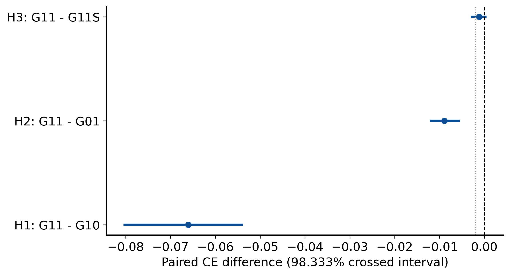
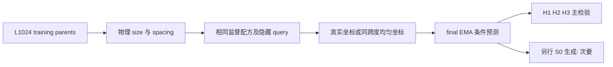
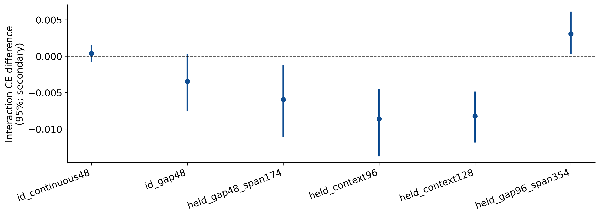
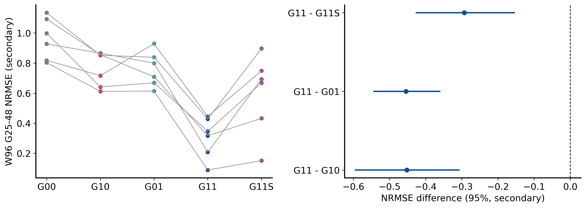

# Size × physical-spacing factorial

Historical alias: **G** · ID `core_geometry_factorial_20260925` · 2026-09-25

**Question:** 训练时增加容器尺寸或真实物理间距覆盖，分别是否改善条件外推？细间距排列在保留总跨度后还贡献多少？

**Design:** 六个新 seed × 五组，同结构、12k 更新。**Main result:** H1/H2 通过原门；H3 未通过。**Status:** 计算与本地核验完成，但不是三主假设全部成功。

## 先看预定义主结果

负值有利于 G11；单位为 conditional CE 的 nats/query，**不是 joint NLL 或精确 KL**。每个主任务先等权平均 K=2/32/512。

| 主假设 | 真正改变的变量 / 任务 | 均值差 | 原定 98.333333% CI | 实质门：上界 < −0.002 |
|---|---|---:|---|---|
| H1: G11−G10 | 同多尺寸训练，加入真实 spacing；W48 held gaps | −0.066041 | [−0.080240, −0.054136] | **通过** |
| H2: G11−G01 | 同 spacing 多样性，加入 size 覆盖；W96 continuous | −0.008908 | [−0.011889, −0.005704] | **通过** |
| H3: G11−G11S | 同物理数据/跨度，保留细间距排列；W48 held gaps | −0.001163 | [−0.002792, +0.000238] | **未通过**，方向亦未确认 |

图直接复用正式分析；竖线为 0 与 −0.002。来源：[crossed_uncertainty.json](evidence/analysis/crossed_uncertainty.json)、[conditional_point.npz](evidence/analysis/conditional_point.npz)、[主 bootstrap 原数组提取](evidence/analysis/conditional_bootstrap_block2_primary_projection.npz)；绘图：[core_geometry_factorial_analysis.py](../../scripts/research20260921/core_geometry_factorial_analysis.py)。提取只去掉大型 `arm_means`，不重新抽样、不改主数组。

H3 不是“证明细几何无用”：区间既跨 0，也越过 −0.002，未落入等效区间。六 seed 的点差均为负、另一个配对 t 分析更乐观，**不能替换原定同时包含 MC 不确定性的主区间**。

## 为什么需要 2×2 和第五组

| 臂 | 训练有效边长 W | 物理采样间距 | 输入坐标 | fresh / 参数 / 更新 |
|---|---|---|---|---|
| G00 | 48 | continuous | 真实坐标 | fresh / 1,976,706 / 12k |
| G10 | 16/24/32/48 | continuous | 真实坐标 | 同上 |
| G01 | 48 | continuous + 非均匀 gaps | 真实坐标 | 同上 |
| G11 | 16/24/32/48 | continuous + 非均匀 gaps | 逐样本真实坐标 | 同上 |
| G11S | 与 G11 相同 | **同一份 G11 物理 spin/data 流** | 保留总跨度，内部均匀化 | 同上 |

G11−G10 隔离 spacing 覆盖；G11−G01 隔离 size 覆盖；2×2 interaction 问二者是否协同。第五组不属于完整 2×2：它检验给定同样物理观测后，网络是否使用**细排列**而不只是总跨度。

对长度 W 的坐标轴，span-only 定义为 $x_i=i(x_{W-1}-x_0)/(W-1)$。unit/rank 坐标则是 $x_i=i$；非连续布局中二者不同，不能把 G11S 写成 unit-coordinate baseline。两组 continuous 时输入自然相同。

六 seed 为 92501–92506；同 seed 五组初始化配对，训练更新数/监督配方配对；**五组并不共享完全相同物理训练数据**，因为 size/spacing 本身是干预。只有 G11/G11S 的完整物理数据、mask、query、t 配对。

## 训练与数据身份

原 dense：d128、4 heads、7 blocks、MLP×4、2D RoPE base10000、dropout0，valid MASK 参加 attention，PAD 不参加。AdamW(.9,.95)、wd.05、clip1、EMA.999；750 步 warmup 到 3e−4，余弦到 3e−5。BF16 训练、FP32 loss/evaluation；每更新18,432 token；32周期75%普通/25%稀疏，稀疏更新总512隐藏 query 槽。4k/8k EMA 用于学习诊断，**固定12k final EMA**决定结果，不挑 checkpoint。

训练池继承 L1024 的 768 个训练父场与独立256验证父场。评价新 MC seed2026092511，8链×128=1024父场，4 random/2 plus/2 minus 初始化；参考不回流训练。固定 Wolff burn40、间隔4及协议 QA，不采到通过。

30个条件 bank = 6几何×5K，128父场/bank（每链16个，原序列间隔8），每父场64隐藏 query；共900预测单元。训练 gap 多重集使用1/2/4/8，held 使用3/6，按冻结整数计数构造跨度；完整定义见协议与代码，不能把“W96”误作相同物理跨度。

## 误差条来自哪里

六配对训练 seed 与8条 MC链独立重抽；链内按选定父场时间顺序块长2，主20,000次。块长1/4、seed-only、MC-only各10,000次为敏感性。三个主区间采用 Bonferroni 98.333333%；query、K和crop不是独立训练重复。两个 continuous 保留门各97.5%上界≤+.005，均通过。无预设 learning-incomplete 标记，但这不是收敛证明。

## 次要结果：明确的反例和 tradeoff

| 结果 | 观察 | 不允许的改写 |
|---|---|---|
| **W96 held-gap 反例** | G01平均CE 0.597356 < G11 0.600037 | 多尺寸×多间距在所有任务协同 |
| held-gap W96 interaction | +0.003072，95% [+.000368,+.006038] | 用 continuous W96 的有利 interaction 代替它 |
| continuous W96 interaction | −0.008583，方向有利 | 任意尺度上的一致协同 |
| W96生成 G25–48 NRMSE | G00 .962560；G10 .757280；G01 .759949；G11 .305383；G11S .598294 | 更低 NRMSE = 正确分布 |
| G11−G11S 生成差 | −.292911，95% [−.425566,−.155013] | 重新判定条件 H3 通过 |
| 物理 tradeoff | G11 signed m bias −.042960，energy bias +.036703；G00/G10 energy约+.005794/+.005615 | 所有指标越小越好；忽略偏差目标为0 |

生成是每模型64张W96，共1,920图/120 shards，S0 cosine-squared 256步、温度1、无MC校正；三臂对比的图级 RNG 配对。生成 bootstrap 包含训练 seed、MC链/时间块和16图shard，不把1,920图当1,920训练重复。**没有 W128 生成实验。** 数值见 [paired_contrasts.csv](evidence/analysis/paired_contrasts.csv)、[generation_point.npz](evidence/analysis/generation_point.npz) 与原统计 JSON。

## 历史与结论边界

最初10h预算门没有通过，后续12h执行窗口有显式版本/授权；不是隐藏改样本量。正式计算约7.428h、含预检预算约7.731h，本地科学备份1459/1459路径核验；见公开 provenance/备份记录。G 后还有 I/J/精确局部实验，**G 是重要 factorial，不是时间上最新一轮**。

支持：指定条件任务中 size 与真实 spacing 训练覆盖的作用。未建立：普遍细几何实质收益、scale invariance、RoPE 是唯一机制、联合分布正确或老师整体构想得到完整验证。

## 证据、参数与可用性

[完整机器证据与协议索引](EVIDENCE.md) · [逐文件来源/编辑SHA](provenance.json) · [科学路径及未公开材料](withheld-manifest.json) · [本地核验回执](backup-verification.json)。

公开仓库不包含所有checkpoint、MC父场或bulk generation；从权重重跑与核对统计是不同复现层级。请先读[数据可用性](../DATA_AVAILABILITY.md)和[复现说明](../REPRODUCING.md)。

[返回研究证据地图](../README.md)。
