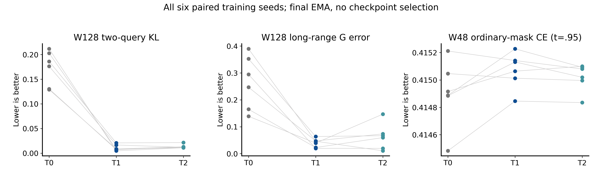
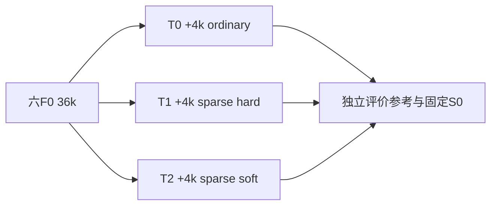

# 稀疏条件训练

Historical alias **T0/T1/T2** · ID `sparse_conditioning_20260923` · 2026-09-23

**Question:** 普通遮盖训练是否缺少低K条件能力；补充稀疏任务能否同时改善局部joint和长程生成？**Design:** 六F0-36k checkpoint各分三支，追加4k到40k。**Main result:** T1相对T0的两主指标和保留门通过；order TV仍恶化。**Status:** 有限预定任务通过，不是联合分布已正确。

| 臂 | 75%共同普通目标 | 25%辅助目标 | 模型身份 |
|---|---|---|---|
| T0 | 普通masked CE/t | 另一普通CE/t | 同F0完整恢复+4k |
| T1 | 同左 | K=1/2/4/8/16/32，hard labels，32near+32uniform查询 | 同上 |
| T2 | 同左 | K≤2用训练池LOCO soft physics，其余同T1 | 同上；评价MC不用于标签 |

| 预定义主比较 T1−T0 | 效应及95%CI | 原判定 |
|---|---|---|
| W128 sequential KL | −.161660 [−.188394,−.135402] | 通过 |
| W128 G49–64 NRMSE | −.224743 [−.299697,−.099112] | 通过 |
| 保留任务 | 原门通过 | 不以其他任务代替 |
| order TV（次要） | +.014905 [.012331,.017206] | **变差** |

[完整统计](evidence/analysis/crossed_uncertainty.json)、[plot_data](evidence/analysis/plot_data.npz)与[分析代码](../../scripts/research20260921/finalize_sparse_conditioning_20260923.py)。CE仍不是精确KL，表中局部sequential KL依赖MC局部参考表。

## 重建设置

dense1,976,706参数，d128/4头/7块、RoPE10000、dropout0，AdamW(.9,.95)、wd.05、clip1、EMA.999，固定final EMA。六lineage91001–6，W24/48/96、batch16/4/1；每更新两个9216token前向，合18,432。continuation lr与完整恢复状态以[实际run_protocol](evidence/run_protocol.json)及冻结训练代码为准，不重新初始化优化器。

新评价MC seed2026092401，8链×128=1024，116cases×2clock、6个bank。生成每模型W128=128，W96/W48/stride10各64，共320；18模型5,760图/360个16图shard。主交叉重抽包含六训练seed、MC链/时间块和生成shard：块8的1000次，块4/16各500；query和平移不是独立seed。

## 负结果与历史

T2没有稳定额外收益；joint风险改善不保证order TV改善。训练预算固定4k，没有为结果延长。初稿更多生成任务在正式启动前因16.41h预测改为上述冻结范围；不是事后丢弃坏结果。实测约7.799h，839/839必需科学路径本地覆盖。

这里T0/T1/T2是9月稀疏续训，**不是早期L64采样器的T0/T3**。后续R和Bridge的失败不会抹去这轮通过，但说明生成收益跨设计/参考并非必然稳定。18分支仍继承六训练lineage。

## 证据、参数与可用性

[完整机器证据与协议索引](EVIDENCE.md) · [逐文件来源/编辑SHA](provenance.json) · [科学路径及未公开材料](withheld-manifest.json) · [本地核验回执](backup-verification.json)。

公开仓库不包含所有checkpoint、MC父场或bulk generation；从权重重跑与核对统计是不同复现层级。请先读[数据可用性](../DATA_AVAILABILITY.md)和[复现说明](../REPRODUCING.md)。

[返回研究证据地图](../README.md)。
