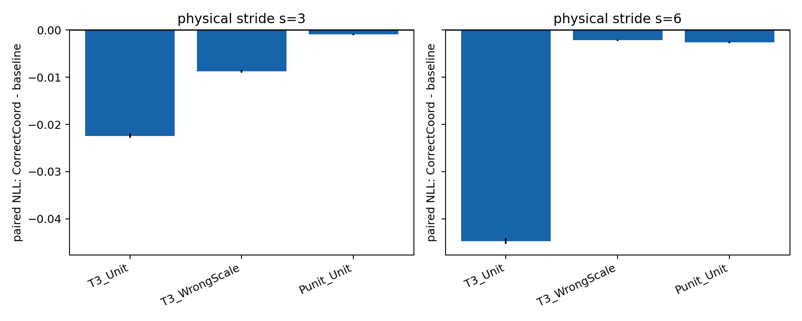
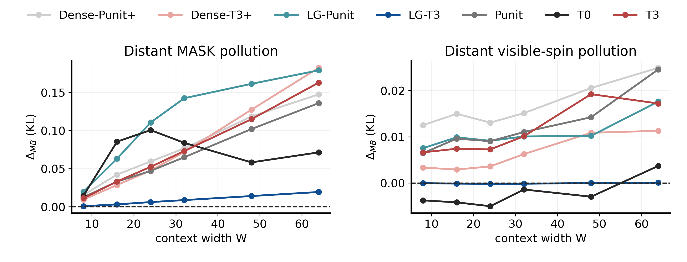
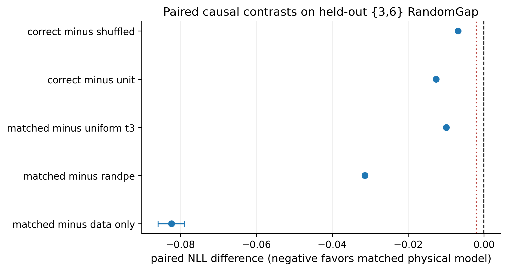

# Scale-aware coordinates 与 Local--Global Ising 实验

本目录整理“模型能否根据 context 中 token 之间的真实物理距离进行推断”这一研究
想法的分阶段证据。目标不是简单延长 Transformer 的位置编码范围，而是让训练样本的
物理采样几何与传入网络的二维坐标同步变化，再检验模型是否真的利用相对物理尺度。

详尽实验设置、逐阶段流程、指标解释、资源记录、结论边界和复现说明见
[`docs/SCALE_AWARE_CONTEXT_EXPERIMENT_REPORT_ZH.md`](../../docs/SCALE_AWARE_CONTEXT_EXPERIMENT_REPORT_ZH.md)。

## 1. 研究问题

固定 token 间距训练的模型在扩大 context 后可能遇到两个问题：

1. 从未见过新的相对位置或 RoPE phase；
2. 新增的远程 token 会干扰本应由局部邻域决定的预测。

因此实验同时研究：

- matched physical coordinates 是否具有独立于数据增强的贡献；
- 随机位置编码本身是否足以解释改善；
- Local--Global 解耦能否在保留长程信息的同时保护局部 Ising Markov 规律。

## 2. 证据链与当前结论

| 阶段 | 核心问题 | 自动判定 | 可以得出的结论 |
|---|---|---|---|
| Level 1 rapid | dense 模型是否使用真实尺度坐标 | `NO-GO` for unchanged design | 坐标和长程收益真实存在，但出现局部污染 |
| Stage 2A | Local--Global 是否修复局部污染 | `CONDITIONAL_GO` | 局部污染显著修复、生成指标通过，但坐标独立贡献略低于 0.002 门槛 |
| Stage 2B causal screen | matched 坐标能否排除 data-only 与 RandomPE 解释 | `GO_FULL_2B` | 单 seed 下五项因果检查全部通过，应进入多 seed 正式确认 |

这里的 `GO_FULL_2B` 是“允许启动正式确认”的决策，不是论文级最终结论。

## 3. Level 1：发现长程收益与局部污染的权衡

四个 dense 模型使用相同初始化和 8,000 updates：

- `T0`：固定 W=48、stride 1；
- `T3`：真实 stride `{1,2,4}` 与 matched coordinates；
- `Pphase`：只改变坐标 phase；
- `Punit`：改变物理 stride，但坐标保持 unit。

主要观察：

- T3 在 held-out stride 上明显优于 T0；
- T3 的 expanded `G(r)` NRMSE 从 T0 的 `0.1643` 降至 `0.0466`；
- 但 short-range NRMSE 从 `0.0354` 升至 `0.0541`；
- Large-MASK Markov pollution 从 T0 的 `0.0638` 升至 T3 的 `0.1183`。

因此原 dense 架构不能直接扩大：它学会了更多长程尺度信息，同时让远程 context 污染
局部 posterior。



机器可读入口：

- `level1_rapid/final/level1_summary.json`
- `level1_rapid/probes/coordinates/summary.json`
- `level1_rapid/probes/markov/summary.json`
- `level1_rapid/generation/metrics.json`

## 4. Stage 2A：Local--Global 解耦

Local--Global denoiser 使用两个互不写入对方 hidden state 的分支：

```text
masked spins + time
        ├── Local expert：一次物理 Manhattan radius-1 attention
        └── Global expert：dense 2D RoPE + physical coordinates
                              ↓ gated residual
local logits + gate × global residual → final logits
```

Local 分支的后三层是逐 site MLP，避免多层 attention 让局部感受野偷偷扩张。Global
分支只以 gated residual 修正 local logits。Local--Global 与 7-block Dense+ 的参数量
误差约 0.09%，避免容量混杂。

Stage 2A 结果：

- `LG-T3` 相对 `Dense-T3+`：W=64 distant-MASK pollution 从 `0.1822` 降至
  `0.0193`；
- distant-visible pollution 从 `0.0113` 降至约 `0.00008`；
- short/expanded `G(r)` NRMSE 为 `0.0162/0.0492`；
- energy absolute error 为 `0.0266`；
- CorrectCoord 相对 UnitCoord 改善 `-0.03225` NLL；
- 但 `LG-T3 - LG-Punit=-0.00164`，低于预设 practical threshold `0.002`。

因此判定为 `CONDITIONAL_GO`，并增加 data-only 与 RandomPE 控制后再做因果筛选。



机器可读入口：`stage2a_screen/stage2a_decision.json`。

## 5. Stage 2B：RandomGap 因果筛选

### 5.1 三个严格对照

三个模型同构、同初始化、单 seed、各 8,000 updates：

| 模型 | 自旋几何 | 输入坐标 | 排除的解释 |
|---|---|---|---|
| `LG-Gap-Unit` | 样本内 RandomGap | rank/unit | 仅稀疏数据增强 |
| `LG-U-RandPE` | 连续 stride-1 | 同分布但与自旋错配的 RandomGap coordinates | 随机 PE 正则化 |
| `LG-Gap-Matched` | 同一 RandomGap | 精确物理坐标 | matched-distance 假设 |

训练 width 为 `{16,24,32,48,64}`，训练 gap 为 `{1,2,4,8}`。测试包含 W=64
seen mixture、held-out `{3,6}` mixture、固定 gap 3/6，以及 W=48 固定 gap 10。

### 5.2 正式配对结果

以下为 held-out `{3,6}` RandomGap 上的 paired NLL difference；负数有利于 matched
physical model。

| 对比 | 均值 | 95% CI |
|---|---:|---:|
| Gap-Matched − Gap-Unit | -0.08238 | [-0.08591, -0.07890] |
| Gap-Matched − U-RandPE | -0.03142 | [-0.03187, -0.03095] |
| Gap-Matched − uniform LG-T3 | -0.00997 | [-0.01053, -0.00945] |
| CorrectCoord − UnitCoord | -0.01262 | [-0.01293, -0.01231] |
| CorrectCoord − ShuffledCoord | -0.00682 | [-0.00707, -0.00657] |

五项均通过，前三项也超过预注册 `0.002` practical threshold。



这支持以下受限表述：在当前单 seed、Local--Global Ising 设置中，真实物理坐标的收益
不能由“见过稀疏数据”或“随机位置编码正则化”单独解释，且模型对坐标置换敏感。

### 5.3 结果文件

- `stage2b_causal_screen/stage2b_causal_decision.json`：预注册检查和 bootstrap CI；
- `stage2b_causal_screen/summary.json`：完整聚合统计；
- `stage2b_causal_screen/per_sample.npz`：逐样本 NLL/Brier，便于重新统计；
- `stage2b_causal_screen/training/`：三个模型的 config、history 与性能记录；
- `stage2b_causal_screen/audit/`：配对初始化、测试和 GPU 遥测；
- `stage2b_causal_screen/*.png|*.pdf`：位图与矢量图表。

## 6. 复现入口

完整执行顺序：

```bash
python -m unittest discover -s tests -v
bash scripts/run_level1_training.sh
bash scripts/run_level1_evaluation.sh
bash scripts/run_stage2a_formal.sh
bash scripts/run_stage2b_causal.sh
```

各脚本默认从自身位置解析仓库根目录，并使用环境中的 `python`；可分别通过
`ISM_ROOT` 与 `PYTHON_BIN` 覆盖。正式数据由 `generate_level1_parents.py` 生成；
所有训练配置位于 `configs/`。

代码入口：

- `ism_diffusion/scale_model.py`：coordinate-aware dense baseline；
- `ism_diffusion/stage2_model.py`：Local--Global denoiser；
- `ism_diffusion/stage2_data.py`：uniform stride、RandomGap 和 RandomPE controls；
- `train_level1.py`、`train_stage2.py`：训练与精确断点恢复；
- `probe_stage2b_causal.py`：paired causal probe；
- `analyze_stage2b_causal.py`：bootstrap、决策和图表。

## 7. 未上传内容与下一步

仓库不保存训练 checkpoint、完整 L=1024 parent ensemble 或远端临时缓存。它们体积
较大，且不影响阅读代码和核对本目录的逐样本结果。

下一步按预注册方案运行：

```text
training seeds = {1234, 2345, 3456}
updates/model = 15,000
analysis = hierarchical bootstrap over training seed / MC chain / crop
```

只有多 seed 结果保持方向和 practical effect，才把 matched physical coordinates
写成稳定方法结论；之后再进入 irregular geometry、sparse/axial attention 和跨系统
验证。
